# KChat Storage & Search — Architecture

**License**: Proprietary — All Rights Reserved. See [LICENSE](../LICENSE).

This document is the system-architecture companion to
[PROPOSAL.md](PROPOSAL.md). It contains the diagrams, schema, state
machines, and sequence flows that define how the Rust core and its
platform bridges fit together. Where the proposal is "what and why",
this document is "how the pieces connect".

All mermaid diagrams use double-quoted labels and no colors so they
render identically in every viewer.

---

## 1. System Overview

The library is a layered Rust core embedded in the KChat client
app. Platform bridges (UniFFI on iOS, JNI on Android, native crate
on desktop) project the core's public API into idiomatic Swift /
Kotlin / Rust call sites. The core itself is platform-agnostic.

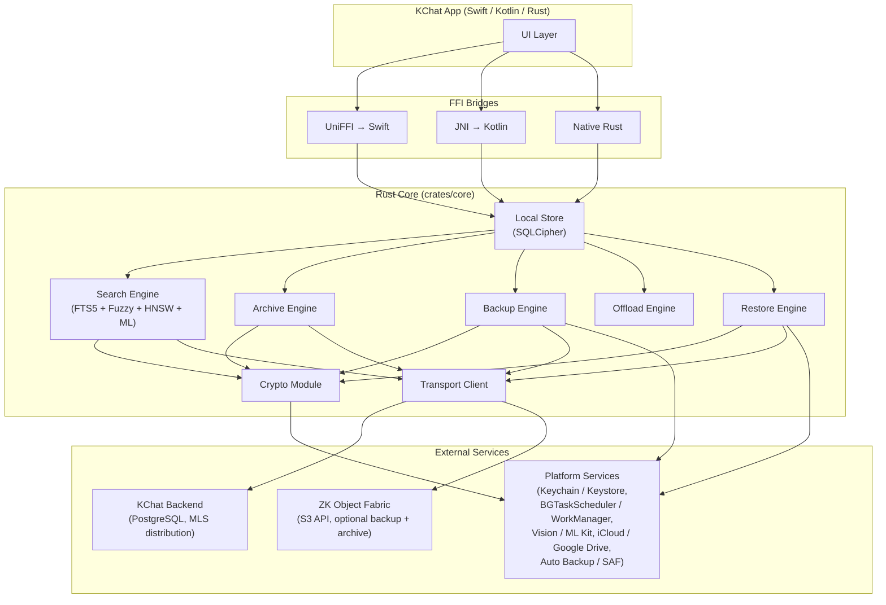

The core never talks to the UI directly. Every cross-boundary call
goes through the FFI bridge for the host platform.

---

## 2. Crate Structure

> **Phase 0 closed; Phase 1 in flight (~96%); Phase 2 in flight
> (~95%); Phase 3 in flight (~97%); Phase 4 in flight (~90%);
> Phase 5 in flight (~95%, cold-shard fetch + restore + p95
> latency gate landed); Phase 6 in flight (~80%, ML inference
> seams for XLM-R / MobileCLIP-S2 / Whisper /
> DocumentExtractor / VideoKeyframeSampler + on-device
> reranker with raw `semantic_score` + INT4 quantization
> selection + INT4 encode/decode codec + criterion bench
> scaffold); Phase 7 in flight (~45%, failure suite at 8 of 8 +
> offline detector + perf collector + large-scale ingest /
> storage-budget / backup-restore scaffold + 100k-message
> stress test + macOS / Windows native integration scaffolds —
> Spotlight / Windows Search bridges, scheduler bridges,
> `WindowsMlConfig` CPU-only contract); Phase 8 in flight
> (~25%, multi-scope / multi-tenant search foundation —
> conversation hierarchy columns + indexes,
> `archive_segment_map.tenant_id`, `SearchTarget` enum + scope
> resolver wired through `QueryEngine`, `IndexType::Bloom`
> shard type with `K_bloom_index_shard` derivation, prefetch
> order updated to `[Bloom, Text, Fuzzy, Vector, Media]`; see
> PHASES.md Phase 8).** Updates vs.
> the original target structure below:
>
> * `crates/core/src/formats/` is a **Phase-0 addition** for the
>   CBOR wire-format types (segment frames, manifest spec, media
>   descriptor, search index shard). It was not shown in the
>   original target structure but is required by the Phase 0
>   checklist; the formats need to exist in code before the
>   higher-level engines (`archive`, `backup`, `search`, `restore`)
>   that consume them.
> * `crates/core/src/crypto/key_wrap.rs` is **implemented**
>   (AES-256-KW per RFC 3394) and is no longer a stub. The
>   platform-specific wraps for `K_local_db` (Keychain / Keystore /
>   DPAPI) still arrive in Phase 1; they layer on top of the same
>   `wrap_key` / `unwrap_key` primitives.
> * `crates/core/src/search/tokenizer.rs` is the **Phase-0 closing**
>   multilingual tokenization spec: `TokenizerConfig`,
>   `FallbackMode::{Icu, Unicode61}`, ISO-15924 `ScriptClass`, the
>   `FuzzyGranularity` mapping, and `detect_script` /
>   `segment_by_script` for mixed-script runs.
> * `crates/core/src/local_store/schema.rs` is the **Phase-1
>   foundation** for the SQLCipher schema: typed Rust row structs
>   for every table in §4 plus the `SCHEMA_SQL` constant carrying
>   the `CREATE TABLE` / `CREATE VIRTUAL TABLE` statements.
> * `crates/core/src/local_store/db.rs` is the **Phase-1 SQLCipher
>   binding**: `LocalStoreDb` opens / creates `{data_dir}/kchat.db`
>   (or an `:memory:` database for tests), sets `PRAGMA key` from
>   the 32-byte `K_local_db`, enables foreign-key enforcement, and
>   runs `SCHEMA_SQL` with automatic detection of the FTS5 ICU
>   tokenizer plus `unicode61` fallback via
>   `create_schema_with_unicode61_fallback()`. CRUD helpers cover
>   conversation / skeleton / body / `update_body_state` /
>   `insert_backup_event`. SQLCipher itself is bundled by
>   `rusqlite`'s `bundled-sqlcipher-vendored-openssl` feature so
>   the workspace builds and tests without a system SQLCipher /
>   OpenSSL install. Platform-specific wrapping of `K_local_db`
>   (Keychain / Keystore / DPAPI) is still stubbed and lands later
>   in Phase 1 alongside the production UniFFI / JNI packaging.
>   The Phase-1 **bridge scaffolds** themselves are already in
>   tree: `crates/ios-bridge/` carries the UDL at
>   `src/kchat.udl`, a `build.rs` that calls
>   `uniffi::generate_scaffolding`, and FFI-shaped wrappers
>   around `CoreImpl` (UUIDs cross the FFI as canonical
>   strings; argument validation throws
>   `KChatError::InvalidArgument`).
>   `crates/android-bridge/` carries the
>   `Java_com_kchat_core_KChatBridge_*` JNI entry points
>   (`initialize`, `destroy`, `sendText`, `search`,
>   `editMessage`, `deleteForMe`, `deleteForEveryone`,
>   `getMessage`, `getConversationMessages`) plus a pure-Rust
>   `KChatBridgeHandle` so unit tests exercise the same code
>   paths without a JNIEnv. Errors throw
>   `com.kchat.core.KChatException`; `MessageView` /
>   `SearchResult` batches marshal as JSON for brevity.
> * `crates/core/src/local_store/state_machines.rs` defines the
>   `body_state`, `media_state`, `archive_state`, `backup_state`,
>   and `restore_state` enums with `try_transition`, `Display` /
>   `FromStr`, and serde support — every transition not in the
>   diagrams in §5 is rejected.
> * `crates/core/src/message/processor.rs` carries the **Phase-1
>   message processor**: `IngestedMessage`, `OutboxEntry`,
>   `OutboxStatus`, `IngestResult`, the pure validators
>   (`validate_ingest`, `is_duplicate`, `create_outbox_entry`),
>   and the DB-backed `MessagePersister` that wraps skeleton +
>   body + FTS row + `"message_received"` /
>   `"outbox_pending"` / `"outbox_sent"` /
>   `"message_edited"` / `"message_deleted"` journal writes
>   inside one `SAVEPOINT` so a crash mid-ingest cannot leave
>   the FTS index out of sync with the skeleton table.
>   `edit_message`, `delete_for_me`, and `delete_for_everyone`
>   call `try_transition` on `body_state` from §5 before
>   touching the FTS / body rows, and the for-everyone path
>   drops `message_body` in addition to clearing the FTS row.
> * `crates/core/src/search/text_search.rs` is the **Phase-1 FTS5
>   text search engine**: `TextSearchEngine::search_fts` runs
>   `bm25(search_fts)`-ordered queries returning
>   `FtsMatch { message_id, conversation_id, sender_id,
>   created_at_ms, snippet, bm25_score }`. `build_fts_query`
>   quotes free-text tokens token-by-token while preserving
>   `"phrase"` and trailing-`*` prefix queries plus the explicit
>   `AND` / `OR` / `NOT` / `NEAR` operators.
> * `crates/core/src/search/query_engine.rs` is the **Phase-1
>   unified search engine**: `QueryEngine::execute_search` fans
>   out to both `TextSearchEngine::search_fts` and
>   `FuzzySearchEngine::search_fuzzy`, deduplicates the union by
>   `message_id`, and weights the merged scores with
>   `BM25_WEIGHT = 2.0` / `FUZZY_WEIGHT = 1.0` per
>   `docs/PROPOSAL.md §7.5` so exact hits always outrank
>   fuzzy-only hits on the same query. Fuzzy-only rows are
>   skeleton-hydrated through one
>   `fetch_skeleton_basic_info()` batch query so the engine
>   does not pay one round-trip per fuzzy hit. The same
>   structured `WHERE` clause on `message_skeleton`
>   (`sender_filter`, `conversation_filter`, `date_from` /
>   `date_to`, `content_kind`) filters both engine outputs via
>   the unified `allowed_skeleton_ids()` helper. The result is
>   mapped to `SearchResult { snippet, rank_score, is_cold }`
>   and short-circuits to a recency-ordered skeleton scan when
>   the query string is empty. `SearchScope::LocalOnly` is
>   honored — no archive fan-out attempts in Phase 1.
> * `crates/core/src/search/fuzzy_search.rs` is the **early
>   Phase-5 foundation** for the fuzzy index, now wired into the
>   Phase-1 hot path. `FuzzyTokenizer` splits text into
>   per-script runs via `segment_by_script` and emits trigrams
>   or bigrams per `fuzzy_granularity(script)` from §3 of
>   `docs/PROPOSAL.md`. Tokens are lowercased for
>   case-insensitive matching and never straddle ASCII
>   whitespace / punctuation / digit boundaries.
>   `FuzzySearchEngine` writes into the `search_fuzzy` table
>   (`message_id`, `token`, `script`) with `INSERT OR IGNORE`
>   semantics, supports `remove_message`, and ranks
>   `search_fuzzy` results by token-overlap ratio.
>   `MessagePersister` (above) calls `index_message` from
>   `persist_ingested_message` / `persist_outbox_entry`,
>   `remove_message` + `index_message` from `edit_message`, and
>   `remove_message` from `delete_for_me` /
>   `delete_for_everyone` so the FTS5 and fuzzy indexes stay in
>   lock-step on every body mutation. The encrypted-shard /
>   archive fan-out path arrives later in Phase 5.
> * `crates/core/src/core_impl.rs` is the **Phase-1 concrete
>   `KChatCore` implementation**. `CoreImpl::new(config, key)`
>   opens the SQLCipher store, retains the 32-byte
>   `K_local_db` in a `Zeroizing<[u8; 32]>` so
>   `initialize(new_config)` can re-open at a different
>   `data_dir`, and stores the `LocalStoreDb` behind a `Mutex`
>   so the trait's `&self` API stays sync. `send_text` mints
>   an `OutboxEntry` through `MessageProcessor::create_outbox_entry`
>   and persists it via
>   `MessagePersister::persist_outbox_entry`;
>   `edit_message`, `delete_for_me`, and `delete_for_everyone`
>   lock the db mutex and delegate to `MessagePersister` so
>   the trait surfaces the full local message lifecycle.
>   `get_message` and `get_conversation_messages` delegate to
>   `LocalStoreDb::get_message_with_body` and
>   `LocalStoreDb::get_conversation_messages` and re-shape the
>   rows into the public `MessageView` (skeleton fields plus
>   the optional decrypted body text) so the bindings never
>   leak the internal schema. `search` delegates to
>   `QueryEngine::execute_search`. The transport-driven
>   `ingest_remote_messages` is now wired against an injected
>   `Box<dyn DeliveryClient>` held in
>   `Mutex<Option<…>>`: `CoreImpl::with_transport(config, key,
>   client)` and the alternate `set_delivery_client(client)`
>   install the implementation; the trait method calls
>   `fetch_messages(conversation_id, after_cursor)`, converts
>   each `RawDeliveryMessage` into `IngestedMessage` (parsing
>   ids back to `Uuid`), and forwards into the existing
>   `ingest_messages` pipeline so deduplication / FTS / fuzzy
>   / journal writes are unchanged. The transport's
>   `next_cursor` is propagated end-to-end through the
>   `IngestResult.next_cursor: Option<String>` field so
>   bridge layers can drive paginated drains directly off
>   the result without poking at the transport mock; the
>   inherent `CoreImpl::ingest_messages(&[IngestedMessage])`
>   path leaves the field as `None` because it has no
>   transport context. When no transport is configured the
>   trait method returns
>   `Err(Error::Transport("no delivery client configured"))`
>   so callers fail fast instead of silently no-oping.
>   Inherent **conversation-management methods**
>   (`create_conversation`, `list_conversations`,
>   `get_conversation`, `update_conversation_pin`,
>   `update_conversation_mute`) wrap the matching helpers on
>   `LocalStoreDb` and surface `Error::Storage` when the
>   conversation does not exist so the bridge layer can show
>   the failure to the user. The trait now also exposes
>   **`delete_conversation(uuid)`** so bridge clients can drive
>   the cascade through the public API; it cascades through
>   every dependent row (`media_search_index` → `search_fuzzy`
>   → `search_fts` → `search_vector` → `media_asset` →
>   `message_body` → `message_skeleton` → `conversation`)
>   inside a single `SAVEPOINT`, leaving sibling conversations
>   untouched. The ordering is dictated by the schema's
>   foreign-key direction: `media_search_index.asset_id`
>   references `media_asset(asset_id)` and
>   `media_asset.message_id` references
>   `message_skeleton(message_id)`, so both must drain
>   top-down before the skeleton delete runs;
>   `search_vector` carries no FK but the rows are
>   message-scoped and never want to outlive the skeleton.
>   The trait also carries a Phase-1 stub
>   **`register_device(&str) -> Result<DeviceRegistration>`**
>   that returns
>   `Err(Error::NotImplemented("register_device"))` until the
>   MLS credential / KeyPackage publication pipeline lands;
>   the empty `DeviceRegistration` placeholder lives next to
>   the other Phase-1 placeholder result types in
>   `crates/core/src/lib.rs` so the FFI shape is stable.
>   Inherent **timeline + single-message helpers**
>   (`get_timeline(uuid, before_ms, limit)` for newest-first
>   `TimelineRow` pages, plus `get_message_with_body(uuid)`
>   and `get_message_body(uuid)` for the binding hydration
>   path) wrap the matching DB helpers without re-shaping
>   through `MessageView`. The Phase-2/3/4 trait methods
>   `send_media`, `hydrate_message`, `run_incremental_backup`,
>   `enforce_storage_budget`, and `restore_from_backup`
>   currently return `Err(Error::NotImplemented(<method>))` —
>   the surface is locked but the implementation lands with
>   the relevant later phase.
> * `crates/core/src/transport/mod.rs` is the **Phase-1
>   transport trait abstraction**. The module exposes two
>   layered traits. The narrower `DeliveryClient` (object-safe,
>   `Send + Sync`) drives `ingest_remote_messages` today via
>   `FetchResult { messages, next_cursor }`, the
>   string-typed `RawDeliveryMessage` wire shape, and
>   `TransportError { Network, Auth, Server }` with
>   `thiserror`-derived `Display` so upper layers can route
>   on intent without parsing free-form text. A test-only
>   `MockDeliveryClient` stages FIFO
>   `(after_cursor → response)` mappings and asserts —
>   inside `fetch_messages` — that the actual `after_cursor`
>   matches the staged one, which is how the
>   `core_impl::core_impl_ingest_remote_passes_cursor` test
>   pins the cursor pass-through. The broader
>   `TransportClient` is the §10 surface that the
>   later-phase engines (`media`, `archive`, `backup`,
>   search-shard fetch) will share: cursor-paginated
>   `fetch_messages` returning `FetchMessagesResponse`,
>   chunked blob upload (`init_blob_upload` →
>   `upload_chunk` → `commit_blob`) with whole-object Merkle
>   verification through `BlobUploadHandle` / `ChunkReceipt`
>   / `CommitBlobResponse`, ranged blob download
>   (`fetch_blob_range`), Personal-Archive manifest +
>   segment fetch (`fetch_archive_manifests` returning
>   `EncryptedManifest`, `fetch_archive_segment` returning
>   ciphertext bytes), and encrypted-search-shard fetch
>   (`fetch_index_shards`). The `BlobClass` enum
>   (`Media`, `ArchiveSegment`, `SearchIndexShard`,
>   `BackupSegment`, `Manifest`) is shared with the AEAD
>   AAD tag in `crypto::aead`, so the wire-level binding
>   and the transport-level upload argument can never
>   disagree. A `NoopTransportClient` returns
>   `Error::NotImplemented("transport")` from every method
>   so `CoreImpl` can be constructed without a real backend
>   until Phase 2 lands. The Phase-2+ HTTP / gRPC / MLS-blob
>   transports layer on top of these traits in sibling
>   sub-modules added when those engines arrive.
> * `crates/core/benches/phase1_benchmarks.rs` is the **Phase-1
>   performance benchmark suite** (criterion). Five benches
>   exercise `MessagePersister::persist_ingested_message`
>   (single insert + 100-row batch),
>   `QueryEngine::execute_search` against a 1k-row corpus
>   (single needle, structured filters, prefix queries) so the
>   < 20 ms / < 150 ms p95 budgets in §13 of
>   `docs/PROPOSAL.md` are continuously verifiable.

The workspace ships four crates: a core that knows nothing about
platforms, and three thin bridges.

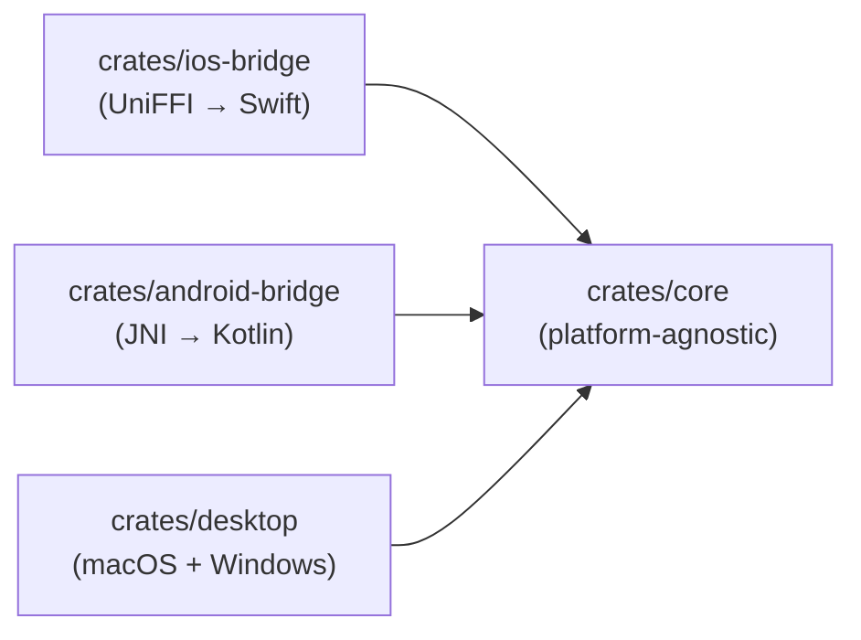

Inside `crates/core` the modules layer downward; higher-level
modules depend on lower-level ones, never vice versa.

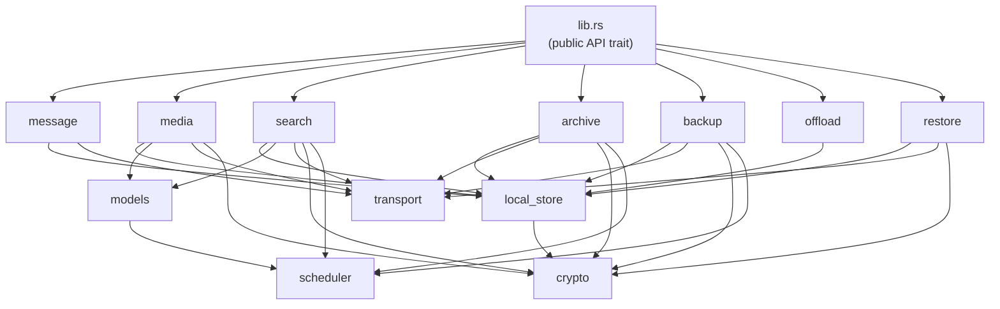

`crypto` is a leaf module: every other module that touches
ciphertext routes through it, and `crypto` itself depends only on
the standard library and chosen primitives.

> **Phase 0 closed; Phase 1 in flight.** The crypto module
> implements `content_hash`, `key_hierarchy`, `aead`, `convergent`,
> and `key_wrap` (AES-256-KW). The platform-specific wrappers
> (Keychain, Android Keystore, DPAPI) and `K_asset` wrapping for
> archive / backup land in Phase 1 / Phase 2 and layer on top of
> the same `wrap_key` / `unwrap_key` primitives.
>
> Phase 1 has additionally landed the `local_store::schema`,
> `local_store::db` (SQLCipher binding + CRUD helpers + the
> conversation-management helpers `list_conversations` /
> `update_conversation_pin` / `update_conversation_mute`),
> `local_store::state_machines`, `message::processor` (validators
> *and* DB-backed `MessagePersister` that now indexes both
> `search_fts` and `search_fuzzy` on every body mutation
> through edit / delete),
> `search::tokenizer`, `search::text_search` (FTS5 BM25 engine),
> `search::query_engine` (unified FTS + fuzzy + structured
> search merged by `message_id` with PROPOSAL.md §7.5 weights),
> and the early-Phase-5 `search::fuzzy_search` (script-aware
> n-gram indexer) modules, plus the expanded `KChatCore`
> public-API trait in `lib.rs` (`SearchQuery`, `SearchScope`,
> `SearchResult`, `HydrationReason`, `BackupReason`,
> `StoragePressureReason`, `ClientMessageId`, `DeliveryCursor`,
> the new placeholder result types `HydratedMessage` /
> `BackupResult` / `OffloadResult` / `RestoreResult` /
> `BackupSource`, and `Error::NotImplemented(&'static str)`)
> and its concrete implementation `core_impl::CoreImpl` wiring
> `send_text` / `ingest_messages` / `search` to the SQLCipher
> store, exposing inherent conversation-management methods
> (`create_conversation` / `list_conversations` /
> `get_conversation` / `update_conversation_pin` /
> `update_conversation_mute`), and stubbing the Phase-2/3/4
> trait methods (`send_media` / `hydrate_message` /
> `run_incremental_backup` / `enforce_storage_budget` /
> `restore_from_backup`) with `Error::NotImplemented`. A
> criterion benchmark suite at
> `crates/core/benches/phase1_benchmarks.rs` enforces the
> < 20 ms / < 150 ms p95 budgets from §13 of
> `docs/PROPOSAL.md`.
>
> Phase 2 has now started filling `crates/core/src/media/`. It
> is no longer a pure placeholder: in addition to the
> tiered-media routing seam under `media/sinks/`
> (`MediaBlobSink` trait + `NoopMediaBlobSink`, see PROPOSAL.md
> §5.7) the module now carries the chunked-media pipeline at
> `media/chunker.rs` (`chunk_and_encrypt`, `verify_and_decrypt`,
> `pad_to_size_class` / `unpad_from_size_class`, the
> `SealedChunk` / `ChunkedMedia` pair, `DEFAULT_CHUNK_SIZE`),
> `media/processor.rs` (`process_media` →
> `MediaProcessResult { descriptor, sealed_chunks, k_asset_raw,
> initial_media_state }` with random `K_asset` generation,
> AES-256-KW wrap, `MediaDescriptor` assembly, and the
> `transition_media_state` / `mark_downloaded` /
> `mark_evicted` / `mark_deleted` helpers that drive the
> `MediaState` machine through `LocalStoreDb::update_media_state`),
> `media/upload.rs` (`upload_chunked_media` / `resume_upload`
> over `TransportClient` with server-side BLAKE3 verification),
> `media/download.rs` (`download_chunked_media` /
> `download_single_chunk` fetching encrypted chunks via
> `TransportClient::fetch_blob_range`, per-chunk SHA-256
> fast-fail, AEAD-open with per-chunk AAD, BLAKE3 root
> verification), `media/cache.rs` (`MediaCache` with O(1)
> insert / `touch` / `remove` and LRU eviction to a
> configurable byte budget), `media/caption.rs`
> (`normalize_caption`, `sanitize_filename`, `validate_mime_type`
> with Unicode NFC normalization, filesystem-illegal-char
> stripping, byte-budget truncation that preserves character
> boundaries, and full multilingual coverage), and
> `media/routing.rs` (`route_media_upload` /
> `route_media_download` dispatching between the KChat backend
> via `TransportClient` and the configured `MediaBlobSink`
> based on `is_thumbnail` and `MediaBlobReference::storage_sink`).
>
> The remaining higher-level modules (`backup`, `restore`,
> `transport`, `scheduler`) are Phase-0 placeholders
> and are filled in across Phases 3 – 7. `transport` is
> partially populated by Phase 1 (`DeliveryClient` /
> `TransportClient` traits, `NoopTransportClient`,
> `MockDeliveryClient`).
>
> The Phase-6 `models` module is no longer a placeholder: it
> hosts the on-device ML seam surface that the platform bridges
> wire actual inference into. See §11 for the full surface, but
> in brief:
> `models::embeddings` (the `TextEmbedder` trait + the
> shared `EmbeddingCache` / `LocalStoreEmbeddingCache` keyed
> `(message_id, model_version)` and the INT8 codec used for
> on-disk storage), `models::embeddings_onnx` (ONNX Runtime
> session lifecycle + EP-selection state machine, gated behind
> `#[cfg(feature = "onnx-runtime")]`), `models::clip` (the
> `ImageEmbedder` trait + MobileCLIP-S2 constants),
> `models::ocr` (the `OcrBridge` trait — platform OCR is the
> Vision / ML Kit / Windows.Media.Ocr backend implementing this
> seam), `models::resource_gate` (battery / thermal / charging /
> network policy with a `ResourceProbe` trait so the host
> platform supplies the live readings), and
> `models::model_manager` (the on-disk artifact lifecycle:
> register / ensure / verify / list / delete plus the
> `ModelDownloader` trait that isolates HTTP from the core).
>
> The Phase 3 modules `archive` and `offload` are no longer
> placeholders: `archive::event_journal` (append-only mutation
> log feeding the segment builder; **wired into
> `MessagePersister`** so every persist / edit / delete path and
> `CoreImpl::send_media` writes a matching `ArchiveEvent` inside
> the existing SAVEPOINT alongside the `BackupEvent`),
> `archive::segment_builder` (CBOR → zstd → XChaCha20-Poly1305
> sealed segments under `K_archive_segment(segment_id)`),
> `archive::manifest_builder` (genesis → gen N chain, BLAKE3 over
> canonical-CBOR signing payload, Ed25519 signature, AEAD-seal
> under `K_archive_manifest`), `archive::upload`
> (`upload_archive_segment` drives the `TransportClient` upload
> sequence and verifies the commit-time ciphertext Merkle root;
> `persist_segment_map_row` records the resulting blob in
> `archive_segment_map`), `archive::prefetch::batch_prefetch_bucket`
> (one transport hop per `(conversation_id, time_bucket)` per
> PROPOSAL §5.6), `archive::prefetch::batch_prefetch_bucket_with_padding`
> (the privacy-aware variant — interleaves UUIDv4 dummy
> segment-ids with the real UUIDv7 ones when
> `KChatCoreConfig::privacy_level == High`),
> `archive::epoch_keys::EpochKeyManager` (current epoch key in
> `Zeroizing<[u8; 32]>` plus a registry of prior epoch keys
> wrapped via AES-256-KW under `K_archive_root` for cross-epoch
> segment decrypt; `rotate(new_epoch_id)` /
> `unwrap_prior_epoch_key` / `delete_epoch_key(epoch_id)` cover
> the lifecycle including forward-secrecy deletion),
> `archive::routing::{route_archive_upload, route_archive_download,
> route_manifest_upload}` (dispatches archive operations to
> either the `TransportClient` or a `ZkofArchiveAdapter` based
> on `KChatCoreConfig::archive_backend`; the ZKOF adapter is
> backed by an `S3Client` trait with a `NoopS3Client` stub),
> `archive::download::{download_archive_segment,
> decrypt_archive_segment, decode_archive_segment_payload,
> fetch_and_decrypt_segment}` (mirrors the inverse of
> `segment_builder` — XChaCha20-Poly1305 open + zstd decompress
> + CBOR decode — and is consumed by
> `CoreImpl::rehydrate_timeline_skeletons` to land archive-only
> stub skeletons on scroll-back),
> `archive::privacy::{should_pad, compute_padding_count,
> generate_dummy_segment_id, pad_with_dummy_requests}`
> (privacy-padding helpers consumed by the prefetch path),
> `local_store::db::update_archive_state` (atomic batch UPDATE
> gated by `ArchiveState::try_transition`),
> `local_store::db::rehydrate_message_body` (in-place body update
> + `body_state` transition + FTS / fuzzy re-indexing inside one
> SAVEPOINT, no `created_at_ms` / `received_at_ms` mutation, so
> the timeline never scroll-jumps when a cold body lands),
> `media::download::rehydrate_media_asset` (reads
> `media_asset.{blob_id, storage_sink, chunk_count, merkle_root,
> wrapped_k_asset}`, unwraps `K_asset` via `K_local_db`, drives
> the chunked download through `TransportClient` or the
> configured `MediaBlobSink` based on `storage_sink`, and flips
> `media_state` to `original_local`), `media::sinks::zk_fabric`
> (`ZkObjectFabricSink` mapping
> `upload_media_chunks` / `fetch_media_chunk` /
> `delete_media_blob` to per-chunk S3 keys
> `media/{asset_id}/chunk-{idx:08}` against a configured bucket;
> `MediaBlobReference::metadata` carries
> `[chunk_count:u32_be][merkle_root:32b][asset_id:utf8]` so the
> rehydration path can re-derive every chunk key without a
> second DB round-trip), and `offload::{budget, scoring, eviction,
> hydration}` (storage budget enforcer, eviction scoring per
> PROPOSAL §5.4 with a `pinned`-row guard returning `f64::MIN`,
> pressure-tier-aware eviction planner / executor including the
> tiered policy `plan_tiered_eviction` (cloud-offload pool first
> → KChat-backend pool only on shortfall), P0..P5 hydration
> priority queue). All of this is wired into `CoreImpl`:
> `enforce_storage_budget` now harvests candidate rows via
> `collect_eviction_candidates` and runs the tiered eviction
> planner / executor in two passes (cloud, then full) with the
> combined `freed_bytes` / `evicted_count` reported back to the
> caller, and `hydrate_message` enqueues every request into a
> `Mutex<HydrationQueue>` with the priority mapped from the
> reason string by `parse_hydration_reason`, calling
> `LocalStoreDb::rehydrate_message_body` for cold text bodies
> and `media::download::rehydrate_media_asset` for evicted /
> remote-only media on the same path. The remote archive fetch
> path (manifest reader / segment download / replay) is queued
> for the next Phase 3 milestone.
>
> The Phase 4 modules `backup` and `restore` are now in tree as
> well: `backup::event_journal::BackupEventJournal` (typed
> `BackupEventType` taxonomy + cursor-based drainage; **wired
> into `MessagePersister`** alongside `ArchiveEventJournal`),
> `backup::segment_builder::BackupSegmentBuilder` (CBOR → zstd →
> XChaCha20-Poly1305 seal under
> `K_backup_segment(K_backup_root, segment_id)` with AAD
> `KCHAT_BACKUP_SEGMENT_V1 || segment_id || merkle_root`, plus
> `decrypt_backup_segment` for the restore path),
> `backup::manifest_builder::build_backup_manifest` (genesis +
> chained generations → BLAKE3 over canonical-CBOR signing
> payload → Ed25519 signature → AEAD-seal under
> `K_backup_manifest` with `device_id` mixed into the AAD for
> device attribution), `backup::compaction` (`CompactionTier`
> daily → weekly → monthly state machine; deterministic
> `CompactionPolicy::plan` buckets segments by
> `(source_tier, week_or_month_bucket)` and applies tombstones
> via `apply_tombstones` so superseded
> `MessageDeleted` / `ConversationDeleted` / `MediaDeleted`
> events do not re-enter the compacted segment),
> `restore::state_machine::{load, save, transition, reset}` (SQL
> helpers for the single-row `restore_state` table, layered
> over the already-defined
> `local_store::state_machines::RestoreState` enum),
> `restore::manifest_verifier::verify_manifest_chain` (walks
> generation 0 → latest, verifies every Ed25519 signature and
> every `previous_manifest_hash` link, surfaces structured
> `EmptyChain` / `SignatureInvalid` / `ChainBreak` /
> `GapDetected` / `GenesisHashNotZero` /
> `HashComputationFailed` failures), and
> `restore::pipeline::RestorePipeline` (skeleton-first
> conversation list → timeline skeletons → search shards
> placeholder → recent bodies → enable lazy media, persisting a
> `RestoreState` transition between every step). All of it is
> bound through `CoreImpl::restore_from_backup`, which now
> drives the persisted state machine end-to-end to terminal
> `FullRestoreComplete` instead of returning
> `Error::NotImplemented`. Phase 3 sink slots also caught up:
> `media::sinks::icloud::ICloudMediaBlobSink` and
> `media::sinks::google_drive::GoogleDriveMediaBlobSink` both
> follow the same `MediaBlobSink` + bridge-trait pattern as
> `media::sinks::zk_fabric::ZkObjectFabricSink`. Outstanding
> Phase-4 scope: Android Auto-Backup / SAF strategy, key
> recovery flows, encrypted search-index shard backup, and the
> multilingual restore corpus.

---

## 3. Four-Store Data Flow

Four logically distinct stores; three interactive on the device,
one non-interactive for disaster recovery. Direction of arrows is
data flow, not request flow.

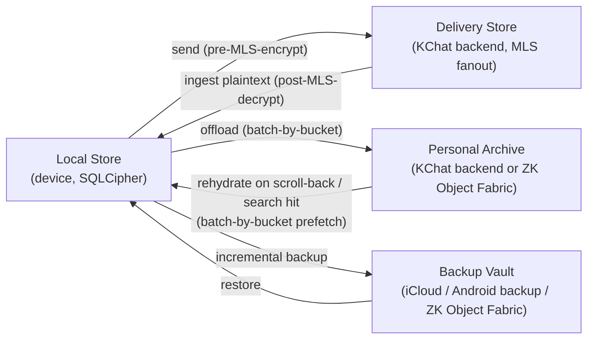

Backup never feeds the archive directly, and the archive never
feeds the backup directly. They are independent pipelines reading
from their own event journals on the local store.

> **Tiered media storage (PROPOSAL.md §5.7).** Media originals may
> route to user cloud storage (iCloud / Google Drive / ZK Object
> Fabric) via the `MediaBlobSink` trait instead of the Personal
> Archive backend. The archive stores only `media_key_delta`
> segments (the `K_asset` wraps) and thumbnails; the originals are
> fetched from the user's configured media sink on tap. Thumbnails
> and archive segments stay on Tier 0; only originals are routed.

---

## 4. Local Store Schema

The schema lives in `crates/core/src/local_store/schema.rs`. The
multilingual FTS5 configuration is the headline element:

```sql
-- Conversations
CREATE TABLE conversation (
    conversation_id   TEXT PRIMARY KEY,
    title_cipher      BLOB,                 -- encrypted with K_local_db
    pinned            INTEGER NOT NULL DEFAULT 0,
    muted             INTEGER NOT NULL DEFAULT 0,
    last_message_id   TEXT,
    last_activity_ms  INTEGER NOT NULL
);

-- Skeletons render the timeline before any body / media is loaded
CREATE TABLE message_skeleton (
    message_id        TEXT PRIMARY KEY,
    conversation_id   TEXT NOT NULL REFERENCES conversation(conversation_id),
    sender_id         TEXT NOT NULL,
    created_at_ms     INTEGER NOT NULL,
    received_at_ms    INTEGER NOT NULL,
    kind              TEXT NOT NULL,
    body_state        TEXT NOT NULL,
    media_state       TEXT,
    archive_state     TEXT NOT NULL DEFAULT 'not_archived',
    backup_state      TEXT NOT NULL DEFAULT 'not_backed_up',
    reply_to          TEXT,
    edited_at_ms      INTEGER,
    deleted_at_ms     INTEGER
);

CREATE TABLE message_body (
    message_id        TEXT PRIMARY KEY REFERENCES message_skeleton(message_id),
    text_content      TEXT,                 -- UTF-8, may mix scripts
    detected_language TEXT,                 -- BCP-47, optional
    rich_meta         BLOB                  -- mentions, link previews (CBOR)
);

CREATE TABLE media_asset (
    asset_id          TEXT PRIMARY KEY,
    message_id        TEXT NOT NULL REFERENCES message_skeleton(message_id),
    mime_type         TEXT NOT NULL,
    bytes_total       INTEGER NOT NULL,
    bytes_local       INTEGER NOT NULL,
    media_state       TEXT NOT NULL,
    wrapped_k_asset   BLOB NOT NULL,
    chunk_count       INTEGER NOT NULL,
    merkle_root       BLOB NOT NULL,
    blob_id           TEXT NOT NULL,
    storage_sink      TEXT NOT NULL DEFAULT 'kchat_backend'  -- PROPOSAL.md §5.7
);

-- Multilingual full-text search
CREATE VIRTUAL TABLE search_fts USING fts5(
    message_id        UNINDEXED,
    conversation_id   UNINDEXED,
    sender_id         UNINDEXED,
    created_at_ms     UNINDEXED,
    text_content,
    tokenize = 'icu'                       -- primary multilingual tokenizer
);

CREATE TABLE search_fuzzy (
    token       TEXT NOT NULL,
    script      TEXT NOT NULL,             -- ISO-15924
    message_id  TEXT NOT NULL,
    PRIMARY KEY (token, script, message_id)
);

CREATE TABLE search_vector (
    message_id    TEXT NOT NULL,
    embedding     BLOB NOT NULL,            -- INT8-quantized
    model_version TEXT NOT NULL,
    PRIMARY KEY (message_id, model_version)
);

CREATE TABLE media_search_index (
    asset_id      TEXT NOT NULL REFERENCES media_asset(asset_id),
    kind          TEXT NOT NULL,            -- 'ocr' | 'caption' | 'transcript' | 'tag'
    text          TEXT NOT NULL,
    language      TEXT,                     -- BCP-47 if detected
    confidence    REAL,
    PRIMARY KEY (asset_id, kind, text)
);

-- Backup pipeline
CREATE TABLE backup_event_journal (
    event_seq     INTEGER PRIMARY KEY AUTOINCREMENT,
    event_type    TEXT NOT NULL,
    payload       BLOB NOT NULL,            -- CBOR
    created_at_ms INTEGER NOT NULL
);

-- Archive pipeline
CREATE TABLE archive_segment_map (
    segment_id           TEXT PRIMARY KEY,
    conversation_id      TEXT NOT NULL,
    time_bucket          TEXT NOT NULL,     -- e.g. '2026-04'
    segment_type         TEXT NOT NULL,
    blob_id              TEXT NOT NULL,
    storage_backend      TEXT NOT NULL DEFAULT 'kchat_backend',  -- PROPOSAL.md §10.1
    merkle_root          BLOB NOT NULL,
    state                TEXT NOT NULL      -- not_archived..archive_compacted
);

-- Restore state machine
CREATE TABLE restore_state (
    id     INTEGER PRIMARY KEY CHECK (id = 1),
    state  TEXT NOT NULL,                  -- identity_restored..full_restore_complete
    notes  TEXT
);
```

The whole database is a SQLCipher database keyed by `K_local_db`,
itself wrapped by the platform Keychain / Keystore.

> **Phase 8 extension.** The `conversation` table gains hierarchy
> columns (`conversation_type`, `scope`, `tenant_id`,
> `community_id`, `domain_id`) and the `archive_segment_map` table
> gains a `tenant_id` column for B2B isolation. See PHASES.md
> Phase 8 and PROPOSAL.md §7.10.

---

## 5. Message State Machine

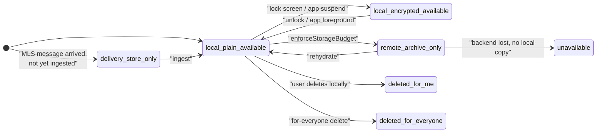

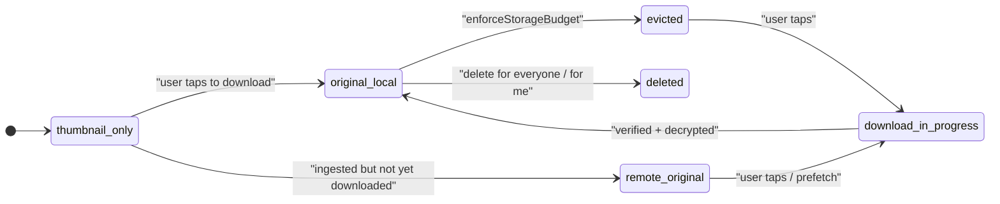

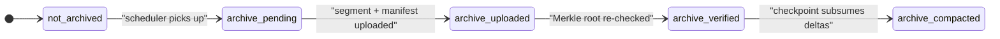

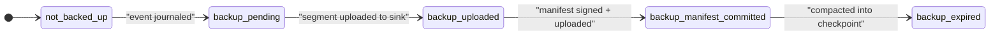

The single-row, global `restore_state` machine owned by
`crates/core/src/local_store/state_machines.rs::RestoreState` and
persisted via `crates/core/src/restore/state_machine.rs`:

```mermaid
stateDiagram-v2
    direction LR
    [*] --> identity_restored : "device key recovered"
    identity_restored --> root_keys_unwrapped : "K_user_master + sub-roots in memory"
    root_keys_unwrapped --> manifest_verified : "manifest chain Ed25519 + hash walk"
    manifest_verified --> skeleton_restored : "conversation list + skeletons reconstructed"
    skeleton_restored --> search_restored : "FTS / fuzzy / vector / media shards reattached"
    search_restored --> recent_messages_restored : "recent bodies hydrated"
    recent_messages_restored --> media_lazy_restore_enabled : "older media downloads on tap"
    media_lazy_restore_enabled --> full_restore_complete : "terminal"
```

Backup segment build / verify pipeline driven by
`crates/core/src/backup/`:

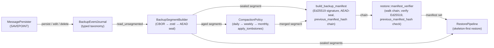

---

## 6. Search Engine Architecture

The search pipeline runs fully on-device. Cold buckets either
arrive as locally cached encrypted shards or are fetched on demand
by coarse bucket; the query string itself never crosses the FFI
boundary as a server request.

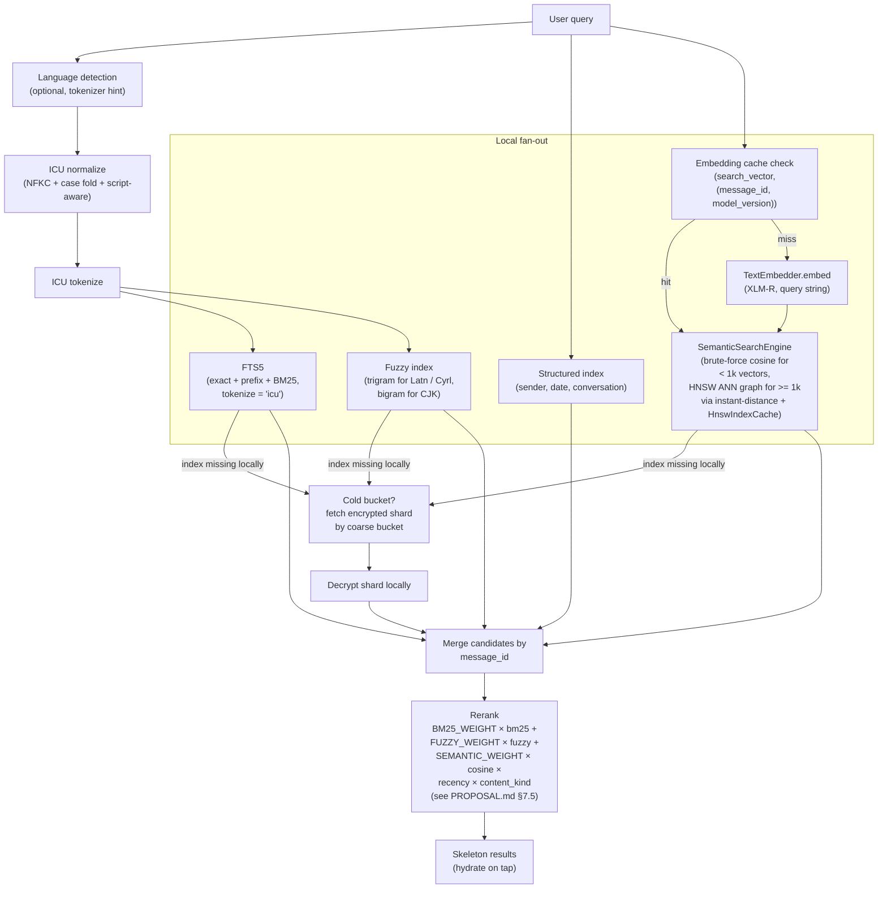

The semantic path is the Phase 6 implementation. The query
string flows through `QueryEngine::execute_search_with_semantic`
which:
1. runs the existing FTS5 + fuzzy fan-out;
2. if a `TextEmbedder` is installed, embeds the query and runs
   `SemanticSearchEngine::search_semantic_auto` which selects
   between the brute-force path (`search_semantic`) and the
   `instant-distance` HNSW ANN path
   (`search_semantic_with_hnsw`) based on
   `HNSW_FALLBACK_THRESHOLD = 1000` rows; built indexes are
   cached per `(conversation_id, model_version)` slot through
   `HnswIndexCache` and invalidated on insert via
   `HnswIndexCache::invalidate`;
3. merges semantic hits into the candidate set, summing
   contributions for rows that hit both surfaces, and stamps
   `SearchResult.semantic_score: Option<f64>` with the **raw
   cosine similarity** for hits that surfaced through the
   semantic path (`None` for FTS / fuzzy-only hits);
4. weights surviving candidates by the recency × content-kind
   factor and re-sorts.

The Phase-6 batch additionally lands a dedicated reranking
entry point: `QueryEngine::rerank_with_semantic` takes a result
set + a query embedding, recomputes cosine similarity for every
result that has a vector in `search_vector`, updates
`semantic_score` in place, adds `sim × SEMANTIC_WEIGHT` to
`rank_score`, and re-sorts by descending `rank_score` then by
descending `created_at_ms` then by `message_id`.
`SearchScope::LocalOnly` is honored — no cold fan-out is
issued during the rerank pass.

The same `media_search_index` table that backs the OCR bridge
also carries the **Phase-6 batch additions**: the
`WhisperTranscriber` seam writes audio MIME results with
`kind = "transcript"` (text + language); the
`DocumentExtractor` seam writes PDF / DOCX page-level extracts
with `kind = "caption"` and `text = "[page {n}] {body}"`.
`media_search_index` rows participate in the same FTS5 search
surface as message bodies, so transcripts and document pages
become directly searchable through `QueryEngine::execute_search`
and the OCR / structured filters. Video MIME types take a
different route: the `VideoKeyframeSampler` seam extracts up to
five keyframes, the first frame is embedded through the
existing `ImageEmbedder` (MobileCLIP-S2), and the resulting
512-dim vector lands in `search_vector` keyed
`(message_id, "mobileclip_s2@v1")` so the row participates in
the semantic-search fan-out alongside still images.

The embedding cache is populated by both the guardrail pipeline
(`kennguy3n/slm-guardrail`) and the search pipeline. A message's
`XLM-R` embedding is computed at most once: whichever pipeline
first observes the message writes the 384-dim vector into the
`search_vector` row keyed by `(message_id, model_version =
'xlmr@v1')`, and the other pipeline reads it back from that row
instead of running its own ONNX inference. See
[`docs/PROPOSAL.md` §7.6.1](./PROPOSAL.md) for the full contract
(version-mismatch handling, locality / non-replication rules)
and [`crate::models::embeddings::EmbeddingCache`] for the trait
that binds the seam. The Phase-6 integration test
`crates/core/tests/phase6_embedding_cache.rs` exercises the
seam (put/get round-trip with INT8-codec cosine fidelity > 0.999,
version-mismatch → `None`, two-instance same-connection
cross-pipeline visibility).

> **Phase 8 extension.** The search pipeline gains multi-scope
> support (`SearchTarget` replacing `conversation_filter`),
> bucket-level date pruning, encrypted bloom filter pre-check,
> on-device shard cache, parallel bucket fetch, and progressive
> result streaming. See PHASES.md Phase 8 and PROPOSAL.md §7.10.

### 6.1 Encrypted shard prefetch

When a query needs a shard that is not in the on-device cache, the
core fetches it from the backend through the
[`search::shard_prefetch`](../crates/core/src/search/shard_prefetch.rs)
module. A naive per-shard `GET /v1/archive/index-shards?...&type=`
leaks `(conversation_hash, bucket, shard_type)` tuples to the
backend. The prefetch module collapses that signal to
`(conversation_hash, bucket)` granularity: every miss issues one
batch call that pulls all four `IndexType` variants
(`Text`, `Fuzzy`, `Vector`, `Media`) for the same time bucket.

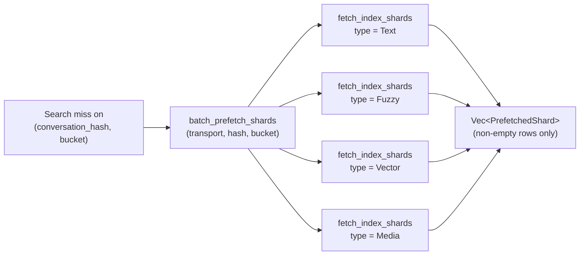

The four type calls run in a deterministic
`[Text, Fuzzy, Vector, Media]` order so the on-the-wire request
sequence does not depend on which shard the local query missed
on. Empty responses are dropped before returning so callers do
not have to deal with sparse vectors.

`batch_prefetch_shards_with_padding` adds a privacy hop on top:
when `KChatCoreConfig::privacy_level` is `High`, it interleaves
real `(conversation_hash, bucket)` requests with dummy
`(conversation_hash, bucket)` pairs minted by
`archive::privacy::generate_dummy_segment_id`. The dummies are
indistinguishable from real shard requests on the wire (same
endpoint, same shape) and silently drop on error, so a network
observer sees a blurred per-bucket access pattern instead of a
sharp per-shard one. Dummy frequency is governed by the same
privacy helpers used for archive-segment prefetch (see §8.4).

The prefetch module is independent of the local query engine: it
returns sealed bytes plus the `IndexType` tag, and it is the
caller's job to decrypt under the appropriate
`K_text_index_shard` / `K_fuzzy_index_shard` /
`K_vector_index_shard` / `K_media_index_shard` derived from
`K_search_root`. This keeps the transport layer ignorant of the
shard payload format.

### 6.2 Cold-shard search pipeline (Phase 5)

Cold-bucket search lives behind the
[`search::query_engine::ColdShardSource`](../crates/core/src/search/query_engine.rs)
trait. The trait is what lets the
[`QueryEngine`](../crates/core/src/search/query_engine.rs) fan out
to offloaded buckets without taking a hard dependency on the
`TransportClient` — the same code path covers production (real
network) and tests (in-process mocks).

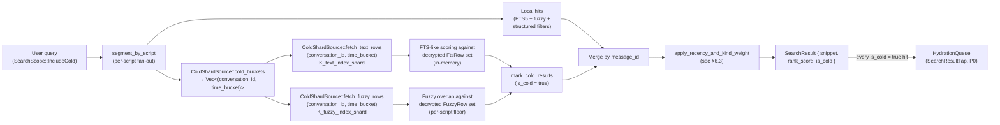

The trait surface is intentionally narrow:

```rust
pub trait ColdShardSource {
    fn cold_buckets(&self) -> Result<Vec<(String, String)>, Error>;
    fn fetch_text_rows(
        &self,
        conversation_id: &str,
        time_bucket: &str,
    ) -> Result<Vec<FtsRow>, Error>;
    fn fetch_fuzzy_rows(
        &self,
        conversation_id: &str,
        time_bucket: &str,
    ) -> Result<Vec<FuzzyRow>, Error>;
}
```

`cold_buckets` is allowed to consult local state (e.g. join
`message_skeleton.body_state` against `archive_segment_map.state`)
to enumerate offloaded `(conversation_id, time_bucket)` pairs.
The two `fetch_*` methods perform the
`TransportClient::fetch_index_shards` call and run the
[`search::shard_builder::restore_text_search_shard`](../crates/core/src/search/shard_builder.rs)
/ `restore_fuzzy_search_shard` decrypt path under the appropriate
`K_text_index_shard` / `K_fuzzy_index_shard` (derived from
`K_search_root`). Implementations return `Ok(Vec::new())` when no
shard exists for the pair — that is a legitimate "no results"
signal, not an error — so the query engine can search without
touching the SQLCipher store.

`QueryEngine::execute_search_with_cold_source` is the entry point
the platform layer calls when `SearchScope::IncludeCold` is set.
It runs the local fan-out first, then asks the source for cold
buckets, decrypts each one, runs FTS5 + fuzzy against the
in-memory shard, marks every cold hit with `is_cold = true`, and
merges with local hits before reranking under the §6.3 formula.
`CoreImpl::search_and_prefetch_cold` in turn enqueues every cold
hit into the `HydrationQueue` at `HydrationReason::SearchResultTap`
(P0) priority so the actual body / media chase the search hit on
tap. End-to-end coverage lives at
[`crates/core/tests/cold_shard_search.rs`](../crates/core/tests/cold_shard_search.rs).

> **Phase 8 optimizations.** The sequential `for (conv, bucket) in
> buckets` loop gains four optimizations: (1) bucket-level date
> pruning skips entire months outside `[date_from, date_to]`,
> (2) bloom filter pre-check eliminates buckets that cannot match
> the query terms, (3) an LRU shard cache eliminates re-fetches
> for recently-searched buckets, and (4) parallel fetch with
> bounded concurrency reduces wall-clock time. See PHASES.md
> Phase 8.

When the backend returns 404 / `Error::Transport` for a shard
(offloaded then garbage-collected), the orchestration layer wraps
the underlying `ColdShardSource` in a graceful-degradation
adapter that swallows the transport error, returns an empty row
vector to the query engine, and records the failed
`(conversation_id, time_bucket, kind)` in a side-channel log so
the platform layer can render a "search results may be
incomplete" banner without losing local hits. The
`search_shard_missing_from_backend_degrades_to_local_only_with_warning_flag`
failure-suite test pins that contract end-to-end (see
`GracefulCold` in
[`crates/core/tests/failure_scenarios.rs`](../crates/core/tests/failure_scenarios.rs)).

### 6.3 Ranking formula (PROPOSAL §7.5)

After the local + cold candidates merge by `message_id`, the
query engine reranks with the multiplicative formula

```
rank_score = (BM25_WEIGHT × bm25 + FUZZY_WEIGHT × fuzzy)
           × recency_factor(age_days)
           × content_kind_weight(kind)
```

implemented in
[`apply_recency_and_kind_weight`](../crates/core/src/search/query_engine.rs).
The constants live in the same module:

| Constant                  | Value | Role                                                    |
| ------------------------- | ----- | ------------------------------------------------------- |
| `BM25_WEIGHT`             | `2.0` | Multiplier on the FTS5 BM25 score                       |
| `FUZZY_WEIGHT`            | `1.0` | Multiplier on the fuzzy overlap score                   |
| `RECENCY_WEIGHT`          | `0.5` | Weight on the exponential term (also `1 - W = 0.5` is the asymptotic floor) |
| `RECENCY_HALF_LIFE_DAYS`  | `30`  | `lambda = ln(2) / 30` — 30-day half-life decay          |
| `TEXT_KIND_WEIGHT`        | `1.0` | Text messages keep their full BM25 + fuzzy contribution |
| `MEDIA_KIND_WEIGHT`       | `0.8` | Media is 0.8× since thumbnails / captions are coarser   |

The recency decay is a linear interpolation between the
asymptotic floor `1 - RECENCY_WEIGHT = 0.5` and an exponential
decay with a 30-day half-life:

```
recency_factor = (1 - RECENCY_WEIGHT)
               + RECENCY_WEIGHT × exp(-ln(2) × age_days / 30)
```

so a message authored today scores at `1.0`, a 30-day-old message
scores at `0.75`, a 90-day-old message at ~`0.5625`, and any
sufficiently-old message asymptotically approaches the
`1 - RECENCY_WEIGHT = 0.5` floor rather than disappearing
entirely. The same decay is applied to cold hits via
`apply_cold_recency_weight`, so local-vs-cold relative ordering
is symmetric — a cold hit on a recent message can still beat a
local hit on an old one if the underlying BM25 / fuzzy
contributions warrant it.

In-module unit tests pin every direction of the formula:
`ranking_recent_message_outranks_identical_old_message`,
`ranking_exact_recent_beats_fuzzy_old`,
`ranking_text_outranks_media_for_equal_recency`, and
`ranking_is_deterministic_for_same_inputs`.

### 6.4 Script-aware fuzzy matching

`FuzzySearchEngine::search_fuzzy` (Phase 5, Task 2) groups query
tokens by `ScriptClass`, joins
`search_fuzzy(token, script, message_id)` on `(token, script)`,
and applies a per-script overlap floor via
[`search::tokenizer::fuzzy_min_overlap`](../crates/core/src/search/tokenizer.rs).
Latin and Cyrillic trigrams use a looser threshold so typos
like `"meetng" → "meeting"` recover; CJK bigrams use a tighter
threshold so two-character collisions across unrelated rows
don't fan out into noise.

Critically, a row is accepted iff at least *one* script bucket
clears its floor. That keeps mixed-script queries —
`"meeting 会議"`, `"встреча meeting"` — fanning out to both
indexes: a row that matches perfectly on the Latin half still
surfaces, just with a lower overall score because the CJK
contribution is zero. The
[`crates/core/tests/mixed_language_query.rs`](../crates/core/tests/mixed_language_query.rs)
suite walks through Latin × CJK, Cyrillic × Latin, pure-CJK on
non-ICU builds via fuzzy fallback, mixed-script promotion, and
unrelated-row exclusion.

---

## 7. Crypto Architecture

Every key derives from `K_user_master` via labelled HKDF-SHA256.
The crypto module knows nothing about messages, media, or search;
it serves AEAD-sealed bytes against typed key handles.

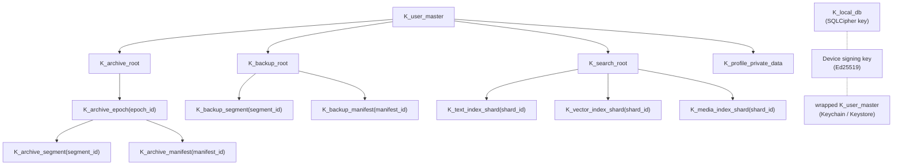

Per-media-object encryption is a separate path with its own
random key:

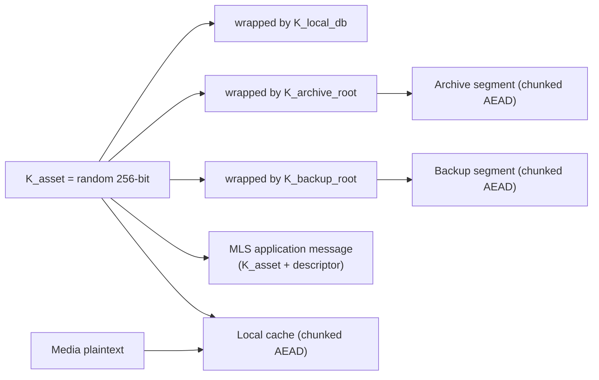

> Phase 3 inserts the `K_archive_epoch(epoch_id)` indirection
> between `K_archive_root` and the per-segment / per-manifest
> keys. `crypto::key_hierarchy` exposes
> `derive_archive_epoch_key`, `derive_archive_segment_key`,
> `derive_archive_manifest_key`, and the AES-256-KW pair
> `wrap_epoch_key` / `unwrap_epoch_key` so the orchestration
> layer can rotate epochs (default cadence: monthly, matching
> `time_bucket`) and still recover prior-epoch segment / manifest
> keys from the wrapped form persisted in the manifest chain.

> **Phase 8 extension.** The key hierarchy gains per-tenant B2B
> isolation:
>
> ```
> K_user_master
>   ├── K_b2c_archive_root              (personal B2C archive)
>   ├── K_b2b_tenant_root(tenant_id)    (per-tenant B2B archive)
>   │     └── K_b2b_archive_epoch(tenant_id, epoch_id)
>   └── K_search_root
>         ├── K_b2c_text_index_shard(shard_id)
>         ├── K_b2b_text_index_shard(tenant_id, shard_id)
>         └── K_bloom_index_shard(shard_id)   ← NEW
> ```
>
> Per-tenant keys allow cryptographic separation of B2B
> organizational data from personal B2C data. See PHASES.md
> Phase 8 and PROPOSAL.md §7.10.

ZK Object Fabric backups use Pattern C, derived deterministically
from the plaintext + tenant ID. The Rust path must produce
bit-identical output to the Go SDK at
`kennguy3n/zk-object-fabric/encryption/client_sdk/`:

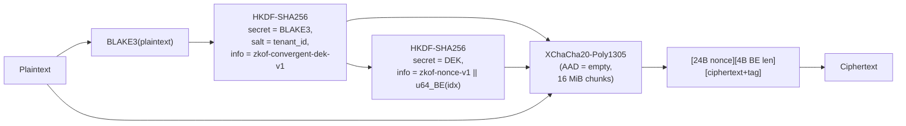

---

## 8. Archive and Offload Architecture

### 8.1 Archive segment build and upload

```mermaid
sequenceDiagram
    participant Core as "Rust core (archive engine)"
    participant Cr as "crypto"
    participant Tr as "transport"
    participant BE as "KChat backend"
    participant ZKOF as "ZK Object Fabric"

    Core->>Core: "read archive event journal since cursor"
    Core->>Core: "group by (conversation_id, time_bucket)"
    Core->>Core: "build CBOR payload, zstd compress"
    Core->>Cr: "AEAD seal with K_archive_segment<br/>(derived from K_archive_epoch)"
    Cr-->>Core: "ciphertext + Merkle root"
    alt "archive_backend = kchat"
        Core->>Tr: "blob init (chunked upload)"
        Tr->>BE: "POST /v1/blobs/init"
        BE-->>Tr: "blob_id"
        Core->>Tr: "upload chunks"
        Tr->>BE: "PUT /v1/blobs/{blob_id}/chunks/{idx}"
        Core->>Tr: "commit blob"
        Tr->>BE: "POST /v1/blobs/{blob_id}/commit"
        BE-->>Tr: "merkle_root"
    else "archive_backend = zkof"
        Core->>Tr: "S3 PutObject (multipart)"
        Tr->>ZKOF: "S3 PutObject (multipart)"
        ZKOF-->>Tr: "ETag + Merkle root"
    end
    Core->>Core: "verify backend Merkle root == local"
    Core->>Cr: "build & seal manifest gen N+1"
    Cr-->>Core: "manifest ciphertext"
    Core->>Tr: "upload manifest"
    Core->>Core: "mark archive_state = archive_verified;<br/>advance cursor"
```

### 8.2 Offload / eviction

```mermaid
sequenceDiagram
    participant Sys as "OS / scheduler"
    participant Off as "offload engine"
    participant DB as "local_store"

    Sys->>Off: "enforceStorageBudget(reason)"
    Off->>DB: "compute storage usage + headroom"
    Off->>DB: "build candidate set<br/>(verified archives, not pinned, not active)"
    Off->>DB: "score each candidate<br/>(see PROPOSAL.md §5.4)"
    loop "until headroom reclaimed"
        Off->>DB: "evict next candidate per priority order"
    end
    Off-->>Sys: "OffloadResult { freed_bytes, evicted_count }"
```

> Phase 3 implementation:
>
> * Storage usage probing and pressure-level computation live in
>   `offload::budget` (`StorageBudget`, `StorageUsage`,
>   `BudgetAssessment`, `PressureLevel::{None, Warning, Critical,
>   Extreme}`, `StorageBudgetEnforcer::assess`).
> * Per-candidate scoring lives in `offload::scoring`
>   (`ContentKind::weight`, 30-day half-life recency decay,
>   16 MiB-normalised size bonus, `compute_eviction_score`).
>   Pinned candidates short-circuit to `f64::NEG_INFINITY`.
> * Plan / execute live in `offload::eviction`. `plan_eviction`
>   filters pinned + not-archived candidates, sorts by score
>   descending, accumulates until `target_bytes`.
>   `plan_eviction_with_pressure` is the pressure-aware variant:
>   originals (video / documents / images / voice) are eligible at
>   `Warning+`, thumbnails at `Critical+`, cold text bodies at
>   `Extreme` only.
>   `execute_eviction` issues the state-machine demotion against
>   `media_asset`.
> * **Tiered eviction policy** (PROPOSAL §5.4 / §5.7): media
>   originals on a user-cloud sink (`storage_sink != "kchat_backend"`)
>   are evicted first because the original is still recoverable
>   from the configured `MediaBlobSink` (cheap rehydration), and
>   only if that pool underruns the byte target does the planner
>   fall through to a second pass over assets whose only remote
>   copy is in the KChat archive.
>   `EvictionTier::{CloudOffload, FullEviction}` classifies each
>   `EvictionCandidate` by its `storage_sink`;
>   `plan_tiered_eviction` partitions the candidate pool, runs
>   `plan_eviction_with_pressure` once per pool, and combines the
>   two `EvictionPlan`s into a `TieredEvictionPlan` with
>   `target_bytes` / `total_bytes` accounting.
> * `offload::hydration::HydrationQueue` drives the rehydration
>   side: a deduplicating priority queue ordered by
>   `HydrationReason` (P0..P5) with FIFO tiebreaker, plus
>   `enqueue_prefetch_window` for viewport adjacency.
> * `CoreImpl::enforce_storage_budget` wires the budget enforcer
>   in: it harvests rows via `collect_eviction_candidates`,
>   runs `plan_tiered_eviction`, and executes the cloud-offload
>   plan and the full-eviction plan in order. The combined
>   `freed_bytes` / `evicted_count` is reported to the caller via
>   `BudgetEnforcementReport`. The end-to-end pipeline is
>   exercised by
>   [`crates/core/tests/storage_budget_enforcement.rs`](../crates/core/tests/storage_budget_enforcement.rs)
>   across every `PressureLevel` and both `EvictionTier` branches.

### 8.3 Rehydration

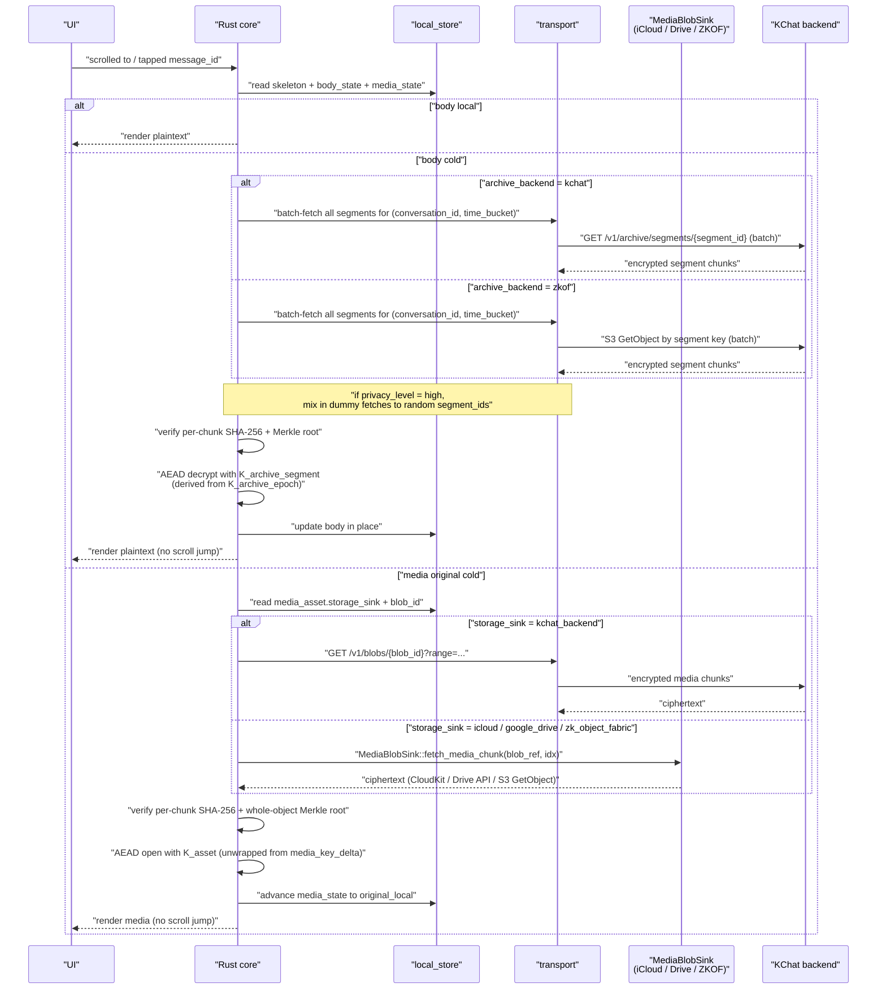

### 8.4 Prefetch window

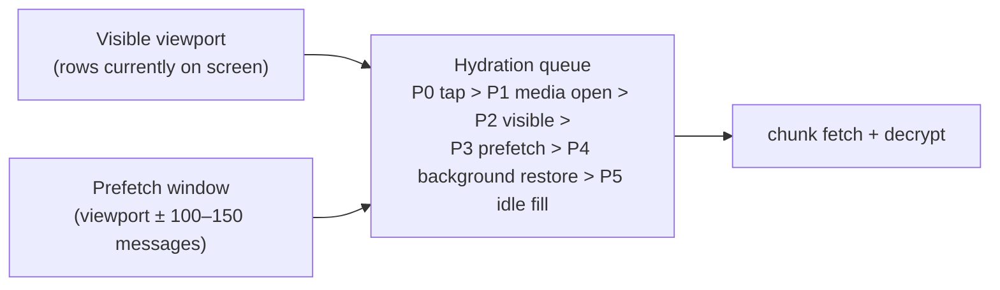

Prefetch granularity is **per time bucket**: when any segment in a
`(conversation_id, time_bucket)` is needed, all segments for that
pair are fetched. This aligns the prefetch unit with the archive
segment grouping and reduces per-segment access-pattern metadata
to per-bucket granularity (see PROPOSAL.md §5.6).

---

## 9. Backup and Restore Architecture

### 9.1 Incremental backup

```mermaid
sequenceDiagram
    participant Sched as "scheduler"
    participant Bk as "backup engine"
    participant Cr as "crypto"
    participant Sink as "sink (iCloud / Auto Backup /<br/>SAF / ZK Object Fabric)"

    Sched->>Bk: "run_incremental_backup(reason)"
    Bk->>Bk: "load last manifest cursor"
    Bk->>Bk: "read backup_event_journal since cursor"
    Bk->>Bk: "group into per-type, per-bucket segments"
    loop "per segment"
        Bk->>Bk: "zstd compress"
        Bk->>Cr: "AEAD seal with K_backup_segment"
        Cr-->>Bk: "ciphertext"
        Bk->>Sink: "upload (resume from prior chunk receipt if any)"
    end
    Bk->>Cr: "build, sign, seal manifest gen N+1"
    Cr-->>Bk: "manifest ciphertext + Ed25519 signature"
    Bk->>Sink: "upload manifest (last)"
    Bk-->>Sched: "BackupResult"
```

### 9.2 Skeleton-first restore

```mermaid
sequenceDiagram
    participant App as "KChat app"
    participant Core as "Rust core (restore engine)"
    participant Sink as "backup sink"
    participant BE as "KChat backend"
    participant UI as "UI"

    App->>Core: "restore_from_backup(source)"
    Core->>BE: "register device"
    Core->>Core: "recover K_user_master<br/>(D2D / recovery key / passphrase)"
    Core->>Sink: "fetch latest manifest"
    Core->>Core: "verify signature + previous_manifest_hash chain"
    Core->>Sink: "fetch conversation list segment"
    Core-->>UI: "skeleton_restored &mdash; render conversation list"
    Core->>Sink: "fetch timeline_skeleton segments"
    Core-->>UI: "skeletons render in each conversation"
    Core->>Sink: "fetch search_index_shard segments"
    Core-->>UI: "search_restored &mdash; search returns hits"
    Core->>Sink: "fetch recent message_body segments"
    Core-->>UI: "recent_messages_restored"
    Core->>Sink: "lazy media (on tap, on prefetch)"
```

### 9.3 Restore state machine

```mermaid
stateDiagram-v2
    direction LR
    [*] --> identity_restored
    identity_restored --> root_keys_unwrapped
    root_keys_unwrapped --> manifest_verified
    manifest_verified --> skeleton_restored
    skeleton_restored --> search_restored
    search_restored --> recent_messages_restored
    recent_messages_restored --> media_lazy_restore_enabled
    media_lazy_restore_enabled --> full_restore_complete
```

### 9.4 Manifest chain verification

```mermaid
flowchart LR
    GenN["manifest gen N<br/>signature OK,<br/>previous_manifest_hash &rarr; gen N-1"]
    GenN1["manifest gen N-1"]
    GenN2["manifest gen N-2"]
    Genesis["genesis hash<br/>(device-attested)"]

    GenN -->|"prev"| GenN1 -->|"prev"| GenN2 -->|"prev"| Genesis
    GenN -->|"break in chain &rArr; alert"| GenN1
```

A break in the chain (a `previous_manifest_hash` mismatch or
signature failure) halts restore and surfaces a recoverable error
to the UI; restore never silently re-roots.

### 9.5 Backup sub-module layout

The Rust modules implementing the diagrams above:

* `crates/core/src/backup/event_journal.rs` — typed
  `BackupEventType` taxonomy, `BackupEvent` row, and
  `BackupEventJournal` with `write_event`, `read_events_since`,
  `read_unsegmented`, `advance_cursor`. The journal is written
  inside the same SAVEPOINT as the matching `archive_event_journal`
  row by `MessagePersister`.
* `crates/core/src/backup/segment_builder.rs` —
  `BackupSegmentBuilder::build_segment` (CBOR encode → zstd
  compress → XChaCha20-Poly1305 seal under `K_backup_segment`)
  and `decrypt_backup_segment` for the inverse path.
* `crates/core/src/backup/manifest_builder.rs` —
  `build_backup_manifest` (genesis → gen-N chain, Ed25519 over
  canonical CBOR, AEAD-seal under `K_backup_manifest` with
  `device_id` mixed into the AAD).
* `crates/core/src/backup/compaction.rs` — `CompactionPolicy::plan`
  drives the daily → weekly → monthly merge; `apply_tombstones`
  drops events superseded by `MessageDeleted` /
  `ConversationDeleted` / `MediaDeleted`. The
  `CoreImpl::compact_backup` orchestration ingests the plan and
  re-seals each merged group.
* `crates/core/src/backup/sinks/mod.rs` — object-safe `BackupSink`
  trait (`upload_backup_segment`, `upload_backup_manifest`,
  `fetch_backup_manifest`, `fetch_backup_segment`,
  `list_backup_manifests`) plus `NoopBackupSink` for tests.
* `crates/core/src/backup/sinks/zk_fabric.rs` — `ZkofBackupSink`
  uploads sealed manifests to `backups/{manifest_id}` and sealed
  segments to `backups/segments/{segment_id}` against a
  configured S3 bucket. Pattern C convergent encryption from
  `crypto::convergent::derive_convergent_dek` keeps the
  ciphertext bit-identical to the Go SDK at
  `kennguy3n/zk-object-fabric/encryption/client_sdk/`.
* `crates/core/src/backup/sinks/icloud.rs` — `ICloudBackupSink`
  wraps an `Arc<dyn ICloudBackupBridge>` exposing
  `upload_file` / `download_file` / `list_files` /
  `delete_file`; the iOS / macOS bridge implements the actual
  CloudKit calls. Manifests map to record name
  `backups/{manifest_id}` and segments to
  `backups/segments/{segment_id}`. `NoopICloudBackupBridge`
  returns `Error::NotImplemented("icloud_backup_bridge")` for
  tests.
* `crates/core/src/backup/sinks/android.rs` — `AndroidBackupSink`
  splits storage by record size: manifest envelopes (under
  Android Auto Backup's 25 MiB cap per record) flow through
  `AndroidBackupBridge::write_auto_backup` /
  `read_auto_backup`; full-size segments flow through
  `write_saf` / `read_saf` (Storage Access Framework, no size
  cap). `list_backup_manifests` filters Auto Backup entries to
  manifests-only so a stale segment URI never surfaces as a
  manifest candidate. `NoopAndroidBackupBridge` stub for tests.

#### 9.5.1 Backup sink architecture

All four backup sinks (`ZkofBackupSink`, `ICloudBackupSink`,
`AndroidBackupSink`, plus the `NoopBackupSink` test stub) share
the same `BackupSink` trait surface so the upper layers
(`run_incremental_backup`, `RestorePipeline`,
`compact_backup`) treat sinks uniformly. The differences between
sinks are confined to two dimensions:

| Sink             | Authentication path                                     | Record / object naming                                    |
| ---------------- | ------------------------------------------------------- | --------------------------------------------------------- |
| `ZkofBackupSink` | ZKOF tenant credentials via `Arc<dyn S3Client>`         | `backups/{manifest_id}` + `backups/segments/{segment_id}` |
| `ICloudBackupSink` | Per-user CloudKit container via `ICloudBackupBridge`   | `backups/{manifest_id}` + `backups/segments/{segment_id}` |
| `AndroidBackupSink` | `BackupAgent` (Auto Backup) + SAF tree URI             | Manifest = Auto Backup entry; segment = SAF blob          |
| `NoopBackupSink` | n/a                                                     | n/a — every method returns `Error::NotImplemented`        |

The naming convention is identical wherever it can be (every
sink that addresses by free-form key uses `backups/...`); the
Android sink is the only one that splits storage by record
size, because that is forced by the platform's 25 MiB Auto
Backup cap.

`CoreImpl` only ever holds a single `Box<dyn BackupSink>` at a
time, but the platform layer can swap sinks at runtime (e.g. a
desktop client first restoring from iCloud, then continuing
with ZKOF). All sinks operate on already-sealed segments and
manifests — they do not see plaintext bytes — so a malicious or
compromised sink cannot leak user content beyond the metadata
already exposed by `(manifest_id, segment_id, byte length)`.

`CoreImpl::run_incremental_backup` is the orchestrator: read
`BackupEventJournal::read_unsegmented` → derive
`K_backup_segment` → build via `BackupSegmentBuilder` → build +
sign manifest → advance cursor.

### 9.6 Restore sub-module layout

* `crates/core/src/restore/state_machine.rs` — persistence
  helpers (`load`, `save`, `transition`, `reset`) for the
  single-row `restore_state` table layered on
  `local_store::state_machines::RestoreState`.
* `crates/core/src/restore/manifest_verifier.rs` —
  `verify_manifest_chain` walks gen 0 → latest, verifies every
  Ed25519 signature, and enforces the
  `previous_manifest_hash == compute_manifest_hash(prev)`
  invariant. Returns structured `EmptyChain` /
  `SignatureInvalid { generation }` /
  `ChainBreak { generation, expected, actual }` /
  `GapDetected { missing_generation }` /
  `GenesisHashNotZero { actual }` /
  `HashComputationFailed { generation }`.
* `crates/core/src/restore/pipeline.rs` — `RestorePipeline`
  drives the priority sequence (conversation list → skeletons
  → search shards → recent bodies → enable lazy media) and
  persists every `RestoreState` transition between steps.
* `crates/core/src/restore/key_recovery.rs` — Phase-4 key
  recovery foundation. Three independent paths share a single
  module so the secret-handling guarantees stay uniform:
  * **Recovery key** — `RecoveryKey` is a 256-bit secret that
    AES-256-KW-wraps `K_user_master` and is rendered as a
    64-character lowercase-hex string for write-down during
    setup. `generate_recovery_key` / `recover_from_key`
    round-trip; wrong / tampered keys fail the AES-KW
    integrity-check value before any further work runs.
  * **Device transfer** — `DeviceTransferEnvelope` is an
    XChaCha20-Poly1305-sealed bundle of
    `(K_user_master, K_archive_root, K_backup_root,
    K_search_root)` under a transfer key derived from a numeric /
    QR transfer code via HKDF-SHA-256.
    `prepare_device_transfer` / `accept_device_transfer`
    round-trip the envelope and validate code length. The
    envelope itself derives `Zeroize` + `ZeroizeOnDrop`, and
    every CBOR / AEAD-opened plaintext flows through
    `Zeroizing<Vec<u8>>` so transfer-time secret material never
    lingers on the heap.
  * **Passphrase** — `PassphraseRecoveryEnvelope { salt,
    wrapped_key, argon2_params }` AES-256-KW-wraps
    `K_user_master` under a 32-byte KEK derived via Argon2id from
    the user's passphrase + a random 16-byte salt.
    `wrap_master_key_with_passphrase` /
    `unwrap_master_key_with_passphrase` use the OWASP-mobile
    parameter triple (`m_cost = 65536`, `t_cost = 3`,
    `p_cost = 1`) by default; the parameters are stored on the
    envelope so a future bump can re-derive against older
    blobs. The unwrap path returns `Zeroizing<[u8; 32]>` and
    surfaces wrong-passphrase / tampered-envelope failures via
    the AES-KW integrity-check value (no oracle on the Argon2
    output itself).
  Server escrow remains OFF by default per
  `docs/PHASES.md §Phase 4`. The three recovery paths are
  designed to be combined: a user can publish a recovery key
  and a passphrase envelope simultaneously, so device loss
  plus passphrase loss does not strand them.

### 9.7 Search-shard sub-module layout

* `crates/core/src/search/shard_builder.rs` — encrypted search
  index shards used for backup / restore.
  `build_text_search_shard` / `build_fuzzy_search_shard` read
  `search_fts` / `search_fuzzy_words` rows for a
  `(conversation_id, time_bucket)` pair, encode through
  `formats::SearchIndexShard` (`IndexType::Text` /
  `IndexType::Fuzzy`), zstd-compress, and AEAD-seal under
  per-shard keys derived from `K_search_root`.
  `restore_text_search_shard` / `restore_fuzzy_search_shard`
  invert the path. Tests cover round-trip, wrong-key, and
  multilingual content (Latin / CJK / Arabic).
* `crates/core/src/search/cold_shard_source.rs` — concrete
  `ColdShardSource` adapter. `TransportColdShardSource` bridges
  a `dyn TransportClient` and a `ShardKeyRegistry`
  (`(conversation_id, time_bucket, IndexType) → KeyMaterial`)
  into the trait by hashing the conversation id under
  `K_conversation_hash`, calling
  `TransportClient::fetch_index_shards`, and decrypting via
  `restore_text_search_shard` / `restore_fuzzy_search_shard`.
  `GracefulCold` wraps any `ColdShardSource` and swallows
  `Error::Transport` / `Error::Storage` so the orchestration
  layer can degrade to local-only results without aborting the
  query (Phase 7 graceful-degradation).
* `CoreImpl::upload_search_shards` — encrypted-shard upload
  pipeline. Takes the FTS / fuzzy rows for a bucket, builds +
  seals through the same `build_*_search_shard` helpers,
  CBOR-encodes the `SearchIndexShard` frame, and ferries it to
  `TransportClient::upload_index_shard`. Returns an
  `UploadedSearchShards` receipt (per-shard `shard_id`,
  `doc_count`, `ciphertext_len`, `ciphertext_sha256`) so
  callers can record the entry in their own search-shard
  ledger.
* `CoreImpl::run_incremental_backup_with_search_shards` —
  Phase-5, Task-1 wrapper that piggy-backs on
  `run_incremental_backup_inner`. Once the backup commits the
  affected `(conversation_id, time_bucket)` rows, the wrapper
  builds + seals fresh text + fuzzy shards under per-shard
  keys derived from `K_search_root`, encodes the
  `SearchIndexShard` frame, and uploads via
  `TransportClient::upload_index_shard`. Existing call sites
  keep using `run_incremental_backup`; new orchestration code
  opts into the shard-aware variant.
* `CoreImpl::fetch_and_restore_cold_shards` — Phase-5, Task-2
  on-device entry point for the cold-search restore path.
  Calls `search::shard_prefetch::batch_prefetch_shards` for a
  bucket, AEAD-opens each `PrefetchedShard` under the
  appropriate per-shard key derived from `K_search_root`, and
  replays the decrypted entries through
  `restore_text_search_shard` /
  `restore_fuzzy_search_shard` so the local FTS5 / fuzzy
  indexes match the cold ones. Returns a structured
  `RestoredShardSummary` with per-type row counts.
* `CoreImpl::hydrate_cold_search_results` — Phase-5, Task-3
  cold-result hydration write-back. After
  `search_and_prefetch_cold` identifies cold hits, the
  routine fetches the archive segment via
  `archive::prefetch::batch_prefetch_bucket`, decrypts under
  the bucket's epoch key, extracts the message body from the
  `KCHAT_ARCHIVE_BODY_PAYLOAD_V1` envelope
  (`crates/core/src/archive/body_payload.rs`), and calls
  `LocalStoreDb::rehydrate_message_body` so `body_state`
  flips from `remote_archive_only` to `local_plain_available`
  and the body is re-indexed into both `search_fts` and
  `search_fuzzy`. Idempotent re-runs are a no-op.

### 9.8 Archive compaction at production scale

* `crates/core/src/archive/compaction.rs` —
  `apply_archive_tombstones` mirrors the backup compaction
  helper but filters `ArchiveEvent` (drops `MessageDeleted` /
  `ConversationDeleted` events themselves and any earlier
  events for tombstoned ids). `ArchiveCompactionResult` carries
  per-bucket counters (`buckets_inspected`, `buckets_compacted`,
  `segments_superseded`, `segments_emitted`, `bytes_before`,
  `bytes_after`).
* `CoreImpl::compact_archive` orchestrates the five-phase
  flow: (A) `SELECT` `archive_verified` segments for the
  `(conversation_id, time_bucket)` pair, (B) decrypt each via
  `ArchiveSegmentRouter` (which dispatches per-row to the
  KChat transport or the ZKOF S3 client), (C) concatenate +
  `apply_archive_tombstones`, (D) re-seal via
  `ArchiveSegmentBuilder::build_segment`, (E) atomically
  transition superseded rows to `archive_compacted` inside a
  SAVEPOINT and emit the new compact segment via the caller's
  upload callback.

---

## 10. Transport Layer

The transport client is a thin async HTTP client that speaks the
KChat backend API. It does not hold any plaintext; every payload
it sends or receives is already AEAD-sealed by the crypto module.

### 10.1 Chunked encrypted blob upload

```mermaid
sequenceDiagram
    participant Core as "core"
    participant Tr as "transport"
    participant BE as "backend"

    Core->>Tr: "init blob (size, blob_class, expected_merkle_root)"
    Tr->>BE: "POST /v1/blobs/init"
    BE-->>Tr: "blob_id, upload_token"
    loop "per chunk"
        Core->>Tr: "upload chunk(idx, ciphertext, sha256)"
        Tr->>BE: "PUT /v1/blobs/{blob_id}/chunks/{idx}"
        BE-->>Tr: "chunk_receipt"
    end
    Core->>Tr: "commit"
    Tr->>BE: "POST /v1/blobs/{blob_id}/commit"
    BE-->>Tr: "computed merkle_root"
    Core->>Core: "verify merkle_root == local"
```

### 10.2 Range download

```mermaid
sequenceDiagram
    participant Core as "core"
    participant Tr as "transport"
    participant BE as "backend"

    Core->>Tr: "fetch blob {blob_id} range [from..to]"
    Tr->>BE: "GET /v1/blobs/{blob_id}?range=from-to"
    BE-->>Tr: "ciphertext bytes"
    Core->>Core: "verify per-chunk AEAD tag + SHA-256"
    Core->>Core: "decrypt with K_archive_segment / K_asset / etc."
```

### 10.3 Archive manifest fetch and segment download

```mermaid
sequenceDiagram
    participant Core as "core"
    participant Tr as "transport"
    participant BE as "backend"

    Core->>Tr: "list archive manifests after_generation = N"
    Tr->>BE: "GET /v1/archive/manifests?after_generation=N"
    BE-->>Tr: "manifest list (encrypted)"
    Core->>Core: "decrypt manifests, walk previous_manifest_hash"
    loop "per needed segment"
        Core->>Tr: "fetch segment {segment_id}"
        Tr->>BE: "GET /v1/archive/segments/{segment_id}"
        BE-->>Tr: "ciphertext"
        Core->>Core: "AEAD decrypt with K_archive_segment"
    end
```

### 10.4 Delivery message fetch (cursor-based)

```mermaid
sequenceDiagram
    participant Core as "core"
    participant Tr as "transport"
    participant BE as "backend"

    Core->>Tr: "ingest_remote_messages(conversation_id, after_cursor)"
    Tr->>BE: "GET /v1/mls/messages?conversation_id=&amp;after_cursor="
    BE-->>Tr: "MLS application messages + new cursor"
    Core->>Core: "MLS-decrypt (KChat MLS layer)"
    Core->>Core: "persist message_skeleton, message_body, media_asset"
    Core->>Core: "bump conversation.last_message_id / last_activity_ms"
    Core->>Core: "write backup + archive events"
    Core->>Core: "update FTS / fuzzy / vector / media indexes"
```

> **Phase 1 transport implementation note.** `transport` is now a
> Phase-1-implemented module (see §2): `core::transport::DeliveryClient`
> is the narrower trait the message-ingest path calls into,
> `RawDeliveryMessage` / `FetchResult` describe the wire shape, and
> `TransportError` flattens provider-specific failures into
> `Network` / `Auth` / `Server`. `CoreImpl::ingest_remote_messages`
> takes a `Box<dyn DeliveryClient>` (installed via
> `with_transport(config, key, client)` or
> `set_delivery_client(client)`), forwards `after_cursor` verbatim,
> converts each `RawDeliveryMessage` into the internal
> `IngestedMessage`, and runs the page through the existing
> `MessagePersister` pipeline so deduplication, FTS / fuzzy
> indexing, and journal writes happen exactly as in the local
> `send_text` path. When no client is configured the trait method
> returns `Err(Error::Transport("no delivery client configured"))`
> so callers fail fast instead of silently no-oping.
>
> The broader **`TransportClient`** trait (also in
> `core::transport`) carries the full §10 surface that Phases
> 2–4 will share: `fetch_messages` (cursor-paginated, returning
> `FetchMessagesResponse`), `init_blob_upload` /
> `upload_chunk` / `commit_blob` (chunked upload with
> whole-object Merkle verification through
> `BlobUploadHandle` / `ChunkReceipt` /
> `CommitBlobResponse`), `fetch_blob_range` (range
> download for resumable hydration), `fetch_archive_manifests`
> (returning `EncryptedManifest` so the manifest chain stays
> AEAD-sealed end-to-end), `fetch_archive_segment`, and
> `fetch_index_shards`. The `BlobClass` enum
> (`Media`, `ArchiveSegment`, `SearchIndexShard`,
> `BackupSegment`, `Manifest`) is shared between the
> per-chunk AAD constructed by `crypto::aead` and the
> `init_blob_upload` argument so the wire-level AAD and the
> upload-control message cannot disagree about what the blob
> is. `NoopTransportClient` returns
> `Error::NotImplemented("transport")` from every method —
> it is what `CoreImpl` builds against today, and the
> Phase-2+ HTTP / gRPC implementation drops in by replacing
> the noop without changing any of the calling code.

> **Conversation-metadata auto-update.** Both message-receive paths
> (`MessagePersister::persist_ingested_message` for transport-driven
> ingest and `MessagePersister::persist_outbox_entry` for the local
> `send_text` flow) call
> `LocalStoreDb::update_conversation_last_message(conversation_id,
> message_id, created_at_ms)` from inside the same `SAVEPOINT` that
> writes the skeleton + body + FTS row + journal entry. The
> conversation row's `last_message_id` and `last_activity_ms` columns
> therefore stay in lock-step with the message timeline atomically:
> `KChatCore::list_conversations` re-orders to reflect the latest
> activity without any additional call from the binding layer, and a
> mid-ingest crash cannot leave the conversation row pointing at a
> message that does not exist.

---

## 11. Platform Integration

### 11.1 iOS

| Concern                    | API / Mechanism                                                                                              |
| -------------------------- | ------------------------------------------------------------------------------------------------------------ |
| FFI binding                | UniFFI &rarr; generated Swift package consumed by KChat.app and any iOS extensions sharing the local store   |
| Keys                       | Keychain (`kSecAttrAccessibleAfterFirstUnlockThisDeviceOnly`); biometric-protected key for higher-tier ops   |
| Background work            | `BGTaskScheduler` (`BGProcessingTask` for backup / archive / index maintenance)                              |
| OCR                        | `VNRecognizeTextRequest` (multilingual; 18+ languages supported in current iOS)                              |
| ML inference               | Core ML (preferred) or ONNX Runtime CoreML EP                                                                |
| Audio transcription        | Apple MLX (`mlx-community/whisper-base-mlx`, preferred on Apple Silicon — routes to the Neural Engine) or ONNX Runtime fallback |
| Model warm-up              | XLM-R session created in `BGProcessingTask` during first idle after launch                                   |
| iCloud backup              | App's iCloud container file storage for encrypted backup files                                               |
| Audio session              | Foreground for live recording; background-friendly transcription via Whisper-tiny / Whisper-base             |

### 11.2 Android

| Concern                    | API / Mechanism                                                                                              |
| -------------------------- | ------------------------------------------------------------------------------------------------------------ |
| FFI binding                | JNI &rarr; idiomatic Kotlin façade in `crates/android-bridge`                                                |
| Keys                       | Android Keystore (StrongBox if available); biometric gate via `BiometricPrompt` when configured              |
| Background work            | `WorkManager` (constraints: charging, unmetered network, thermal-headroom)                                   |
| OCR                        | ML Kit Text Recognition v2 (multilingual; 50+ languages including CJK)                                       |
| ML inference               | ONNX Runtime NNAPI EP, fallback to CPU EP                                                                    |
| Model warm-up              | XLM-R session created in `WorkManager` job during first idle                                                 |
| Auto Backup                | `BackupAgent` storing recovery envelopes + manifest pointers under the 25 MB cap                             |
| Large Backup               | Large Backups API where available                                                                            |
| Storage Access Framework   | User-selected cloud / document provider for large encrypted backup files                                     |

### 11.3 macOS

| Concern                    | API / Mechanism                                                                                              |
| -------------------------- | ------------------------------------------------------------------------------------------------------------ |
| FFI binding                | Native Rust (no FFI bridge needed)                                                                           |
| Keys                       | Keychain                                                                                                     |
| Background work            | `NSBackgroundActivityScheduler` + cooperative scheduler                                                      |
| OCR                        | `VNRecognizeTextRequest` (Vision)                                                                            |
| ML inference               | Core ML or ONNX Runtime CoreML EP                                                                            |
| Audio transcription        | Apple MLX (`mlx-community/whisper-base-mlx`, preferred on Apple Silicon — routes to the Neural Engine); ONNX Runtime CPU EP fallback on Intel Macs |
| Model warm-up              | XLM-R session created eagerly at startup; kept resident                                                      |
| Search integration         | Optional Spotlight integration for app-internal search anchors                                               |

### 11.4 Windows

| Concern                    | API / Mechanism                                                                                              |
| -------------------------- | ------------------------------------------------------------------------------------------------------------ |
| FFI binding                | Native Rust                                                                                                  |
| Keys                       | DPAPI (`CryptProtectData`) bound to the user profile; TPM-backed via `NCryptCreatePersistedKey` if available |
| Background work            | Background Tasks / Task Scheduler integration                                                                |
| OCR                        | `Windows.Media.Ocr` (multilingual where the Language Pack is installed); Tesseract fallback                  |
| ML inference               | ONNX Runtime DirectML EP (preferred, when GPU available) or CPU EP (fallback); INT8/INT4 quantized models essential |
| Model warm-up              | XLM-R session created eagerly at startup; kept resident                                                      |
| Search integration         | Optional Windows Search integration for app-internal anchors                                                 |

> The DirectML EP is best-effort: session creation attempts
> DirectML first, and falls back to CPU EP if DirectML
> initialization fails (e.g., no compatible GPU, driver issues).
> This mirrors the cv-guard `OnnxInferenceBridge` pattern
> (`kennguy3n/cv-guard`,
> `desktop/native/windows/Sources/CVGuardAddon/OnnxInferenceBridge.cpp`).
> The Rust scaffold lives in
> `crates/core/src/models/embeddings_onnx.rs` (XLM-R) and
> `crates/core/src/models/clip.rs` (MobileCLIP-S2). The
> EP-selection state machine is factored as a pure function over
> a `DirectMlProbe` trait so it can be exhaustively unit-tested
> on non-Windows hosts.

### 11.5 ML seams: `TextEmbedder` / `ImageEmbedder` / `OcrBridge`

The Phase 6 model surface is intentionally a set of thin
object-safe traits in `crates/core/src/models/` that the
platform bridges implement. The Rust core never owns an HTTP
client, never decodes images on its own, and never calls into
Vision / ML Kit / Windows.Media.Ocr directly.

* `models::embeddings::TextEmbedder` — `fn embed(&self, text:
  &str) -> Result<Vec<f32>>`. The `NoopTextEmbedder` returns
  `Error::NotImplemented("text_embedder")`; the
  `MockTextEmbedder` returns deterministic INT8-quantizable
  vectors for tests; the ONNX-backed implementation lives behind
  `#[cfg(feature = "onnx-runtime")]` in `embeddings_onnx.rs` and
  pipes `tokenize → pad/truncate → session.run → mean-pool →
  L2-normalize`. Installed on the core via
  `CoreImpl::install_text_embedder`.
* `models::clip::ImageEmbedder` — `fn embed_image(&self, bytes:
  &[u8], mime: &str) -> Result<Vec<f32>>`. Same shape as
  `TextEmbedder`; `Noop` / `Mock` plus an ONNX-gated
  implementation that runs `decode → resize 224×224 → RGB
  NCHW → ImageNet-normalize → session.run → L2-normalize`.
  Installed via `CoreImpl::install_image_embedder`.
* `models::ocr::OcrBridge` — `fn recognize_text(&self, bytes:
  &[u8], mime: &str) -> Result<Vec<OcrResult>>` returning text
  + language + confidence + optional bounding box. Platform
  implementations are `VNRecognizeTextRequest` (iOS / macOS), ML
  Kit Text Recognition v2 (Android), `Windows.Media.Ocr` /
  Tesseract (Windows). Installed via
  `CoreImpl::install_ocr_bridge`.

All three traits are `Send + Sync` and object-safe so they live
behind a `Mutex<Option<Box<dyn …>>>` (or `Arc` for `OcrBridge` /
`ResourceProbe`) on `CoreImpl`. This lets the bridge crates swap
in a real implementation without recompiling the core, and keeps
the test surface small (mock ↔ real swap is a one-line install).

### 11.6 `ModelManager` lifecycle

`crates/core/src/models/model_manager.rs` owns the on-disk
artifact lifecycle, but **not** the download itself.

```
ModelManager::ensure(model_id, version) ──┐
   ├─ artifact already on disk?  → return cached  ModelArtifact
   ├─ otherwise → ModelDownloader::download_model(...) → register
   └─ verify_integrity (SHA-256) before handing back to the caller
```

Surface: `register_model`, `ensure_model`, `verify_integrity`,
`list_models`, `delete_model`, `select_quantization(model_id,
storage)` (returns `Quantization::Int4` on tight cache budgets,
`Int8` otherwise). `ModelDownloader` is the
`Send + Sync` HTTP seam; `NoopModelDownloader` returns
`Error::NotImplemented("model_downloader")`. The bridge crates
ship the real downloader so the core stays free of TLS / cert
plumbing.

### 11.7 `ResourceGate` policy

`crates/core/src/models/resource_gate.rs` keeps the on-device
"is it OK to run this work right now?" decision as pure logic:

```
DeviceResources { battery_level, is_charging, thermal_state, network_type }
      │
      ▼
ResourcePolicy { min_battery, require_charging_for_heavy,
                 max_thermal, require_wifi_for_download }
      │
      ▼
ResourceGate::should_run_embedding   (cheap, runs at moderate battery)
ResourceGate::should_run_ocr         (medium, gated on thermal headroom)
ResourceGate::should_run_transcription (expensive, strictest gate)
ResourceGate::should_download_model  (gated on Wi-Fi by default)
```

Live readings come from a `ResourceProbe` trait the platform
implements; `NoopResourceProbe` returns an "all-clear"
`DeviceResources` so unit tests don't have to fake battery
readings. Installed via `CoreImpl::install_resource_probe`.

### 11.8 Semantic search pipeline

The on-device semantic path runs entirely inside the Rust core
once a `TextEmbedder` is installed:

```
QueryEngine::execute_search_with_semantic
   ├─ run existing FTS5 + fuzzy fan-out (BM25 + fuzzy scores per row)
   ├─ if a TextEmbedder is installed AND the query is non-empty:
   │     ├─ embed the query string → q_vec
   │     ├─ SemanticSearchEngine::search_semantic(q_vec, conv_filter, top_k)
   │     │     └─ brute-force cosine over `search_vector` rows
   │     │        for the conversation; INT8 codec is decoded via
   │     │        `dequantize_int8`
   │     ├─ merge into the candidate set keyed by message_id
   │     └─ for rows that hit BOTH surfaces:
   │           combined = BM25_WEIGHT  * bm25
   │                    + FUZZY_WEIGHT * fuzzy
   │                    + SEMANTIC_WEIGHT * cosine
   ├─ apply recency × content-kind weighting to semantic-only hits
   └─ re-sort and truncate
```

`BM25_WEIGHT = 2.0`, `FUZZY_WEIGHT = 1.0`,
`SEMANTIC_WEIGHT = 1.5` per PROPOSAL §7.5. The path is a strict
opt-in: with no embedder installed, `execute_search_with_semantic`
falls back to the existing FTS5 + fuzzy result set so a missing
model never breaks the search surface. The cross-pipeline
`EmbeddingCache` (PROPOSAL §7.6.1) is what keeps inference work
out of the hot path: a guardrail-pipeline write on the same
`(message_id, "xlmr@v1")` key is read straight back by the
search pipeline without re-embedding.

The HNSW upgrade lands in batch-5 (2026-05-04). Brute-force
cosine remains the implementation for slots smaller than
`HNSW_FALLBACK_THRESHOLD = 1000` rows where it is still cheaper
than building an ANN graph; for larger slots
`SemanticSearchEngine::search_semantic_auto` builds an
`instant-distance` HNSW graph lazily on the first query and
caches it in `HnswIndexCache` keyed by
`(conversation_id, model_version)`. Inserts call
`HnswIndexCache::invalidate(slot)` so the next query rebuilds
the graph. The HNSW path returns `Vec<SemanticHit>` with the
same `cosine_similarity` shape as the brute-force path, so the
public API contract is unchanged.

### 11.9 ML seams (continued): `WhisperTranscriber` / `DocumentExtractor` / `VideoKeyframeSampler`

Three additional Phase-6 inference seams round out the
multilingual media-search surface. All three follow the exact
shape of §11.5 — object-safe `Send + Sync + Debug` traits in
`crates/core/src/models/`, with a `Noop*` returning
`Error::NotImplemented` and a `Mock*` returning a deterministic
BLAKE3-derived result for tests, plus an
`install_*` / `has_*` pair on `CoreImpl`.

* `models::whisper::WhisperTranscriber` — `fn transcribe(&self,
  audio_data: &[u8], mime_type: &str) ->
  Result<TranscriptionResult>` where
  `TranscriptionResult { text, language: Option<String>,
  segments: Vec<TranscriptionSegment> }` and
  `TranscriptionSegment { start_ms, end_ms, text }`.
  `select_whisper_backend` (Apple MLX
  `whisper-base-mlx` on Apple Silicon, ONNX Runtime
  `whisper-base` ~140 MB INT8 elsewhere, `whisper-tiny` ~75 MB
  on low-end Android) lives next to the trait. Wired into
  `CoreImpl::send_media`: when `mime_type.starts_with("audio/")`
  and a transcriber is installed, the result lands in
  `media_search_index` keyed `(asset_id, "transcript")`.
  Best-effort.
* `models::document::DocumentExtractor` — `fn extract_text(&self,
  data: &[u8], mime_type: &str) -> Result<Vec<DocumentPage>>`
  where `DocumentPage { page_number, text, language }`. Wired
  into `CoreImpl::send_media`: when `mime_type` is
  `application/pdf` or
  `application/vnd.openxmlformats-officedocument.wordprocessingml.document`
  and an extractor is installed, each page lands in
  `media_search_index` keyed `(asset_id, "caption")` with
  `text = "[page {n}] {body}"`. Best-effort.
* `models::video::VideoKeyframeSampler` — `fn extract_keyframes(&self,
  video_data: &[u8], mime_type: &str, max_frames: usize) ->
  Result<Vec<Keyframe>>` where
  `Keyframe { timestamp_ms, image_data, mime_type }`. Wired
  into `CoreImpl::send_media`: when `mime_type.starts_with("video/")`
  and both a sampler and an `ImageEmbedder` are installed, up
  to five keyframes are extracted; the first frame is embedded
  through the existing MobileCLIP-S2 seam and the resulting
  512-dim vector lands in `search_vector` keyed
  `(message_id, "mobileclip_s2@v1")` so videos participate in
  the same semantic-search fan-out as still images.
  Best-effort.

All three paths absorb inference failures (logged, never
propagated) — the same contract as `maybe_embed_text_message` /
`maybe_embed_image_message`. `media_search_index` is the
shared text-search surface for transcripts, document pages, and
OCR; `search_vector` is the shared vector surface for image and
video embeddings.

### 11.10 Quantization selection: INT4 vs INT8

`crates/core/src/models/model_manager.rs::select_quantization`
returns `Quantization::Int4` whenever
`available_storage_bytes < TIGHT_STORAGE_THRESHOLD_BYTES`
(512 MiB), else `Quantization::Int8`. `ModelArtifactSpec`
defines four compile-time constants — `XLMR_INT8_ARTIFACT`,
`XLMR_INT4_ARTIFACT`, `MOBILECLIP_S2_INT8_ARTIFACT`,
`MOBILECLIP_S2_INT4_ARTIFACT` — pinning the expected ONNX
filenames so artifact integrity check + on-disk lookup stay
deterministic across platform builds.
`ModelManager::resolve_artifact(model_id, quant)` maps the
`(model, quantization)` pair to the right `ModelArtifactSpec`
so `ensure_model` can pick the right file at lazy-download
time. `embeddings_onnx::create_xlmr_session_int4` and
`clip::create_mobileclip_session_int4` configure the ONNX
session with `MatMulNBits` optimization behind
`#[cfg(feature = "onnx-runtime")]`; without the feature both
helpers return `Error::NotImplemented`. The
`INT4`-vs-`INT8` cosine-correlation benchmark using the
multilingual relevance regression suite is queued for the
platform-bridge follow-up.

### 11.11 Phase-7 seams: `OfflineDetector` and `PerfCollector`

Two object-safe traits in the Phase-7 layer round out the
runtime-policy surface. Both follow the §11.5 contract
(`Send + Sync + Debug`, object-safe, `install_*` / `has_*` on
`CoreImpl`).

* `transport::offline::OfflineDetector` — `fn is_online(&self)
  -> bool`. Implementations: `NoopOfflineDetector` (always
  online — fail-open), `AlwaysOfflineDetector` (always
  offline, for tests), `ToggleOfflineDetector` (mid-test
  flip). Wired into `CoreImpl` via
  `install_offline_detector` / `is_online`.
  `CoreImpl::run_incremental_backup` short-circuits with
  `BackupResult.deferred = true` when offline (no segment is
  built; no upload is attempted) and produces a non-deferred
  result on the next call once the detector reports online.
  `CoreImpl::hydrate_message` short-circuits with
  `HydratedMessage { is_cold: true, offline: true,
  text_content: None }` when the body is `RemoteArchiveOnly`
  and the device is offline. Both paths are exercised by
  `tests/failure_scenarios.rs::offline_during_backup_*` and
  `tests/failure_scenarios.rs::offline_during_hydration_*`.
* `perf::PerfCollector` — `fn record(&self, trace: PerfTrace)`.
  `PerfTrace { operation: String, start_ns: u64, end_ns: u64,
  metadata: HashMap<String, String> }`. Implementations:
  `NoopPerfCollector` (discards), `InMemoryPerfCollector`
  (`Mutex<Vec<PerfTrace>>` for tests). Wired into `CoreImpl`
  via `install_perf_collector` / `has_perf_collector` /
  `collect_perf_stats`. Hot paths `ingest_messages`, `search`,
  and `enforce_storage_budget` emit traces with operation-
  specific metadata: input batch size + new / duplicate
  counts; query length + scope + result count; pressure level
  + freed bytes + evicted count. Every code path — success,
  error, offline / no-pressure short-circuit — closes the
  trace before returning.

### 11.12 Phase-7 batch-5 seams: `ExecutionProviderSelector`, `InProcessScheduler`, `MediaMigration`, `DedupAnalytics`, desktop crate

The 2026-05-04 batch-5 push lands four additional Phase-7
seams on `CoreImpl` plus a platform-agnostic `crates/desktop`
trait scaffold. All four follow the §11.5 contract
(`Send + Sync + Debug`, object-safe where appropriate,
`install_*` / `has_*` on `CoreImpl`).

* `models::ep_tuning::ExecutionProviderSelector` — pure-data
  EP-selection state machine. `select_ep(platform,
  device_capabilities) -> ExecutionProvider` returns the
  preferred EP for `(macOS, iOS) → CoreMl`,
  `Android → Nnapi`, `Windows + GPU → DirectMl`,
  `Linux → Cpu`, with an explicit CPU fallback for every
  platform. `EpBenchmark { ep, latency_ms, batch_size }` lets
  the selector record runtime measurements so future selection
  can lean on observed performance. The `DesktopMlEpSelector`
  in `crates/desktop/src/ml_ep.rs` forwards to this selector
  with the desktop platform pinned.
* `scheduler::in_process::InProcessScheduler` — Rust-native
  scheduler that runs scheduled tasks on a background thread
  pool implementing the `BackgroundScheduler` trait. Public
  surface: `schedule_backup`, `schedule_archive_compaction`,
  `schedule_index_maintenance`,
  `schedule_media_cache_eviction`, `cancel_all`,
  `is_task_pending(task_type)`. Task deduplication ensures the
  same task type is never scheduled twice. `Drop` cancels
  every pending task, so a graceful shutdown leaks no
  background work.
* `media::migration::{MediaMigrationPlan, MediaMigrationItem,
  MigrationProgress, plan_media_migration,
  execute_media_migration}` — cross-platform media-blob
  migration. `plan_media_migration(db, source_sink,
  target_sink)` reads `media_asset` rows where
  `storage_sink = source_sink` into a plan; the executor
  fetches each chunk from the source sink, uploads to the
  target sink, verifies the BLAKE3 transit hash, and rewrites
  `media_asset.storage_sink` plus `MediaDescriptor.storage_sink`
  in a single SAVEPOINT. Optional `delete_source_after_success`
  drains the source sink in idempotent re-runs. The
  `MigrationProgress` callback trait reports per-item /
  per-byte progress to UI surfaces. Wired into `CoreImpl`
  via `plan_media_migration` / `migrate_media_sink`.
* `transport::dedup_analytics::DedupAnalytics` — read-only
  telemetry trait surfaced over the ZK Object Fabric
  ContentIndex.
  `query_dedup_ratio(tenant_id) -> Result<DedupStats>` returns
  `DedupStats { total_objects, unique_objects,
  dedup_ratio_percent, total_bytes, unique_bytes }`;
  `query_storage_savings(tenant_id) -> Result<StorageSavings>`
  returns `StorageSavings { bytes_saved, objects_deduped,
  last_updated_ms }`. `NoopDedupAnalytics` returns
  `Error::NotImplemented("dedup_analytics")`;
  `FixedDedupAnalytics` is the unit-test test double. Privacy
  contract: only opaque ciphertext-side metrics cross the
  boundary — never plaintext, never derived plaintext such as
  tokens or embeddings. Wired into `CoreImpl` via
  `install_dedup_analytics` / `query_dedup_stats` /
  `query_storage_savings`.

The `crates/desktop/` crate gains a platform-agnostic batch-5
trait scaffold alongside the existing
`#[cfg(target_os = …)]`-gated `macos.rs` / `windows.rs`
modules:

* `crates/desktop/src/spotlight.rs` — `SpotlightAnchor` trait
  + `NoopSpotlightAnchor`. Object-safe `Send + Sync + Debug`
  surface for index / deindex / search-anchor calls into
  Spotlight on macOS.
* `crates/desktop/src/windows_search.rs` —
  `WindowsSearchAnchor` trait + `NoopWindowsSearchAnchor`.
  Mirrors the Spotlight surface for the Windows Search
  protocol handler.
* `crates/desktop/src/background.rs` — `DesktopScheduler`
  trait + `NoopDesktopScheduler` implementing the
  `BackgroundScheduler` trait from
  `crates/core/src/scheduler/mod.rs` so the desktop bridge
  can plug straight into `CoreImpl::install_scheduler`.
* `crates/desktop/src/ml_ep.rs` — `DesktopMlEpSelector` that
  forwards to `kchat_core::models::ep_tuning::ExecutionProviderSelector`
  with the desktop platform pinned, plus a `DirectMl`
  vs `CoreMl` vs `Cpu` fallback ladder.

---

## 12. Data Flow Diagrams

### 12.1 Message receive

```mermaid
flowchart LR
    MLS["MLS<br/>application message"]
    Decrypt["KChat MLS layer<br/>decrypt"]
    Persist["local_store:<br/>insert skeleton, body, media_asset"]
    Index["search:<br/>FTS / fuzzy / vector / media index"]
    ArchEvt["archive:<br/>write archive event"]
    BkEvt["backup:<br/>write backup event"]

    MLS --> Decrypt --> Persist
    Persist --> Index
    Persist --> ArchEvt
    Persist --> BkEvt
```

### 12.2 Message send

```mermaid
flowchart LR
    Compose["UI compose"]
    Outbox["message:<br/>persist to outbox<br/>(local_plain_available)"]
    Index["search:<br/>index outgoing message"]
    MLS["KChat MLS layer<br/>encrypt"]
    Send["transport:<br/>POST /v1/mls/messages"]
    Confirm["delivery confirm"]
    ArchEvt["archive event"]
    BkEvt["backup event"]

    Compose --> Outbox --> Index
    Outbox --> MLS --> Send --> Confirm
    Confirm --> ArchEvt
    Confirm --> BkEvt
```

### 12.3 Media receive

```mermaid
flowchart LR
    Msg["MLS message<br/>(K_asset + descriptor)"]
    Thumb["fetch thumbnail blob"]
    Decrypt["AEAD decrypt with K_asset"]
    Persist["local_store:<br/>media_asset (thumbnail_only),<br/>wrapped K_asset"]
    BG["background:<br/>OCR + image embedding +<br/>(if video) keyframe + Whisper transcript"]
    MIndex["media_search_index +<br/>search_vector"]

    Msg --> Thumb --> Decrypt --> Persist --> BG --> MIndex
```

### 12.4 Search

```mermaid
flowchart LR
    Q["query"]
    Local["local fan-out<br/>(FTS5 + fuzzy + HNSW + structured)"]
    Cold["cold buckets?<br/>fetch encrypted index shard"]
    Decrypt["decrypt shard locally"]
    Merge["merge + rerank"]
    Tap["user taps result"]
    Hyd["hydrate body / media if cold"]

    Q --> Local
    Local --> Cold --> Decrypt --> Merge
    Local --> Merge
    Merge --> Tap --> Hyd
```

### 12.5 Backup

```mermaid
flowchart LR
    Sched["scheduler trigger<br/>(BGTask / WorkManager / app launch)"]
    Journal["read backup_event_journal"]
    Build["build per-segment CBOR payload"]
    Compress["zstd compress"]
    Seal["AEAD seal with K_backup_segment"]
    Upload["upload to selected sink"]
    Manifest["build, sign, seal manifest gen N+1"]
    Commit["mark events included; advance cursor"]

    Sched --> Journal --> Build --> Compress --> Seal --> Upload --> Manifest --> Commit
```

### 12.6 Restore

```mermaid
flowchart LR
    Auth["authenticate account"]
    Reg["register new device"]
    Keys["recover K_user_master"]
    Man["fetch + verify manifest chain"]
    Conv["restore conversation list"]
    Skel["restore timeline skeletons"]
    Idx["restore search index shards"]
    Recent["restore recent bodies"]
    Lazy["lazy media on demand"]

    Auth --> Reg --> Keys --> Man --> Conv --> Skel --> Idx --> Recent --> Lazy
```
