# KChat Storage & Search — Architecture

**License**: Proprietary — All Rights Reserved. See [LICENSE](../LICENSE).

This document is the system-architecture companion to
[PROPOSAL.md](PROPOSAL.md). It contains the diagrams, schema, state
machines, and sequence flows that define how the Rust core and its
platform bridges fit together. Where the proposal is "what and why",
this document is "how the pieces connect".

All mermaid diagrams use double-quoted labels and no colors so they
render identically in every viewer.

---

## 1. System Overview

The library is a layered Rust core embedded in the KChat client
app. Platform bridges (UniFFI on iOS, JNI on Android, native crate
on desktop) project the core's public API into idiomatic Swift /
Kotlin / Rust call sites. The core itself is platform-agnostic.

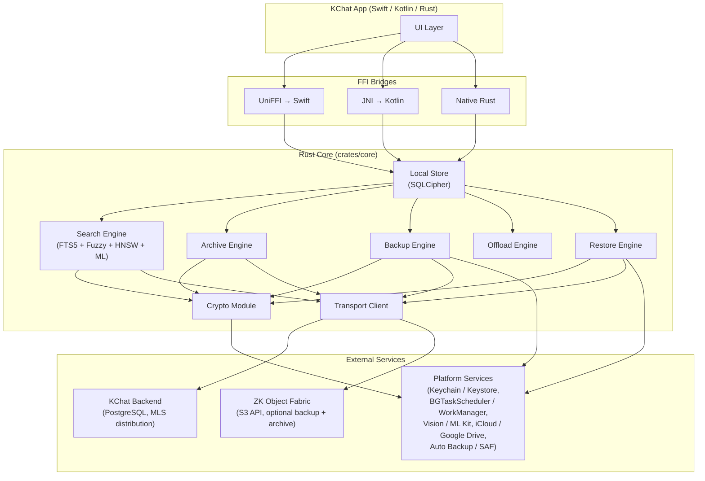

The core never talks to the UI directly. Every cross-boundary call
goes through the FFI bridge for the host platform.

---

## 2. Crate Structure

The Rust workspace is organized into four crates: one
platform-agnostic library (`crates/core`) and three thin bridges
that expose that library to platform code.

- `crates/core` is the entire library. It opens the encrypted
  local SQLCipher database, encrypts and decrypts messages and
  media, builds backup and archive manifests, runs multilingual
  search across local and cold-shard data, and speaks to the
  backend transport. All four-store logic lives here. The crate
  is platform-free: it does no filesystem path translation, no
  thread spawning beyond the Tokio runtime injected by callers,
  and no platform secret storage.
- `crates/ios-bridge` wraps `crates/core` with a UniFFI surface
  and emits a Swift package consumed by the iOS app and its
  extensions. It contains the Keychain wrappers for `K_local_db`
  and `K_user_master`, the iCloud media-sink bridge, and the
  background-task scheduler glue.
- `crates/android-bridge` wraps `crates/core` with JNI bindings
  and provides an idiomatic Kotlin façade. It contains the
  Android Keystore wrappers, the Google Drive media-sink bridge,
  the WorkManager scheduler glue, and the Auto Backup integration.
- `crates/desktop` consumes `crates/core` directly (no FFI layer)
  and adds DPAPI-bound key storage on Windows, Keychain bindings
  on macOS, OS-native search-index surfaces (Spotlight on macOS,
  Windows Search), and the ONNX execution-provider auto-selector
  used by on-device ML.

Each crate boundary is enforced at compile time: `crates/core`
has no platform-specific code paths, and the bridge crates depend
on `crates/core` but not on each other. The desktop crate uses
`crates/core` directly because it shares the same Rust runtime;
the mobile bridges go through FFI because they target Swift and
Kotlin runtimes.

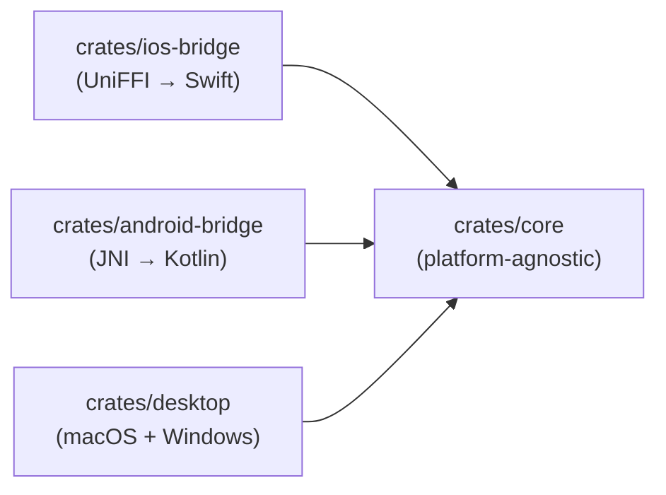

Inside `crates/core` the modules layer downward; higher-level
modules depend on lower-level ones, never vice versa.

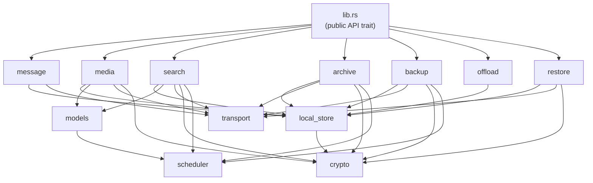

`crypto` is a leaf module: every other module that touches
ciphertext routes through it, and `crypto` itself depends only on
the standard library and chosen primitives.

---

## 3. Four-Store Data Flow

Four logically distinct stores; three interactive on the device,
one non-interactive for disaster recovery. Direction of arrows is
data flow, not request flow.

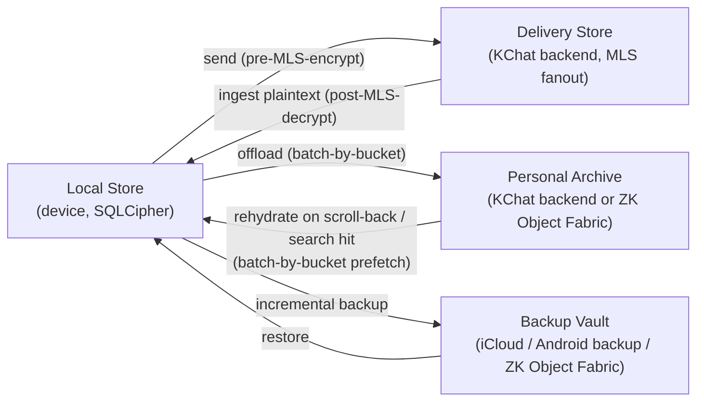

Backup never feeds the archive directly, and the archive never
feeds the backup directly. They are independent pipelines reading
from their own event journals on the local store.

**Tiered media storage.** Media originals may route to user cloud
storage (iCloud / Google Drive / ZK Object Fabric) via the
`MediaBlobSink` trait instead of the Personal Archive backend. The
archive stores only `media_key_delta` segments (the `K_asset`
wraps) and thumbnails; originals are fetched from the user's
configured media sink on tap. Thumbnails and archive segments
stay on Tier 0; only originals are routed. See PROPOSAL.md §5.7.

---

## 4. Local Store Schema

The schema lives in `crates/core/src/local_store/schema.rs`. The
multilingual FTS5 configuration is the headline element:

```sql
-- Conversations
CREATE TABLE conversation (
    conversation_id   TEXT PRIMARY KEY,
    title_cipher      BLOB,                 -- encrypted with K_local_db
    pinned            INTEGER NOT NULL DEFAULT 0,
    muted             INTEGER NOT NULL DEFAULT 0,
    last_message_id   TEXT,
    last_activity_ms  INTEGER NOT NULL
);

-- Skeletons render the timeline before any body / media is loaded
CREATE TABLE message_skeleton (
    message_id        TEXT PRIMARY KEY,
    conversation_id   TEXT NOT NULL REFERENCES conversation(conversation_id),
    sender_id         TEXT NOT NULL,
    created_at_ms     INTEGER NOT NULL,
    received_at_ms    INTEGER NOT NULL,
    kind              TEXT NOT NULL,
    body_state        TEXT NOT NULL,
    media_state       TEXT,
    archive_state     TEXT NOT NULL DEFAULT 'not_archived',
    backup_state      TEXT NOT NULL DEFAULT 'not_backed_up',
    reply_to          TEXT,
    edited_at_ms      INTEGER,
    deleted_at_ms     INTEGER
);

CREATE TABLE message_body (
    message_id        TEXT PRIMARY KEY REFERENCES message_skeleton(message_id),
    text_content      TEXT,                 -- UTF-8, may mix scripts
    detected_language TEXT,                 -- BCP-47, optional
    rich_meta         BLOB                  -- mentions, link previews (CBOR)
);

CREATE TABLE media_asset (
    asset_id          TEXT PRIMARY KEY,
    message_id        TEXT NOT NULL REFERENCES message_skeleton(message_id),
    mime_type         TEXT NOT NULL,
    bytes_total       INTEGER NOT NULL,
    bytes_local       INTEGER NOT NULL,
    media_state       TEXT NOT NULL,
    wrapped_k_asset   BLOB NOT NULL,
    chunk_count       INTEGER NOT NULL,
    merkle_root       BLOB NOT NULL,
    blob_id           TEXT NOT NULL,
    storage_sink      TEXT NOT NULL DEFAULT 'kchat_backend'  -- PROPOSAL.md §5.7
);

-- Multilingual full-text search
CREATE VIRTUAL TABLE search_fts USING fts5(
    message_id        UNINDEXED,
    conversation_id   UNINDEXED,
    sender_id         UNINDEXED,
    created_at_ms     UNINDEXED,
    text_content,
    tokenize = 'icu'                       -- primary multilingual tokenizer
);

CREATE TABLE search_fuzzy (
    token       TEXT NOT NULL,
    script      TEXT NOT NULL,             -- ISO-15924
    message_id  TEXT NOT NULL,
    PRIMARY KEY (token, script, message_id)
);

CREATE TABLE search_vector (
    message_id    TEXT NOT NULL,
    embedding     BLOB NOT NULL,            -- INT8-quantized
    model_version TEXT NOT NULL,
    PRIMARY KEY (message_id, model_version)
);

CREATE TABLE media_search_index (
    asset_id      TEXT NOT NULL REFERENCES media_asset(asset_id),
    kind          TEXT NOT NULL,            -- 'ocr' | 'caption' | 'transcript' | 'tag'
    text          TEXT NOT NULL,
    language      TEXT,                     -- BCP-47 if detected
    confidence    REAL,
    PRIMARY KEY (asset_id, kind, text)
);

-- Backup pipeline
CREATE TABLE backup_event_journal (
    event_seq     INTEGER PRIMARY KEY AUTOINCREMENT,
    event_type    TEXT NOT NULL,
    payload       BLOB NOT NULL,            -- CBOR
    created_at_ms INTEGER NOT NULL
);

-- Archive pipeline
CREATE TABLE archive_segment_map (
    segment_id           TEXT PRIMARY KEY,
    conversation_id      TEXT NOT NULL,
    time_bucket          TEXT NOT NULL,     -- e.g. '2026-04'
    segment_type         TEXT NOT NULL,
    blob_id              TEXT NOT NULL,
    storage_backend      TEXT NOT NULL DEFAULT 'kchat_backend',  -- PROPOSAL.md §10.1
    merkle_root          BLOB NOT NULL,
    state                TEXT NOT NULL      -- not_archived..archive_compacted
);

-- Restore state machine
CREATE TABLE restore_state (
    id     INTEGER PRIMARY KEY CHECK (id = 1),
    state  TEXT NOT NULL,                  -- identity_restored..full_restore_complete
    notes  TEXT
);
```

The whole database is a SQLCipher database keyed by `K_local_db`,
itself wrapped by the platform Keychain / Keystore.

---

## 5. Message State Machine

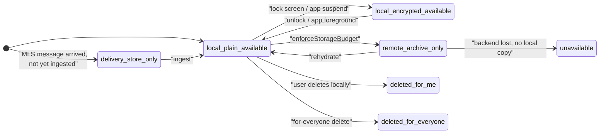

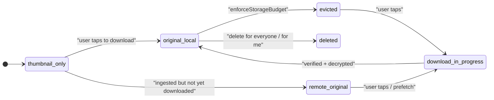

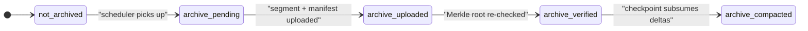

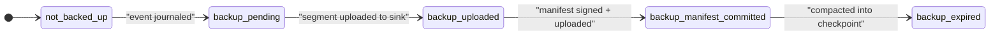

The single-row, global `restore_state` machine owned by
`crates/core/src/local_store/state_machines.rs::RestoreState` and
persisted via `crates/core/src/restore/state_machine.rs`:

```mermaid
stateDiagram-v2
    direction LR
    [*] --> identity_restored : "device key recovered"
    identity_restored --> root_keys_unwrapped : "K_user_master + sub-roots in memory"
    root_keys_unwrapped --> manifest_verified : "manifest chain hybrid Ed25519 + ML-DSA-65 + hash walk"
    manifest_verified --> skeleton_restored : "conversation list + skeletons reconstructed"
    skeleton_restored --> search_restored : "FTS / fuzzy / vector / media shards reattached"
    search_restored --> recent_messages_restored : "recent bodies hydrated"
    recent_messages_restored --> media_lazy_restore_enabled : "older media downloads on tap"
    media_lazy_restore_enabled --> full_restore_complete : "terminal"
```

Backup segment build / verify pipeline driven by
`crates/core/src/backup/`:

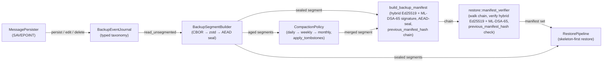

---

## 6. Search Engine Architecture

The search pipeline runs fully on-device. Cold buckets either
arrive as locally cached encrypted shards or are fetched on demand
by coarse bucket; the query string itself never crosses the FFI
boundary as a server request.

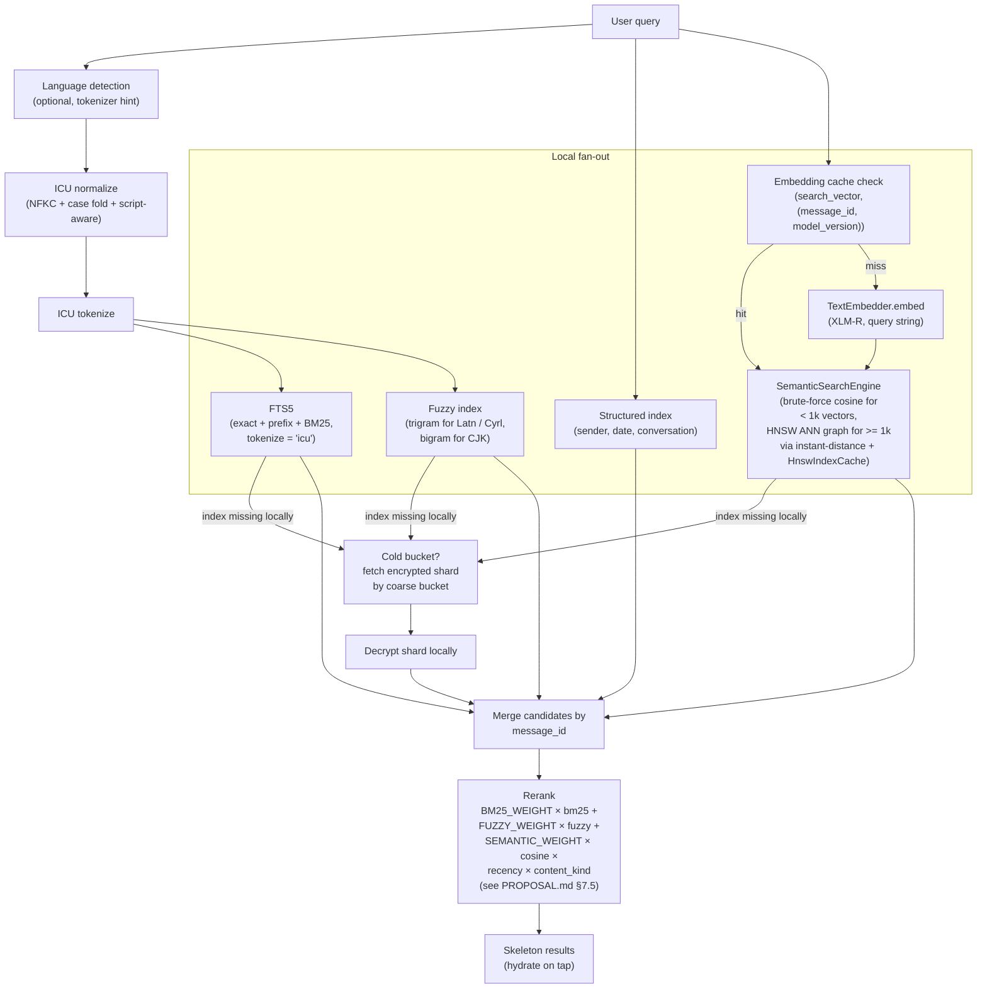

The semantic path is the Phase 6 implementation. The query
string flows through `QueryEngine::execute_search_with_semantic`
which:
1. runs the existing FTS5 + fuzzy fan-out;
2. if a `TextEmbedder` is installed, embeds the query and runs
   `SemanticSearchEngine::search_semantic_auto` which selects
   between the brute-force path (`search_semantic`) and the
   `instant-distance` HNSW ANN path
   (`search_semantic_with_hnsw`) based on
   `HNSW_FALLBACK_THRESHOLD = 1000` rows; built indexes are
   cached per `(conversation_id, model_version)` slot through
   `HnswIndexCache` and invalidated on insert via
   `HnswIndexCache::invalidate`;
3. merges semantic hits into the candidate set, summing
   contributions for rows that hit both surfaces, and stamps
   `SearchResult.semantic_score: Option<f64>` with the **raw
   cosine similarity** for hits that surfaced through the
   semantic path (`None` for FTS / fuzzy-only hits);
4. weights surviving candidates by the recency × content-kind
   factor and re-sorts.

The Phase-6 batch additionally lands a dedicated reranking
entry point: `QueryEngine::rerank_with_semantic` takes a result
set + a query embedding, recomputes cosine similarity for every
result that has a vector in `search_vector`, updates
`semantic_score` in place, adds `sim × SEMANTIC_WEIGHT` to
`rank_score`, and re-sorts by descending `rank_score` then by
descending `created_at_ms` then by `message_id`.
`SearchScope::LocalOnly` is honored — no cold fan-out is
issued during the rerank pass.

The same `media_search_index` table that backs the OCR bridge
also carries the **Phase-6 batch additions**: the
`WhisperTranscriber` seam writes audio MIME results with
`kind = "transcript"` (text + language); the
`DocumentExtractor` seam writes PDF / DOCX page-level extracts
with `kind = "caption"` and `text = "[page {n}] {body}"`.
`media_search_index` rows participate in the same FTS5 search
surface as message bodies, so transcripts and document pages
become directly searchable through `QueryEngine::execute_search`
and the OCR / structured filters. Video MIME types take a
different route: the `VideoKeyframeSampler` seam extracts up to
five keyframes, the first frame is embedded through the
existing `ImageEmbedder` (MobileCLIP-S2), and the resulting
512-dim vector lands in `search_vector` keyed
`(message_id, "mobileclip_s2@v1")` so the row participates in
the semantic-search fan-out alongside still images.

The embedding cache is populated by both the guardrail pipeline
(`kennguy3n/slm-guardrail`) and the search pipeline. A message's
`XLM-R` embedding is computed at most once: whichever pipeline
first observes the message writes the 384-dim vector into the
`search_vector` row keyed by `(message_id, model_version =
'xlmr@v1')`, and the other pipeline reads it back from that row
instead of running its own ONNX inference. See
[`docs/PROPOSAL.md` §7.6.1](./PROPOSAL.md) for the full contract
(version-mismatch handling, locality / non-replication rules)
and [`crate::models::embeddings::EmbeddingCache`] for the trait
that binds the seam. The Phase-6 integration test
`crates/core/tests/phase6_embedding_cache.rs` exercises the
seam (put/get round-trip with INT8-codec cosine fidelity > 0.999,
version-mismatch → `None`, two-instance same-connection
cross-pipeline visibility).

### 6.1 Encrypted shard prefetch

When a query needs a shard that is not in the on-device cache, the
core fetches it from the backend through the
[`search::shard_prefetch`](../crates/core/src/search/shard_prefetch.rs)
module. A naive per-shard `GET /v1/archive/index-shards?...&type=`
leaks `(conversation_hash, bucket, shard_type)` tuples to the
backend. The prefetch module collapses that signal to
`(conversation_hash, bucket)` granularity: every miss issues one
batch call that pulls all four `IndexType` variants
(`Text`, `Fuzzy`, `Vector`, `Media`) for the same time bucket.

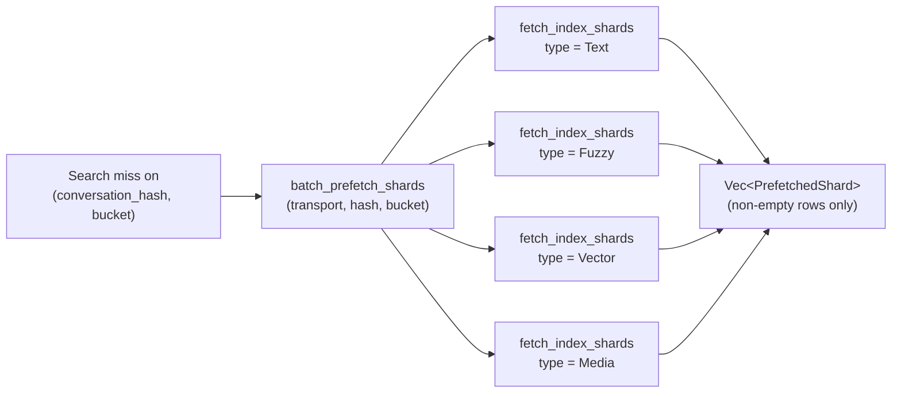

The four type calls run in a deterministic
`[Text, Fuzzy, Vector, Media]` order so the on-the-wire request
sequence does not depend on which shard the local query missed
on. Empty responses are dropped before returning so callers do
not have to deal with sparse vectors.

`batch_prefetch_shards_with_padding` adds a privacy hop on top:
when `KChatCoreConfig::privacy_level` is `High`, it interleaves
real `(conversation_hash, bucket)` requests with dummy
`(conversation_hash, bucket)` pairs minted by
`archive::privacy::generate_dummy_segment_id`. The dummies are
indistinguishable from real shard requests on the wire (same
endpoint, same shape) and silently drop on error, so a network
observer sees a blurred per-bucket access pattern instead of a
sharp per-shard one. Dummy frequency is governed by the same
privacy helpers used for archive-segment prefetch (see §8.4).

The prefetch module is independent of the local query engine: it
returns sealed bytes plus the `IndexType` tag, and it is the
caller's job to decrypt under the appropriate
`K_text_index_shard` / `K_fuzzy_index_shard` /
`K_vector_index_shard` / `K_media_index_shard` derived from
`K_search_root`. This keeps the transport layer ignorant of the
shard payload format.

### 6.2 Cold-shard search pipeline

Cold-bucket search lives behind the `ColdShardSource` trait. The
trait lets the query engine fan out to offloaded buckets without
taking a hard dependency on the transport client — the same code
path covers production (real network) and tests (in-process
mocks).

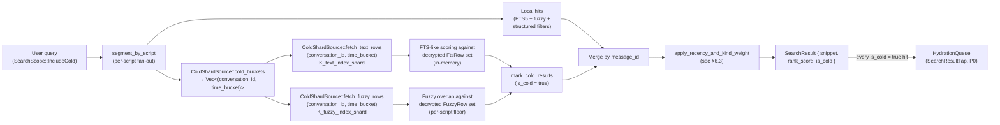

The trait surface is intentionally narrow:

```rust
pub trait ColdShardSource {
    fn cold_buckets(&self) -> Result<Vec<(String, String)>, Error>;
    fn fetch_text_rows(
        &self,
        conversation_id: &str,
        time_bucket: &str,
    ) -> Result<Vec<FtsRow>, Error>;
    fn fetch_fuzzy_rows(
        &self,
        conversation_id: &str,
        time_bucket: &str,
    ) -> Result<Vec<FuzzyRow>, Error>;
}
```

`cold_buckets` may consult local state (e.g. join
`message_skeleton.body_state` against `archive_segment_map.state`)
to enumerate offloaded `(conversation_id, time_bucket)` pairs.
The two `fetch_*` methods call the transport layer and run the
shard-restore decrypt path under the appropriate per-shard key
derived from `K_search_root`. Implementations return
`Ok(Vec::new())` when no shard exists for the pair — that is a
legitimate "no results" signal, not an error — so the query
engine can search without touching the SQLCipher store.

The query engine entry point runs the local fan-out first, then
asks the source for cold buckets, decrypts each one, runs FTS5 +
fuzzy against the in-memory shard, marks every cold hit with
`is_cold = true`, and merges with local hits before reranking
under the §6.3 formula. Cold hits are enqueued into the
`HydrationQueue` at `SearchResultTap` (P0) priority so the actual
body / media chase the search hit on tap.

When the backend returns 404 for a shard (offloaded then garbage
collected), a graceful-degradation adapter wraps the underlying
`ColdShardSource`. It swallows the transport error, returns an
empty row vector to the query engine, and records the failure in
a side-channel log so the platform layer can render a "search
results may be incomplete" banner without losing local hits.

### 6.3 Ranking formula (PROPOSAL §7.5)

After the local + cold candidates merge by `message_id`, the
query engine reranks with the multiplicative formula

```
rank_score = (BM25_WEIGHT × bm25 + FUZZY_WEIGHT × fuzzy)
           × recency_factor(age_days)
           × content_kind_weight(kind)
```

implemented in
[`apply_recency_and_kind_weight`](../crates/core/src/search/query_engine.rs).
The constants live in the same module:

| Constant                  | Value | Role                                                    |
| ------------------------- | ----- | ------------------------------------------------------- |
| `BM25_WEIGHT`             | `2.0` | Multiplier on the FTS5 BM25 score                       |
| `FUZZY_WEIGHT`            | `1.0` | Multiplier on the fuzzy overlap score                   |
| `RECENCY_WEIGHT`          | `0.5` | Weight on the exponential term (also `1 - W = 0.5` is the asymptotic floor) |
| `RECENCY_HALF_LIFE_DAYS`  | `30`  | `lambda = ln(2) / 30` — 30-day half-life decay          |
| `TEXT_KIND_WEIGHT`        | `1.0` | Text messages keep their full BM25 + fuzzy contribution |
| `MEDIA_KIND_WEIGHT`       | `0.8` | Media is 0.8× since thumbnails / captions are coarser   |

The recency decay is a linear interpolation between the
asymptotic floor `1 - RECENCY_WEIGHT = 0.5` and an exponential
decay with a 30-day half-life:

```
recency_factor = (1 - RECENCY_WEIGHT)
               + RECENCY_WEIGHT × exp(-ln(2) × age_days / 30)
```

so a message authored today scores at `1.0`, a 30-day-old message
scores at `0.75`, a 90-day-old message at ~`0.5625`, and any
sufficiently-old message asymptotically approaches the
`1 - RECENCY_WEIGHT = 0.5` floor rather than disappearing
entirely. The same decay is applied to cold hits via
`apply_cold_recency_weight`, so local-vs-cold relative ordering
is symmetric — a cold hit on a recent message can still beat a
local hit on an old one if the underlying BM25 / fuzzy
contributions warrant it.

In-module unit tests pin every direction of the formula:
`ranking_recent_message_outranks_identical_old_message`,
`ranking_exact_recent_beats_fuzzy_old`,
`ranking_text_outranks_media_for_equal_recency`, and
`ranking_is_deterministic_for_same_inputs`.

### 6.4 Script-aware fuzzy matching

`FuzzySearchEngine::search_fuzzy` (Phase 5, Task 2) groups query
tokens by `ScriptClass`, joins
`search_fuzzy(token, script, message_id)` on `(token, script)`,
and applies a per-script overlap floor via
[`search::tokenizer::fuzzy_min_overlap`](../crates/core/src/search/tokenizer.rs).
Latin and Cyrillic trigrams use a looser threshold so typos
like `"meetng" → "meeting"` recover; CJK bigrams use a tighter
threshold so two-character collisions across unrelated rows
don't fan out into noise.

Critically, a row is accepted iff at least *one* script bucket
clears its floor. That keeps mixed-script queries —
`"meeting 会議"`, `"встреча meeting"` — fanning out to both
indexes: a row that matches perfectly on the Latin half still
surfaces, just with a lower overall score because the CJK
contribution is zero. The
[`crates/core/tests/mixed_language_query.rs`](../crates/core/tests/mixed_language_query.rs)
suite walks through Latin × CJK, Cyrillic × Latin, pure-CJK on
non-ICU builds via fuzzy fallback, mixed-script promotion, and
unrelated-row exclusion.

---

## 7. Crypto Architecture

Every key derives from `K_user_master` via labelled HKDF-SHA256.
The crypto module knows nothing about messages, media, or search;
it serves AEAD-sealed bytes against typed key handles.

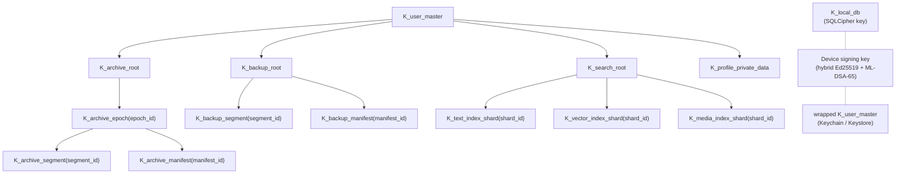

Per-media-object encryption is a separate path with its own
random key:

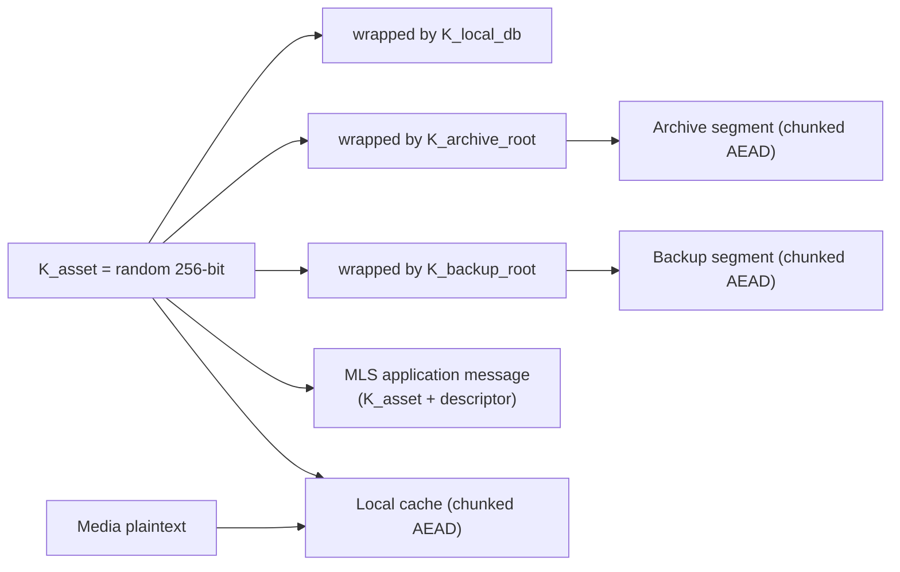

The archive layer inserts a `K_archive_epoch(epoch_id)`
indirection between `K_archive_root` and per-segment /
per-manifest keys. The orchestration layer rotates epochs on a
monthly cadence (matching `time_bucket`) and recovers prior-epoch
keys by unwrapping them from the manifest chain.

ZK Object Fabric backups use Pattern C, derived deterministically
from the plaintext + tenant ID. The Rust path must produce
bit-identical output to the Go SDK at
`kennguy3n/zk-object-fabric/encryption/client_sdk/`:

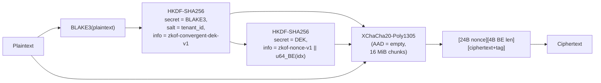

---

## 8. Archive and Offload Architecture

### 8.1 Archive segment build and upload

```mermaid
sequenceDiagram
    participant Core as "Rust core (archive engine)"
    participant Cr as "crypto"
    participant Tr as "transport"
    participant BE as "KChat backend"
    participant ZKOF as "ZK Object Fabric"

    Core->>Core: "read archive event journal since cursor"
    Core->>Core: "group by (conversation_id, time_bucket)"
    Core->>Core: "build CBOR payload, zstd compress"
    Core->>Cr: "AEAD seal with K_archive_segment<br/>(derived from K_archive_epoch)"
    Cr-->>Core: "ciphertext + Merkle root"
    alt "archive_backend = kchat"
        Core->>Tr: "blob init (chunked upload)"
        Tr->>BE: "POST /v1/blobs/init"
        BE-->>Tr: "blob_id"
        Core->>Tr: "upload chunks"
        Tr->>BE: "PUT /v1/blobs/{blob_id}/chunks/{idx}"
        Core->>Tr: "commit blob"
        Tr->>BE: "POST /v1/blobs/{blob_id}/commit"
        BE-->>Tr: "merkle_root"
    else "archive_backend = zkof"
        Core->>Tr: "S3 PutObject (multipart)"
        Tr->>ZKOF: "S3 PutObject (multipart)"
        ZKOF-->>Tr: "ETag + Merkle root"
    end
    Core->>Core: "verify backend Merkle root == local"
    Core->>Cr: "build & seal manifest gen N+1"
    Cr-->>Core: "manifest ciphertext"
    Core->>Tr: "upload manifest"
    Core->>Core: "mark archive_state = archive_verified;<br/>advance cursor"
```

### 8.2 Offload / eviction

```mermaid
sequenceDiagram
    participant Sys as "OS / scheduler"
    participant Off as "offload engine"
    participant DB as "local_store"

    Sys->>Off: "enforceStorageBudget(reason)"
    Off->>DB: "compute storage usage + headroom"
    Off->>DB: "build candidate set<br/>(verified archives, not pinned, not active)"
    Off->>DB: "score each candidate<br/>(see PROPOSAL.md §5.4)"
    loop "until headroom reclaimed"
        Off->>DB: "evict next candidate per priority order"
    end
    Off-->>Sys: "OffloadResult { freed_bytes, evicted_count }"
```

The offload pipeline is split into three composable layers under
`crates/core/src/offload/`:

- **Budget** — probes current device storage and computes a
  `PressureLevel` (`None`, `Warning`, `Critical`, `Extreme`).
- **Scoring** — ranks each eviction candidate by content kind,
  recency (30-day half-life), and size. Pinned candidates are
  excluded.
- **Planning and execution** — partitions candidates into a
  `CloudOffload` tier (assets whose original is recoverable from
  a user-cloud `MediaBlobSink`) and a `FullEviction` tier (assets
  whose only remote copy is in the KChat archive), plans each
  tier under the active `PressureLevel`, and runs the
  state-machine demotion. The combined plan is a
  `TieredEvictionPlan` with `target_bytes` and `total_bytes`
  accounting.

Rehydration uses a deduplicating priority queue ordered by
`HydrationReason` (P0–P5) with a FIFO tiebreaker, plus a viewport
prefetch window to warm scroll-back.

### 8.3 Rehydration

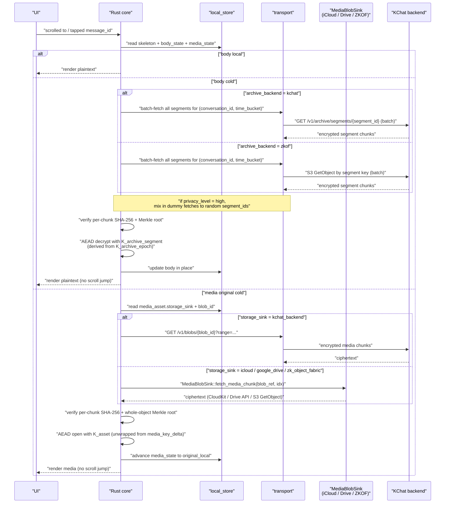

### 8.4 Prefetch window

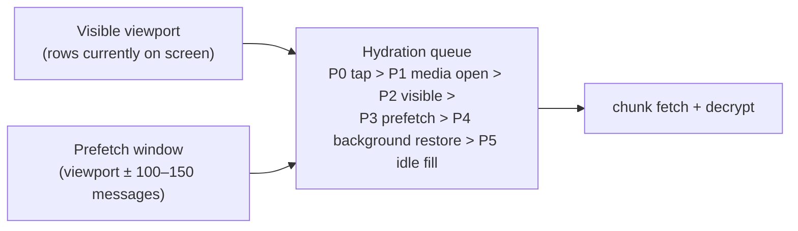

Prefetch granularity is **per time bucket**: when any segment in a
`(conversation_id, time_bucket)` is needed, all segments for that
pair are fetched. This aligns the prefetch unit with the archive
segment grouping and reduces per-segment access-pattern metadata
to per-bucket granularity (see PROPOSAL.md §5.6).

---

## 9. Backup and Restore Architecture

### 9.1 Incremental backup

```mermaid
sequenceDiagram
    participant Sched as "scheduler"
    participant Bk as "backup engine"
    participant Cr as "crypto"
    participant Sink as "sink (iCloud / Auto Backup /<br/>SAF / ZK Object Fabric)"

    Sched->>Bk: "run_incremental_backup(reason)"
    Bk->>Bk: "load last manifest cursor"
    Bk->>Bk: "read backup_event_journal since cursor"
    Bk->>Bk: "group into per-type, per-bucket segments"
    loop "per segment"
        Bk->>Bk: "zstd compress"
        Bk->>Cr: "AEAD seal with K_backup_segment"
        Cr-->>Bk: "ciphertext"
        Bk->>Sink: "upload (resume from prior chunk receipt if any)"
    end
    Bk->>Cr: "build, sign, seal manifest gen N+1"
    Cr-->>Bk: "manifest ciphertext + hybrid Ed25519 + ML-DSA-65 signatures"
    Bk->>Sink: "upload manifest (last)"
    Bk-->>Sched: "BackupResult"
```

### 9.2 Skeleton-first restore

```mermaid
sequenceDiagram
    participant App as "KChat app"
    participant Core as "Rust core (restore engine)"
    participant Sink as "backup sink"
    participant BE as "KChat backend"
    participant UI as "UI"

    App->>Core: "restore_from_backup(source)"
    Core->>BE: "register device"
    Core->>Core: "recover K_user_master<br/>(D2D / recovery key / passphrase)"
    Core->>Sink: "fetch latest manifest"
    Core->>Core: "verify signature + previous_manifest_hash chain"
    Core->>Sink: "fetch conversation list segment"
    Core-->>UI: "skeleton_restored &mdash; render conversation list"
    Core->>Sink: "fetch timeline_skeleton segments"
    Core-->>UI: "skeletons render in each conversation"
    Core->>Sink: "fetch search_index_shard segments"
    Core-->>UI: "search_restored &mdash; search returns hits"
    Core->>Sink: "fetch recent message_body segments"
    Core-->>UI: "recent_messages_restored"
    Core->>Sink: "lazy media (on tap, on prefetch)"
```

### 9.3 Restore state machine

```mermaid
stateDiagram-v2
    direction LR
    [*] --> identity_restored
    identity_restored --> root_keys_unwrapped
    root_keys_unwrapped --> manifest_verified
    manifest_verified --> skeleton_restored
    skeleton_restored --> search_restored
    search_restored --> recent_messages_restored
    recent_messages_restored --> media_lazy_restore_enabled
    media_lazy_restore_enabled --> full_restore_complete
```

### 9.4 Manifest chain verification

```mermaid
flowchart LR
    GenN["manifest gen N<br/>signature OK,<br/>previous_manifest_hash &rarr; gen N-1"]
    GenN1["manifest gen N-1"]
    GenN2["manifest gen N-2"]
    Genesis["genesis hash<br/>(device-attested)"]

    GenN -->|"prev"| GenN1 -->|"prev"| GenN2 -->|"prev"| Genesis
    GenN -->|"break in chain &rArr; alert"| GenN1
```

A break in the chain (a `previous_manifest_hash` mismatch or
signature failure) halts restore and surfaces a recoverable error
to the UI; restore never silently re-roots.

### 9.5 Backup sub-module layout

The backup pipeline is split into composable Rust modules under
`crates/core/src/backup/`:

| Module           | Responsibility                                                                          |
| ---------------- | --------------------------------------------------------------------------------------- |
| `event_journal`  | Append-only journal of `BackupEvent`s written inside each message-mutation SAVEPOINT.   |
| `segment_builder`| CBOR-encode → zstd-compress → XChaCha20-Poly1305 seal under `K_backup_segment`.         |
| `manifest_builder`| Chained backup manifests (genesis → gen-N); hybrid Ed25519 + ML-DSA-65 signature.      |
| `compaction`     | Daily → weekly → monthly merge; tombstone application for deleted messages.             |
| `sinks/`         | Pluggable `BackupSink` implementations (ZKOF, iCloud, Android Auto Backup + SAF).       |

#### 9.5.1 Backup sink architecture

All backup sinks share the same `BackupSink` trait so the upper
layers (`run_incremental_backup`, `RestorePipeline`,
`compact_backup`) treat sinks uniformly. The differences are
confined to two dimensions:

| Sink                | Authentication path                                       | Record / object naming                                    |
| ------------------- | --------------------------------------------------------- | --------------------------------------------------------- |
| `ZkofBackupSink`    | ZKOF tenant credentials via an `S3Client` implementation  | `backups/{manifest_id}` + `backups/segments/{segment_id}` |
| `ICloudBackupSink`  | Per-user CloudKit container via `ICloudBackupBridge`      | `backups/{manifest_id}` + `backups/segments/{segment_id}` |
| `AndroidBackupSink` | Auto Backup (manifests) + Storage Access Framework (segments) | Manifest = Auto Backup entry; segment = SAF blob       |
| `NoopBackupSink`    | n/a                                                       | n/a — every method returns `NotImplemented` for tests     |

The naming convention is identical wherever it can be (every
sink that addresses by free-form key uses `backups/...`); the
Android sink is the only one that splits storage by record size,
because that is forced by the platform's 25 MiB Auto Backup cap.

`CoreImpl` only ever holds a single `Box<dyn BackupSink>` at a
time, but the platform layer can swap sinks at runtime (e.g. a
desktop client first restoring from iCloud, then continuing with
ZKOF). All sinks operate on already-sealed segments and
manifests — they do not see plaintext bytes — so a malicious or
compromised sink cannot leak user content beyond the metadata
already exposed by `(manifest_id, segment_id, byte length)`.

### 9.6 Restore sub-module layout

The restore pipeline is split into parallel layers under
`crates/core/src/restore/`:

| Module             | Responsibility                                                                       |
| ------------------ | ------------------------------------------------------------------------------------ |
| `state`            | Persisted `restore_state` row; transition between restore phases.                    |
| `manifest_verifier`| Walk the manifest chain genesis → latest; verify hybrid signatures.                  |
| `pipeline`         | Skeleton-first orchestrator: conversations → skeletons → bodies → media.             |
| `recovery_key`     | Generate, verify, and consume the user-facing 32-character recovery key.             |
| `device_transfer`  | Old-device → new-device handshake export of `K_user_master`.                         |

### 9.7 Search-shard sub-module layout

The encrypted search-shard plumbing lives under
`crates/core/src/search/` alongside the regular search engine:

| Module              | Responsibility                                                                       |
| ------------------- | ------------------------------------------------------------------------------------ |
| `shard_builder`     | Build text / fuzzy / vector / media / bloom shards from local rows; seal under per-shard keys derived from `K_search_root`. |
| `cold_shard_source` | Trait abstraction over the cold-shard backend; bridges transport + key registry into the search engine. |
| `shard_cache`       | On-device LRU cache of decrypted shards (default 50 MB).                             |
| `shard_prefetch`    | Batch-by-bucket cold-shard fetch with optional dummy-request padding.                |

The orchestration entry points on `CoreImpl` are
`upload_search_shards`, `run_incremental_backup_with_search_shards`,
`fetch_and_restore_cold_shards`, and `hydrate_cold_search_results`.
Together they implement the cold-shard build → upload → fetch →
decrypt → search → rehydrate loop.

### 9.8 Archive compaction at production scale

Archive compaction mirrors backup compaction but operates on
already-sealed archive segments. The five-phase flow is:

1. Select `archive_verified` segments for the
   `(conversation_id, time_bucket)` pair.
2. Decrypt each segment via the `ArchiveSegmentRouter` (which
   dispatches per-row to the KChat transport or the ZKOF S3
   client).
3. Concatenate events and apply archive tombstones (drops
   `MessageDeleted` / `ConversationDeleted` events themselves and
   any earlier events for tombstoned ids).
4. Re-seal the compacted result via the same segment builder.
5. Atomically transition superseded rows to `archive_compacted`
   inside a SAVEPOINT and emit the new compact segment via the
   caller's upload callback.

The compaction result reports per-bucket counters
(`buckets_inspected`, `buckets_compacted`, `segments_superseded`,
`segments_emitted`, `bytes_before`, `bytes_after`) so operators
can observe progress at production scale.


## 10. Transport Layer

The transport client is a thin async HTTP client that speaks the
KChat backend API. It does not hold any plaintext; every payload
it sends or receives is already AEAD-sealed by the crypto module.

### 10.1 Chunked encrypted blob upload

```mermaid
sequenceDiagram
    participant Core as "core"
    participant Tr as "transport"
    participant BE as "backend"

    Core->>Tr: "init blob (size, blob_class, expected_merkle_root)"
    Tr->>BE: "POST /v1/blobs/init"
    BE-->>Tr: "blob_id, upload_token"
    loop "per chunk"
        Core->>Tr: "upload chunk(idx, ciphertext, sha256)"
        Tr->>BE: "PUT /v1/blobs/{blob_id}/chunks/{idx}"
        BE-->>Tr: "chunk_receipt"
    end
    Core->>Tr: "commit"
    Tr->>BE: "POST /v1/blobs/{blob_id}/commit"
    BE-->>Tr: "computed merkle_root"
    Core->>Core: "verify merkle_root == local"
```

### 10.2 Range download

```mermaid
sequenceDiagram
    participant Core as "core"
    participant Tr as "transport"
    participant BE as "backend"

    Core->>Tr: "fetch blob {blob_id} range [from..to]"
    Tr->>BE: "GET /v1/blobs/{blob_id}?range=from-to"
    BE-->>Tr: "ciphertext bytes"
    Core->>Core: "verify per-chunk AEAD tag + SHA-256"
    Core->>Core: "decrypt with K_archive_segment / K_asset / etc."
```

### 10.3 Archive manifest fetch and segment download

```mermaid
sequenceDiagram
    participant Core as "core"
    participant Tr as "transport"
    participant BE as "backend"

    Core->>Tr: "list archive manifests after_generation = N"
    Tr->>BE: "GET /v1/archive/manifests?after_generation=N"
    BE-->>Tr: "manifest list (encrypted)"
    Core->>Core: "decrypt manifests, walk previous_manifest_hash"
    loop "per needed segment"
        Core->>Tr: "fetch segment {segment_id}"
        Tr->>BE: "GET /v1/archive/segments/{segment_id}"
        BE-->>Tr: "ciphertext"
        Core->>Core: "AEAD decrypt with K_archive_segment"
    end
```

### 10.4 Delivery message fetch (cursor-based)

```mermaid
sequenceDiagram
    participant Core as "core"
    participant Tr as "transport"
    participant BE as "backend"

    Core->>Tr: "ingest_remote_messages(conversation_id, after_cursor)"
    Tr->>BE: "GET /v1/mls/messages?conversation_id=&amp;after_cursor="
    BE-->>Tr: "MLS application messages + new cursor"
    Core->>Core: "MLS-decrypt (KChat MLS layer)"
    Core->>Core: "persist message_skeleton, message_body, media_asset"
    Core->>Core: "bump conversation.last_message_id / last_activity_ms"
    Core->>Core: "write backup + archive events"
    Core->>Core: "update FTS / fuzzy / vector / media indexes"
```

---

## 11. Platform Integration

### 11.1 iOS

| Concern                    | API / Mechanism                                                                                              |
| -------------------------- | ------------------------------------------------------------------------------------------------------------ |
| FFI binding                | UniFFI &rarr; generated Swift package consumed by KChat.app and any iOS extensions sharing the local store   |
| Keys                       | Keychain (`kSecAttrAccessibleAfterFirstUnlockThisDeviceOnly`); biometric-protected key for higher-tier ops   |
| Background work            | `BGTaskScheduler` (`BGProcessingTask` for backup / archive / index maintenance)                              |
| OCR                        | `VNRecognizeTextRequest` (multilingual; 18+ languages supported in current iOS)                              |
| ML inference               | Core ML (preferred) or ONNX Runtime CoreML EP                                                                |
| Audio transcription        | Apple MLX (`mlx-community/whisper-base-mlx`, preferred on Apple Silicon — routes to the Neural Engine) or ONNX Runtime fallback |
| Model warm-up              | XLM-R session created in `BGProcessingTask` during first idle after launch                                   |
| iCloud backup              | App's iCloud container file storage for encrypted backup files                                               |
| Audio session              | Foreground for live recording; background-friendly transcription via Whisper-tiny / Whisper-base             |

### 11.2 Android

| Concern                    | API / Mechanism                                                                                              |
| -------------------------- | ------------------------------------------------------------------------------------------------------------ |
| FFI binding                | JNI &rarr; idiomatic Kotlin façade in `crates/android-bridge`                                                |
| Keys                       | Android Keystore (StrongBox if available); biometric gate via `BiometricPrompt` when configured              |
| Background work            | `WorkManager` (constraints: charging, unmetered network, thermal-headroom)                                   |
| OCR                        | ML Kit Text Recognition v2 (multilingual; 50+ languages including CJK)                                       |
| ML inference               | ONNX Runtime NNAPI EP, fallback to CPU EP                                                                    |
| Model warm-up              | XLM-R session created in `WorkManager` job during first idle                                                 |
| Auto Backup                | `BackupAgent` storing recovery envelopes + manifest pointers under the 25 MB cap                             |
| Large Backup               | Large Backups API where available                                                                            |
| Storage Access Framework   | User-selected cloud / document provider for large encrypted backup files                                     |

### 11.3 macOS

| Concern                    | API / Mechanism                                                                                              |
| -------------------------- | ------------------------------------------------------------------------------------------------------------ |
| FFI binding                | Native Rust (no FFI bridge needed)                                                                           |
| Keys                       | Keychain                                                                                                     |
| Background work            | `NSBackgroundActivityScheduler` + cooperative scheduler                                                      |
| OCR                        | `VNRecognizeTextRequest` (Vision)                                                                            |
| ML inference               | Core ML or ONNX Runtime CoreML EP                                                                            |
| Audio transcription        | Apple MLX (`mlx-community/whisper-base-mlx`, preferred on Apple Silicon — routes to the Neural Engine); ONNX Runtime CPU EP fallback on Intel Macs |
| Model warm-up              | XLM-R session created eagerly at startup; kept resident                                                      |
| Search integration         | Optional Spotlight integration for app-internal search anchors                                               |

### 11.4 Windows

| Concern                    | API / Mechanism                                                                                              |
| -------------------------- | ------------------------------------------------------------------------------------------------------------ |
| FFI binding                | Native Rust                                                                                                  |
| Keys                       | DPAPI (`CryptProtectData`) bound to the user profile; TPM-backed via `NCryptCreatePersistedKey` if available |
| Background work            | Background Tasks / Task Scheduler integration                                                                |
| OCR                        | `Windows.Media.Ocr` (multilingual where the Language Pack is installed); Tesseract fallback                  |
| ML inference               | ONNX Runtime DirectML EP (preferred, when GPU available) or CPU EP (fallback); INT8/INT4 quantized models essential |
| Model warm-up              | XLM-R session created eagerly at startup; kept resident                                                      |
| Search integration         | Optional Windows Search integration for app-internal anchors                                                 |

The DirectML EP is best-effort: session creation attempts
DirectML first and falls back to CPU EP if DirectML initialization
fails (e.g. no compatible GPU, or driver issues). The EP-selection
logic is factored as a pure state machine over a `DirectMlProbe`
trait so the routing can be exhaustively unit-tested on
non-Windows hosts.

### 11.5 ML seams: text, image, OCR, audio, document, and video

The on-device ML surface is a set of small, object-safe traits in
`crates/core/src/models/` that the platform bridges implement.
Core never owns an HTTP client, never decodes images on its own,
and never calls Vision / ML Kit / Windows.Media.Ocr directly.

| Trait                 | Purpose                                         | Default backend                                  |
| --------------------- | ----------------------------------------------- | ------------------------------------------------ |
| `TextEmbedder`        | Multilingual text embedding (XLM-R)             | ONNX Runtime (INT8 mobile, INT4 tight storage)   |
| `ImageEmbedder`       | Image embedding (MobileCLIP-S2)                 | ONNX Runtime                                     |
| `OcrBridge`           | Multilingual OCR on still images                | Vision (iOS / macOS), ML Kit (Android), `Windows.Media.Ocr` |
| `WhisperTranscriber`  | Audio transcription (Whisper-base)              | Apple MLX on Apple Silicon, ONNX Runtime elsewhere |
| `DocumentExtractor`   | Text extraction from PDF / Word documents       | Platform-native text extractor                   |
| `VideoKeyframeSampler`| Sample representative keyframes from video      | Platform-native AV pipeline                      |

Every trait is `Send + Sync + Debug` and object-safe, so it lives
behind a `Mutex<Option<Box<dyn …>>>` or `Arc<dyn …>` on
`CoreImpl`. The bridge crates swap in real implementations without
recompiling the core; the test surface uses no-op and mock
doubles.

### 11.6 `ModelManager` lifecycle

The `ModelManager` handles model download, caching, version
pinning, quantization variants, and resource gating. It is
deliberately a small façade around three primitives: a
`ModelStore` (where models live on disk), a `ModelSource` (how
they are fetched), and the `ResourceGate` policy (when downloads
and inference may run). The bridge crates choose how to expose
download UI; the core handles integrity verification
(SHA-256 + size + manifest signature) and version pinning.

### 11.7 `ResourceGate` policy

The `ResourceGate` decides whether an ML model can be downloaded
or executed based on battery, thermal, network, and storage
conditions. The policy is encoded as a pure state machine over
`DeviceState { battery_percent, charging, thermal_state,
network, available_storage_bytes }`, so the gating logic can be
unit-tested deterministically. The default policy gates downloads
behind charging + Wi-Fi + cool thermal state; inference is gated
behind a softer policy that still runs on battery for foreground
operations.

### 11.8 Semantic search pipeline

Semantic search lives alongside (not above) text search. The
search engine runs the text query through `TextEmbedder` once,
fans out to the per-conversation `search_vector` rows, and merges
the cosine-similarity scores into the same ranking pipeline as
FTS5 / fuzzy results (§6.3). Image search runs the input image
through `ImageEmbedder`, opens the configured `OcrBridge` and the
caption / transcript / tag entries in `media_search_index`, and
combines the matches.

Two reranking stages run on-device: a lightweight
`semantic_score` (vector cosine) is combined with the ranking
formula in §6.3; an optional cross-encoder reranker rescore is
applied to the top-k locally, never on the backend.

### 11.9 Quantization selection: INT4 vs INT8

The `ModelManager` picks a quantization variant based on
available storage and platform capability:

| Variant     | Trade-off                                                          | Default for                                   |
| ----------- | ------------------------------------------------------------------ | --------------------------------------------- |
| INT8        | Smaller model size, modest quality drop                            | Mobile (iOS / Android) and constrained desktop |
| INT4        | Much smaller model size, larger quality drop                       | Tight-storage devices                         |
| FP16 / FP32 | Highest quality, largest size                                      | High-RAM desktop (opt-in)                     |

Vector storage on-disk is INT8 by default; an INT4 codec is also
supported for the on-device `search_vector` rows when storage is
tight.

### 11.10 Runtime policy seams

Two further object-safe traits round out the runtime-policy
surface:

- `OfflineDetector` returns whether the device currently has
  network. The core uses it to short-circuit backup and cold-shard
  search when offline (operations return a `deferred = true`
  result and are retried on the next event).
- `PerfCollector` collects per-operation latency traces. Hot
  paths emit traces with operation-specific metadata (batch
  sizes, query length, result counts, pressure level) so that
  per-platform p95 dashboards can be assembled from a single
  collector backend.

### 11.11 Phase 7 service seams

Four additional object-safe traits add desktop and B2B
operational support:

- `ExecutionProviderSelector` chooses the ONNX execution provider
  per platform (CoreML on macOS / iOS, NNAPI on Android, DirectML
  on Windows + GPU, CPU as the universal fallback) and can
  incorporate runtime EP benchmarks.
- `BackgroundScheduler` runs scheduled tasks (backup,
  archive compaction, index maintenance, media cache eviction)
  on a platform-appropriate background runtime — WorkManager on
  Android, BGTaskScheduler on iOS, Windows Task Scheduler on
  Windows, and an in-process thread pool on macOS / Linux. Task
  deduplication prevents the same task from being scheduled twice.
- `MediaMigration` plans and executes the cross-sink migration of
  media originals (e.g. moving from the KChat archive to iCloud or
  to ZK Object Fabric). Migration verifies the chunk Merkle root
  on the destination side and rewrites both the `media_asset`
  row and the in-flight `MediaDescriptor` in one transaction.
- `DedupAnalytics` is a read-only telemetry surface over the ZK
  Object Fabric ContentIndex. It returns opaque dedup ratios and
  byte-savings figures — never plaintext, never tokens, never
  embeddings — for backup and media sinks that opt in.

### 11.12 Desktop crate platform surfaces

`crates/desktop/` adds platform-agnostic trait scaffolds for the
desktop bridges alongside the existing `#[cfg(target_os = …)]`
modules. The headline surfaces are:

- `SpotlightAnchor` / `WindowsSearchAnchor` for OS search
  integration (Spotlight on macOS, Windows Search on Windows).
- `DesktopScheduler` implementing the core `BackgroundScheduler`
  trait so `CoreImpl::install_scheduler` is uniform across mobile
  and desktop.
- `DesktopMlEpSelector` forwarding to the core
  `ExecutionProviderSelector` with the desktop platform pinned,
  plus the DirectML → CoreML → CPU fallback ladder.
## 12. Data Flow Diagrams

### 12.1 Message receive

```mermaid
flowchart LR
    MLS["MLS<br/>application message"]
    Decrypt["KChat MLS layer<br/>decrypt"]
    Persist["local_store:<br/>insert skeleton, body, media_asset"]
    Index["search:<br/>FTS / fuzzy / vector / media index"]
    ArchEvt["archive:<br/>write archive event"]
    BkEvt["backup:<br/>write backup event"]

    MLS --> Decrypt --> Persist
    Persist --> Index
    Persist --> ArchEvt
    Persist --> BkEvt
```

### 12.2 Message send

```mermaid
flowchart LR
    Compose["UI compose"]
    Outbox["message:<br/>persist to outbox<br/>(local_plain_available)"]
    Index["search:<br/>index outgoing message"]
    MLS["KChat MLS layer<br/>encrypt"]
    Send["transport:<br/>POST /v1/mls/messages"]
    Confirm["delivery confirm"]
    ArchEvt["archive event"]
    BkEvt["backup event"]

    Compose --> Outbox --> Index
    Outbox --> MLS --> Send --> Confirm
    Confirm --> ArchEvt
    Confirm --> BkEvt
```

### 12.3 Media receive

```mermaid
flowchart LR
    Msg["MLS message<br/>(K_asset + descriptor)"]
    Thumb["fetch thumbnail blob"]
    Decrypt["AEAD decrypt with K_asset"]
    Persist["local_store:<br/>media_asset (thumbnail_only),<br/>wrapped K_asset"]
    BG["background:<br/>OCR + image embedding +<br/>(if video) keyframe + Whisper transcript"]
    MIndex["media_search_index +<br/>search_vector"]

    Msg --> Thumb --> Decrypt --> Persist --> BG --> MIndex
```

### 12.4 Search

```mermaid
flowchart LR
    Q["query"]
    Local["local fan-out<br/>(FTS5 + fuzzy + HNSW + structured)"]
    Cold["cold buckets?<br/>fetch encrypted index shard"]
    Decrypt["decrypt shard locally"]
    Merge["merge + rerank"]
    Tap["user taps result"]
    Hyd["hydrate body / media if cold"]

    Q --> Local
    Local --> Cold --> Decrypt --> Merge
    Local --> Merge
    Merge --> Tap --> Hyd
```

### 12.5 Backup

```mermaid
flowchart LR
    Sched["scheduler trigger<br/>(BGTask / WorkManager / app launch)"]
    Journal["read backup_event_journal"]
    Build["build per-segment CBOR payload"]
    Compress["zstd compress"]
    Seal["AEAD seal with K_backup_segment"]
    Upload["upload to selected sink"]
    Manifest["build, sign, seal manifest gen N+1"]
    Commit["mark events included; advance cursor"]

    Sched --> Journal --> Build --> Compress --> Seal --> Upload --> Manifest --> Commit
```

### 12.6 Restore

```mermaid
flowchart LR
    Auth["authenticate account"]
    Reg["register new device"]
    Keys["recover K_user_master"]
    Man["fetch + verify manifest chain"]
    Conv["restore conversation list"]
    Skel["restore timeline skeletons"]
    Idx["restore search index shards"]
    Recent["restore recent bodies"]
    Lazy["lazy media on demand"]

    Auth --> Reg --> Keys --> Man --> Conv --> Skel --> Idx --> Recent --> Lazy
```
