# KChat Storage & Search — Architecture

**License**: Proprietary — All Rights Reserved. See [LICENSE](../LICENSE).

This document is the system-architecture companion to
[PROPOSAL.md](PROPOSAL.md). It contains the diagrams, schema, state
machines, and sequence flows that define how the Rust core and its
platform bridges fit together. Where the proposal is "what and why",
this document is "how the pieces connect".

All mermaid diagrams use double-quoted labels and no colors so they
render identically in every viewer.

---

## 1. System Overview

The library is a layered Rust core embedded in the KChat client
app. Platform bridges (UniFFI on iOS, JNI on Android, native crate
on desktop) project the core's public API into idiomatic Swift /
Kotlin / Rust call sites. The core itself is platform-agnostic.

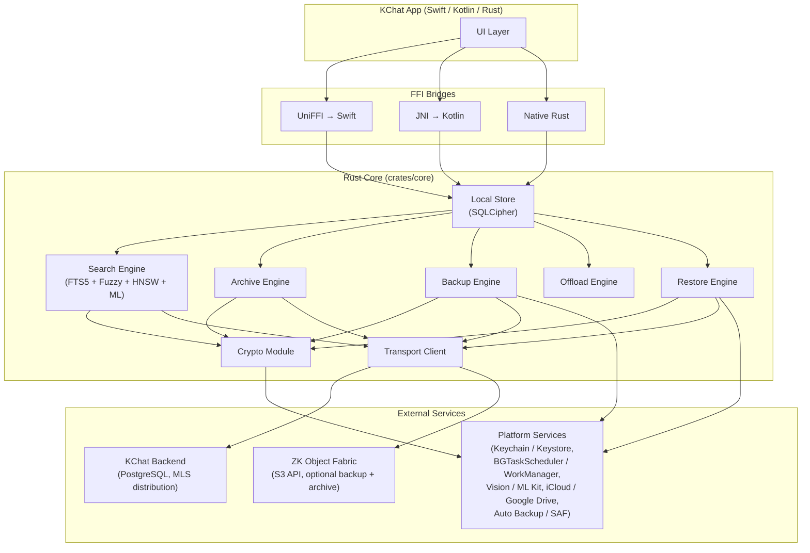

The core never talks to the UI directly. Every cross-boundary call
goes through the FFI bridge for the host platform.

---

## 2. Crate Structure

> **Phase 0 closed; Phase 1 in flight (~95%).** Updates vs. the
> original target structure below:
>
> * `crates/core/src/formats/` is a **Phase-0 addition** for the
>   CBOR wire-format types (segment frames, manifest spec, media
>   descriptor, search index shard). It was not shown in the
>   original target structure but is required by the Phase 0
>   checklist; the formats need to exist in code before the
>   higher-level engines (`archive`, `backup`, `search`, `restore`)
>   that consume them.
> * `crates/core/src/crypto/key_wrap.rs` is **implemented**
>   (AES-256-KW per RFC 3394) and is no longer a stub. The
>   platform-specific wraps for `K_local_db` (Keychain / Keystore /
>   DPAPI) still arrive in Phase 1; they layer on top of the same
>   `wrap_key` / `unwrap_key` primitives.
> * `crates/core/src/search/tokenizer.rs` is the **Phase-0 closing**
>   multilingual tokenization spec: `TokenizerConfig`,
>   `FallbackMode::{Icu, Unicode61}`, ISO-15924 `ScriptClass`, the
>   `FuzzyGranularity` mapping, and `detect_script` /
>   `segment_by_script` for mixed-script runs.
> * `crates/core/src/local_store/schema.rs` is the **Phase-1
>   foundation** for the SQLCipher schema: typed Rust row structs
>   for every table in §4 plus the `SCHEMA_SQL` constant carrying
>   the `CREATE TABLE` / `CREATE VIRTUAL TABLE` statements.
> * `crates/core/src/local_store/db.rs` is the **Phase-1 SQLCipher
>   binding**: `LocalStoreDb` opens / creates `{data_dir}/kchat.db`
>   (or an `:memory:` database for tests), sets `PRAGMA key` from
>   the 32-byte `K_local_db`, enables foreign-key enforcement, and
>   runs `SCHEMA_SQL` with automatic detection of the FTS5 ICU
>   tokenizer plus `unicode61` fallback via
>   `create_schema_with_unicode61_fallback()`. CRUD helpers cover
>   conversation / skeleton / body / `update_body_state` /
>   `insert_backup_event`. SQLCipher itself is bundled by
>   `rusqlite`'s `bundled-sqlcipher-vendored-openssl` feature so
>   the workspace builds and tests without a system SQLCipher /
>   OpenSSL install. Platform-specific wrapping of `K_local_db`
>   (Keychain / Keystore / DPAPI) is still stubbed and lands later
>   in Phase 1 alongside the production UniFFI / JNI packaging.
>   The Phase-1 **bridge scaffolds** themselves are already in
>   tree: `crates/ios-bridge/` carries the UDL at
>   `src/kchat.udl`, a `build.rs` that calls
>   `uniffi::generate_scaffolding`, and FFI-shaped wrappers
>   around `CoreImpl` (UUIDs cross the FFI as canonical
>   strings; argument validation throws
>   `KChatError::InvalidArgument`).
>   `crates/android-bridge/` carries the
>   `Java_com_kchat_core_KChatBridge_*` JNI entry points
>   (`initialize`, `destroy`, `sendText`, `search`,
>   `editMessage`, `deleteForMe`, `deleteForEveryone`,
>   `getMessage`, `getConversationMessages`) plus a pure-Rust
>   `KChatBridgeHandle` so unit tests exercise the same code
>   paths without a JNIEnv. Errors throw
>   `com.kchat.core.KChatException`; `MessageView` /
>   `SearchResult` batches marshal as JSON for brevity.
> * `crates/core/src/local_store/state_machines.rs` defines the
>   `body_state`, `media_state`, `archive_state`, `backup_state`,
>   and `restore_state` enums with `try_transition`, `Display` /
>   `FromStr`, and serde support — every transition not in the
>   diagrams in §5 is rejected.
> * `crates/core/src/message/processor.rs` carries the **Phase-1
>   message processor**: `IngestedMessage`, `OutboxEntry`,
>   `OutboxStatus`, `IngestResult`, the pure validators
>   (`validate_ingest`, `is_duplicate`, `create_outbox_entry`),
>   and the DB-backed `MessagePersister` that wraps skeleton +
>   body + FTS row + `"message_received"` /
>   `"outbox_pending"` / `"outbox_sent"` /
>   `"message_edited"` / `"message_deleted"` journal writes
>   inside one `SAVEPOINT` so a crash mid-ingest cannot leave
>   the FTS index out of sync with the skeleton table.
>   `edit_message`, `delete_for_me`, and `delete_for_everyone`
>   call `try_transition` on `body_state` from §5 before
>   touching the FTS / body rows, and the for-everyone path
>   drops `message_body` in addition to clearing the FTS row.
> * `crates/core/src/search/text_search.rs` is the **Phase-1 FTS5
>   text search engine**: `TextSearchEngine::search_fts` runs
>   `bm25(search_fts)`-ordered queries returning
>   `FtsMatch { message_id, conversation_id, sender_id,
>   created_at_ms, snippet, bm25_score }`. `build_fts_query`
>   quotes free-text tokens token-by-token while preserving
>   `"phrase"` and trailing-`*` prefix queries plus the explicit
>   `AND` / `OR` / `NOT` / `NEAR` operators.
> * `crates/core/src/search/query_engine.rs` is the **Phase-1
>   unified search engine**: `QueryEngine::execute_search` fans
>   out to both `TextSearchEngine::search_fts` and
>   `FuzzySearchEngine::search_fuzzy`, deduplicates the union by
>   `message_id`, and weights the merged scores with
>   `BM25_WEIGHT = 2.0` / `FUZZY_WEIGHT = 1.0` per
>   `docs/PROPOSAL.md §7.5` so exact hits always outrank
>   fuzzy-only hits on the same query. Fuzzy-only rows are
>   skeleton-hydrated through one
>   `fetch_skeleton_basic_info()` batch query so the engine
>   does not pay one round-trip per fuzzy hit. The same
>   structured `WHERE` clause on `message_skeleton`
>   (`sender_filter`, `conversation_filter`, `date_from` /
>   `date_to`, `content_kind`) filters both engine outputs via
>   the unified `allowed_skeleton_ids()` helper. The result is
>   mapped to `SearchResult { snippet, rank_score, is_cold }`
>   and short-circuits to a recency-ordered skeleton scan when
>   the query string is empty. `SearchScope::LocalOnly` is
>   honored — no archive fan-out attempts in Phase 1.
> * `crates/core/src/search/fuzzy_search.rs` is the **early
>   Phase-5 foundation** for the fuzzy index, now wired into the
>   Phase-1 hot path. `FuzzyTokenizer` splits text into
>   per-script runs via `segment_by_script` and emits trigrams
>   or bigrams per `fuzzy_granularity(script)` from §3 of
>   `docs/PROPOSAL.md`. Tokens are lowercased for
>   case-insensitive matching and never straddle ASCII
>   whitespace / punctuation / digit boundaries.
>   `FuzzySearchEngine` writes into the `search_fuzzy` table
>   (`message_id`, `token`, `script`) with `INSERT OR IGNORE`
>   semantics, supports `remove_message`, and ranks
>   `search_fuzzy` results by token-overlap ratio.
>   `MessagePersister` (above) calls `index_message` from
>   `persist_ingested_message` / `persist_outbox_entry`,
>   `remove_message` + `index_message` from `edit_message`, and
>   `remove_message` from `delete_for_me` /
>   `delete_for_everyone` so the FTS5 and fuzzy indexes stay in
>   lock-step on every body mutation. The encrypted-shard /
>   archive fan-out path arrives later in Phase 5.
> * `crates/core/src/core_impl.rs` is the **Phase-1 concrete
>   `KChatCore` implementation**. `CoreImpl::new(config, key)`
>   opens the SQLCipher store, retains the 32-byte
>   `K_local_db` in a `Zeroizing<[u8; 32]>` so
>   `initialize(new_config)` can re-open at a different
>   `data_dir`, and stores the `LocalStoreDb` behind a `Mutex`
>   so the trait's `&self` API stays sync. `send_text` mints
>   an `OutboxEntry` through `MessageProcessor::create_outbox_entry`
>   and persists it via
>   `MessagePersister::persist_outbox_entry`;
>   `edit_message`, `delete_for_me`, and `delete_for_everyone`
>   lock the db mutex and delegate to `MessagePersister` so
>   the trait surfaces the full local message lifecycle.
>   `get_message` and `get_conversation_messages` delegate to
>   `LocalStoreDb::get_message_with_body` and
>   `LocalStoreDb::get_conversation_messages` and re-shape the
>   rows into the public `MessageView` (skeleton fields plus
>   the optional decrypted body text) so the bindings never
>   leak the internal schema. `search` delegates to
>   `QueryEngine::execute_search`. The transport-driven
>   `ingest_remote_messages` is now wired against an injected
>   `Box<dyn DeliveryClient>` held in
>   `Mutex<Option<…>>`: `CoreImpl::with_transport(config, key,
>   client)` and the alternate `set_delivery_client(client)`
>   install the implementation; the trait method calls
>   `fetch_messages(conversation_id, after_cursor)`, converts
>   each `RawDeliveryMessage` into `IngestedMessage` (parsing
>   ids back to `Uuid`), and forwards into the existing
>   `ingest_messages` pipeline so deduplication / FTS / fuzzy
>   / journal writes are unchanged. The transport's
>   `next_cursor` is propagated end-to-end through the
>   `IngestResult.next_cursor: Option<String>` field so
>   bridge layers can drive paginated drains directly off
>   the result without poking at the transport mock; the
>   inherent `CoreImpl::ingest_messages(&[IngestedMessage])`
>   path leaves the field as `None` because it has no
>   transport context. When no transport is configured the
>   trait method returns
>   `Err(Error::Transport("no delivery client configured"))`
>   so callers fail fast instead of silently no-oping.
>   Inherent **conversation-management methods**
>   (`create_conversation`, `list_conversations`,
>   `get_conversation`, `update_conversation_pin`,
>   `update_conversation_mute`) wrap the matching helpers on
>   `LocalStoreDb` and surface `Error::Storage` when the
>   conversation does not exist so the bridge layer can show
>   the failure to the user. The trait now also exposes
>   **`delete_conversation(uuid)`** so bridge clients can drive
>   the cascade through the public API; it cascades through
>   every dependent row (`media_search_index` → `search_fuzzy`
>   → `search_fts` → `search_vector` → `media_asset` →
>   `message_body` → `message_skeleton` → `conversation`)
>   inside a single `SAVEPOINT`, leaving sibling conversations
>   untouched. The ordering is dictated by the schema's
>   foreign-key direction: `media_search_index.asset_id`
>   references `media_asset(asset_id)` and
>   `media_asset.message_id` references
>   `message_skeleton(message_id)`, so both must drain
>   top-down before the skeleton delete runs;
>   `search_vector` carries no FK but the rows are
>   message-scoped and never want to outlive the skeleton.
>   The trait also carries a Phase-1 stub
>   **`register_device(&str) -> Result<DeviceRegistration>`**
>   that returns
>   `Err(Error::NotImplemented("register_device"))` until the
>   MLS credential / KeyPackage publication pipeline lands;
>   the empty `DeviceRegistration` placeholder lives next to
>   the other Phase-1 placeholder result types in
>   `crates/core/src/lib.rs` so the FFI shape is stable.
>   Inherent **timeline + single-message helpers**
>   (`get_timeline(uuid, before_ms, limit)` for newest-first
>   `TimelineRow` pages, plus `get_message_with_body(uuid)`
>   and `get_message_body(uuid)` for the binding hydration
>   path) wrap the matching DB helpers without re-shaping
>   through `MessageView`. The Phase-2/3/4 trait methods
>   `send_media`, `hydrate_message`, `run_incremental_backup`,
>   `enforce_storage_budget`, and `restore_from_backup`
>   currently return `Err(Error::NotImplemented(<method>))` —
>   the surface is locked but the implementation lands with
>   the relevant later phase.
> * `crates/core/src/transport/mod.rs` is the **Phase-1
>   transport trait abstraction**. The module exposes two
>   layered traits. The narrower `DeliveryClient` (object-safe,
>   `Send + Sync`) drives `ingest_remote_messages` today via
>   `FetchResult { messages, next_cursor }`, the
>   string-typed `RawDeliveryMessage` wire shape, and
>   `TransportError { Network, Auth, Server }` with
>   `thiserror`-derived `Display` so upper layers can route
>   on intent without parsing free-form text. A test-only
>   `MockDeliveryClient` stages FIFO
>   `(after_cursor → response)` mappings and asserts —
>   inside `fetch_messages` — that the actual `after_cursor`
>   matches the staged one, which is how the
>   `core_impl::core_impl_ingest_remote_passes_cursor` test
>   pins the cursor pass-through. The broader
>   `TransportClient` is the §10 surface that the
>   later-phase engines (`media`, `archive`, `backup`,
>   search-shard fetch) will share: cursor-paginated
>   `fetch_messages` returning `FetchMessagesResponse`,
>   chunked blob upload (`init_blob_upload` →
>   `upload_chunk` → `commit_blob`) with whole-object Merkle
>   verification through `BlobUploadHandle` / `ChunkReceipt`
>   / `CommitBlobResponse`, ranged blob download
>   (`fetch_blob_range`), Personal-Archive manifest +
>   segment fetch (`fetch_archive_manifests` returning
>   `EncryptedManifest`, `fetch_archive_segment` returning
>   ciphertext bytes), and encrypted-search-shard fetch
>   (`fetch_index_shards`). The `BlobClass` enum
>   (`Media`, `ArchiveSegment`, `SearchIndexShard`,
>   `BackupSegment`, `Manifest`) is shared with the AEAD
>   AAD tag in `crypto::aead`, so the wire-level binding
>   and the transport-level upload argument can never
>   disagree. A `NoopTransportClient` returns
>   `Error::NotImplemented("transport")` from every method
>   so `CoreImpl` can be constructed without a real backend
>   until Phase 2 lands. The Phase-2+ HTTP / gRPC / MLS-blob
>   transports layer on top of these traits in sibling
>   sub-modules added when those engines arrive.
> * `crates/core/benches/phase1_benchmarks.rs` is the **Phase-1
>   performance benchmark suite** (criterion). Five benches
>   exercise `MessagePersister::persist_ingested_message`
>   (single insert + 100-row batch),
>   `QueryEngine::execute_search` against a 1k-row corpus
>   (single needle, structured filters, prefix queries) so the
>   < 20 ms / < 150 ms p95 budgets in §13 of
>   `docs/PROPOSAL.md` are continuously verifiable.

The workspace ships four crates: a core that knows nothing about
platforms, and three thin bridges.

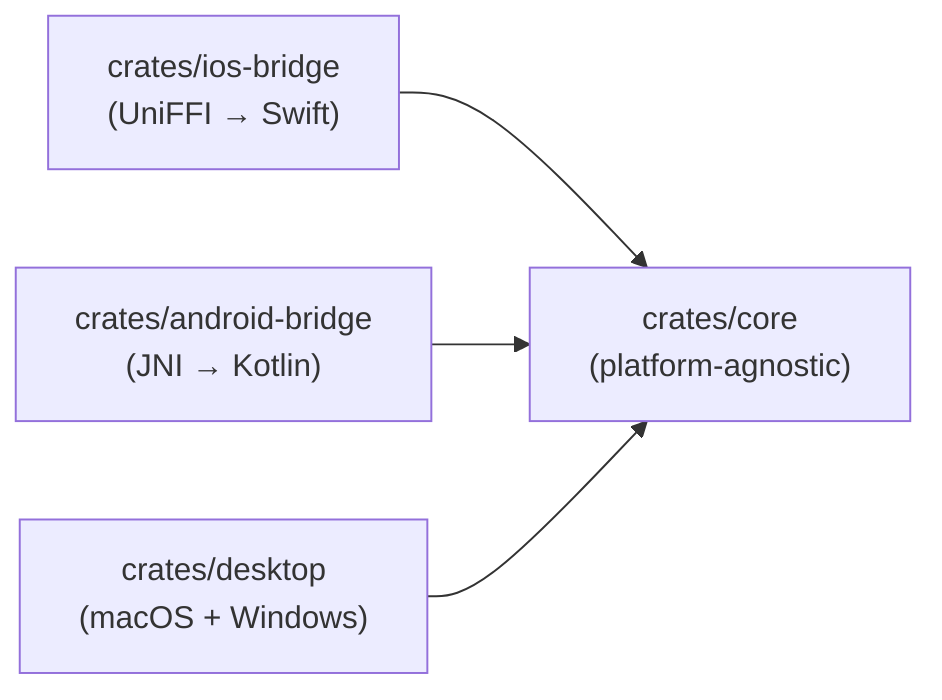

Inside `crates/core` the modules layer downward; higher-level
modules depend on lower-level ones, never vice versa.

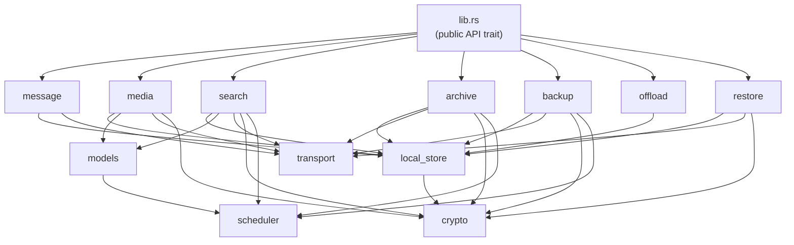

`crypto` is a leaf module: every other module that touches
ciphertext routes through it, and `crypto` itself depends only on
the standard library and chosen primitives.

> **Phase 0 closed; Phase 1 in flight.** The crypto module
> implements `content_hash`, `key_hierarchy`, `aead`, `convergent`,
> and `key_wrap` (AES-256-KW). The platform-specific wrappers
> (Keychain, Android Keystore, DPAPI) and `K_asset` wrapping for
> archive / backup land in Phase 1 / Phase 2 and layer on top of
> the same `wrap_key` / `unwrap_key` primitives.
>
> Phase 1 has additionally landed the `local_store::schema`,
> `local_store::db` (SQLCipher binding + CRUD helpers + the
> conversation-management helpers `list_conversations` /
> `update_conversation_pin` / `update_conversation_mute`),
> `local_store::state_machines`, `message::processor` (validators
> *and* DB-backed `MessagePersister` that now indexes both
> `search_fts` and `search_fuzzy` on every body mutation
> through edit / delete),
> `search::tokenizer`, `search::text_search` (FTS5 BM25 engine),
> `search::query_engine` (unified FTS + fuzzy + structured
> search merged by `message_id` with PROPOSAL.md §7.5 weights),
> and the early-Phase-5 `search::fuzzy_search` (script-aware
> n-gram indexer) modules, plus the expanded `KChatCore`
> public-API trait in `lib.rs` (`SearchQuery`, `SearchScope`,
> `SearchResult`, `HydrationReason`, `BackupReason`,
> `StoragePressureReason`, `ClientMessageId`, `DeliveryCursor`,
> the new placeholder result types `HydratedMessage` /
> `BackupResult` / `OffloadResult` / `RestoreResult` /
> `BackupSource`, and `Error::NotImplemented(&'static str)`)
> and its concrete implementation `core_impl::CoreImpl` wiring
> `send_text` / `ingest_messages` / `search` to the SQLCipher
> store, exposing inherent conversation-management methods
> (`create_conversation` / `list_conversations` /
> `get_conversation` / `update_conversation_pin` /
> `update_conversation_mute`), and stubbing the Phase-2/3/4
> trait methods (`send_media` / `hydrate_message` /
> `run_incremental_backup` / `enforce_storage_budget` /
> `restore_from_backup`) with `Error::NotImplemented`. A
> criterion benchmark suite at
> `crates/core/benches/phase1_benchmarks.rs` enforces the
> < 20 ms / < 150 ms p95 budgets from §13 of
> `docs/PROPOSAL.md`.
>
> Phase 2 has now started filling `crates/core/src/media/`. It
> is no longer a pure placeholder: in addition to the
> tiered-media routing seam under `media/sinks/`
> (`MediaBlobSink` trait + `NoopMediaBlobSink`, see PROPOSAL.md
> §5.7) the module now carries the chunked-media pipeline at
> `media/chunker.rs` (`chunk_and_encrypt`, `verify_and_decrypt`,
> `pad_to_size_class` / `unpad_from_size_class`, the
> `SealedChunk` / `ChunkedMedia` pair, `DEFAULT_CHUNK_SIZE`),
> `media/processor.rs` (`process_media` →
> `MediaProcessResult { descriptor, sealed_chunks, k_asset_raw,
> initial_media_state }` with random `K_asset` generation,
> AES-256-KW wrap, `MediaDescriptor` assembly, and the
> `transition_media_state` / `mark_downloaded` /
> `mark_evicted` / `mark_deleted` helpers that drive the
> `MediaState` machine through `LocalStoreDb::update_media_state`),
> `media/upload.rs` (`upload_chunked_media` / `resume_upload`
> over `TransportClient` with server-side BLAKE3 verification),
> `media/download.rs` (`download_chunked_media` /
> `download_single_chunk` fetching encrypted chunks via
> `TransportClient::fetch_blob_range`, per-chunk SHA-256
> fast-fail, AEAD-open with per-chunk AAD, BLAKE3 root
> verification), `media/cache.rs` (`MediaCache` with O(1)
> insert / `touch` / `remove` and LRU eviction to a
> configurable byte budget), `media/caption.rs`
> (`normalize_caption`, `sanitize_filename`, `validate_mime_type`
> with Unicode NFC normalization, filesystem-illegal-char
> stripping, byte-budget truncation that preserves character
> boundaries, and full multilingual coverage), and
> `media/routing.rs` (`route_media_upload` /
> `route_media_download` dispatching between the KChat backend
> via `TransportClient` and the configured `MediaBlobSink`
> based on `is_thumbnail` and `MediaBlobReference::storage_sink`).
>
> The remaining higher-level modules (`backup`, `restore`,
> `models`, `transport`, `scheduler`) are Phase-0 placeholders
> and are filled in across Phases 3 – 7. `transport` is
> partially populated by Phase 1 (`DeliveryClient` /
> `TransportClient` traits, `NoopTransportClient`,
> `MockDeliveryClient`).
>
> The Phase 3 modules `archive` and `offload` are no longer
> placeholders: `archive::event_journal` (append-only mutation
> log feeding the segment builder; **wired into
> `MessagePersister`** so every persist / edit / delete path and
> `CoreImpl::send_media` writes a matching `ArchiveEvent` inside
> the existing SAVEPOINT alongside the `BackupEvent`),
> `archive::segment_builder` (CBOR → zstd → XChaCha20-Poly1305
> sealed segments under `K_archive_segment(segment_id)`),
> `archive::manifest_builder` (genesis → gen N chain, BLAKE3 over
> canonical-CBOR signing payload, Ed25519 signature, AEAD-seal
> under `K_archive_manifest`), `archive::upload`
> (`upload_archive_segment` drives the `TransportClient` upload
> sequence and verifies the commit-time ciphertext Merkle root;
> `persist_segment_map_row` records the resulting blob in
> `archive_segment_map`), `archive::prefetch::batch_prefetch_bucket`
> (one transport hop per `(conversation_id, time_bucket)` per
> PROPOSAL §5.6), `archive::prefetch::batch_prefetch_bucket_with_padding`
> (the privacy-aware variant — interleaves UUIDv4 dummy
> segment-ids with the real UUIDv7 ones when
> `KChatCoreConfig::privacy_level == High`),
> `archive::epoch_keys::EpochKeyManager` (current epoch key in
> `Zeroizing<[u8; 32]>` plus a registry of prior epoch keys
> wrapped via AES-256-KW under `K_archive_root` for cross-epoch
> segment decrypt; `rotate(new_epoch_id)` /
> `unwrap_prior_epoch_key` / `delete_epoch_key(epoch_id)` cover
> the lifecycle including forward-secrecy deletion),
> `archive::routing::{route_archive_upload, route_archive_download,
> route_manifest_upload}` (dispatches archive operations to
> either the `TransportClient` or a `ZkofArchiveAdapter` based
> on `KChatCoreConfig::archive_backend`; the ZKOF adapter is
> backed by an `S3Client` trait with a `NoopS3Client` stub),
> `archive::privacy::{should_pad, compute_padding_count,
> generate_dummy_segment_id, pad_with_dummy_requests}`
> (privacy-padding helpers consumed by the prefetch path),
> `local_store::db::update_archive_state` (atomic batch UPDATE
> gated by `ArchiveState::try_transition`),
> `local_store::db::rehydrate_message_body` (in-place body update
> + `body_state` transition + FTS / fuzzy re-indexing inside one
> SAVEPOINT, no `created_at_ms` / `received_at_ms` mutation, so
> the timeline never scroll-jumps when a cold body lands),
> `media::download::rehydrate_media_asset` (reads
> `media_asset.{blob_id, storage_sink, chunk_count, merkle_root,
> wrapped_k_asset}`, unwraps `K_asset` via `K_local_db`, drives
> the chunked download through `TransportClient` or the
> configured `MediaBlobSink` based on `storage_sink`, and flips
> `media_state` to `original_local`), `media::sinks::zk_fabric`
> (`ZkObjectFabricSink` mapping
> `upload_media_chunks` / `fetch_media_chunk` /
> `delete_media_blob` to per-chunk S3 keys
> `media/{asset_id}/chunk-{idx:08}` against a configured bucket;
> `MediaBlobReference::metadata` carries
> `[chunk_count:u32_be][merkle_root:32b][asset_id:utf8]` so the
> rehydration path can re-derive every chunk key without a
> second DB round-trip), and `offload::{budget, scoring, eviction,
> hydration}` (storage budget enforcer, eviction scoring per
> PROPOSAL §5.4 with a `pinned`-row guard returning `f64::MIN`,
> pressure-tier-aware eviction planner / executor including the
> tiered policy `plan_tiered_eviction` (cloud-offload pool first
> → KChat-backend pool only on shortfall), P0..P5 hydration
> priority queue). All of this is wired into `CoreImpl`:
> `enforce_storage_budget` now harvests candidate rows via
> `collect_eviction_candidates` and runs the tiered eviction
> planner / executor in two passes (cloud, then full) with the
> combined `freed_bytes` / `evicted_count` reported back to the
> caller, and `hydrate_message` enqueues every request into a
> `Mutex<HydrationQueue>` with the priority mapped from the
> reason string by `parse_hydration_reason`, calling
> `LocalStoreDb::rehydrate_message_body` for cold text bodies
> and `media::download::rehydrate_media_asset` for evicted /
> remote-only media on the same path. The remote archive fetch
> path (manifest reader / segment download / replay) is queued
> for the next Phase 3 milestone.

---

## 3. Four-Store Data Flow

Four logically distinct stores; three interactive on the device,
one non-interactive for disaster recovery. Direction of arrows is
data flow, not request flow.

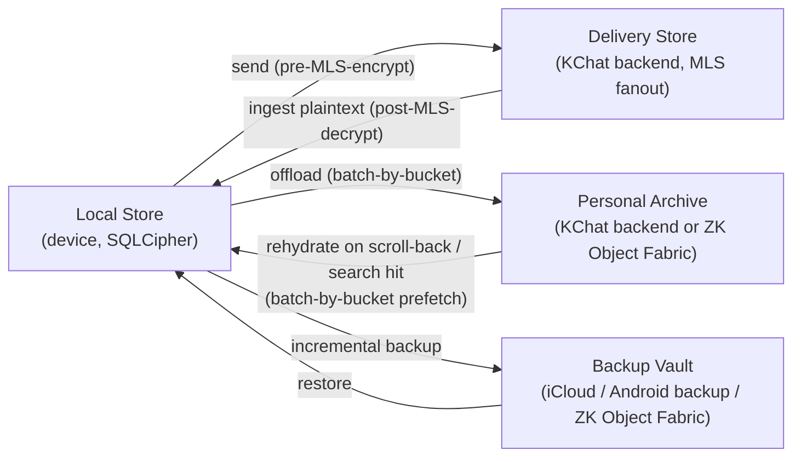

Backup never feeds the archive directly, and the archive never
feeds the backup directly. They are independent pipelines reading
from their own event journals on the local store.

> **Tiered media storage (PROPOSAL.md §5.7).** Media originals may
> route to user cloud storage (iCloud / Google Drive / ZK Object
> Fabric) via the `MediaBlobSink` trait instead of the Personal
> Archive backend. The archive stores only `media_key_delta`
> segments (the `K_asset` wraps) and thumbnails; the originals are
> fetched from the user's configured media sink on tap. Thumbnails
> and archive segments stay on Tier 0; only originals are routed.

---

## 4. Local Store Schema

The schema lives in `crates/core/src/local_store/schema.rs`. The
multilingual FTS5 configuration is the headline element:

```sql
-- Conversations
CREATE TABLE conversation (
    conversation_id   TEXT PRIMARY KEY,
    title_cipher      BLOB,                 -- encrypted with K_local_db
    pinned            INTEGER NOT NULL DEFAULT 0,
    muted             INTEGER NOT NULL DEFAULT 0,
    last_message_id   TEXT,
    last_activity_ms  INTEGER NOT NULL
);

-- Skeletons render the timeline before any body / media is loaded
CREATE TABLE message_skeleton (
    message_id        TEXT PRIMARY KEY,
    conversation_id   TEXT NOT NULL REFERENCES conversation(conversation_id),
    sender_id         TEXT NOT NULL,
    created_at_ms     INTEGER NOT NULL,
    received_at_ms    INTEGER NOT NULL,
    kind              TEXT NOT NULL,
    body_state        TEXT NOT NULL,
    media_state       TEXT,
    archive_state     TEXT NOT NULL DEFAULT 'not_archived',
    backup_state      TEXT NOT NULL DEFAULT 'not_backed_up',
    reply_to          TEXT,
    edited_at_ms      INTEGER,
    deleted_at_ms     INTEGER
);

CREATE TABLE message_body (
    message_id        TEXT PRIMARY KEY REFERENCES message_skeleton(message_id),
    text_content      TEXT,                 -- UTF-8, may mix scripts
    detected_language TEXT,                 -- BCP-47, optional
    rich_meta         BLOB                  -- mentions, link previews (CBOR)
);

CREATE TABLE media_asset (
    asset_id          TEXT PRIMARY KEY,
    message_id        TEXT NOT NULL REFERENCES message_skeleton(message_id),
    mime_type         TEXT NOT NULL,
    bytes_total       INTEGER NOT NULL,
    bytes_local       INTEGER NOT NULL,
    media_state       TEXT NOT NULL,
    wrapped_k_asset   BLOB NOT NULL,
    chunk_count       INTEGER NOT NULL,
    merkle_root       BLOB NOT NULL,
    blob_id           TEXT NOT NULL,
    storage_sink      TEXT NOT NULL DEFAULT 'kchat_backend'  -- PROPOSAL.md §5.7
);

-- Multilingual full-text search
CREATE VIRTUAL TABLE search_fts USING fts5(
    message_id        UNINDEXED,
    conversation_id   UNINDEXED,
    sender_id         UNINDEXED,
    created_at_ms     UNINDEXED,
    text_content,
    tokenize = 'icu'                       -- primary multilingual tokenizer
);

CREATE TABLE search_fuzzy (
    token       TEXT NOT NULL,
    script      TEXT NOT NULL,             -- ISO-15924
    message_id  TEXT NOT NULL,
    PRIMARY KEY (token, script, message_id)
);

CREATE TABLE search_vector (
    message_id    TEXT NOT NULL,
    embedding     BLOB NOT NULL,            -- INT8-quantized
    model_version TEXT NOT NULL,
    PRIMARY KEY (message_id, model_version)
);

CREATE TABLE media_search_index (
    asset_id      TEXT NOT NULL REFERENCES media_asset(asset_id),
    kind          TEXT NOT NULL,            -- 'ocr' | 'caption' | 'transcript' | 'tag'
    text          TEXT NOT NULL,
    language      TEXT,                     -- BCP-47 if detected
    confidence    REAL,
    PRIMARY KEY (asset_id, kind, text)
);

-- Backup pipeline
CREATE TABLE backup_event_journal (
    event_seq     INTEGER PRIMARY KEY AUTOINCREMENT,
    event_type    TEXT NOT NULL,
    payload       BLOB NOT NULL,            -- CBOR
    created_at_ms INTEGER NOT NULL
);

-- Archive pipeline
CREATE TABLE archive_segment_map (
    segment_id           TEXT PRIMARY KEY,
    conversation_id      TEXT NOT NULL,
    time_bucket          TEXT NOT NULL,     -- e.g. '2026-04'
    segment_type         TEXT NOT NULL,
    blob_id              TEXT NOT NULL,
    storage_backend      TEXT NOT NULL DEFAULT 'kchat_backend',  -- PROPOSAL.md §10.1
    merkle_root          BLOB NOT NULL,
    state                TEXT NOT NULL      -- not_archived..archive_compacted
);

-- Restore state machine
CREATE TABLE restore_state (
    id     INTEGER PRIMARY KEY CHECK (id = 1),
    state  TEXT NOT NULL,                  -- identity_restored..full_restore_complete
    notes  TEXT
);
```

The whole database is a SQLCipher database keyed by `K_local_db`,
itself wrapped by the platform Keychain / Keystore.

---

## 5. Message State Machine

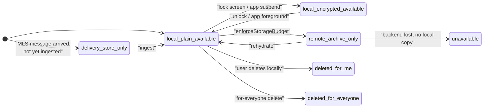

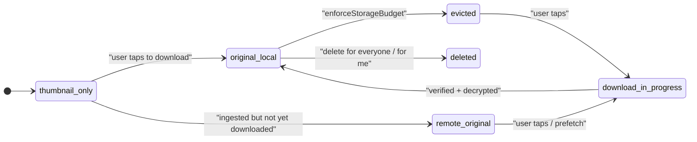

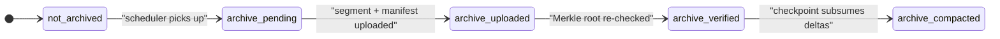

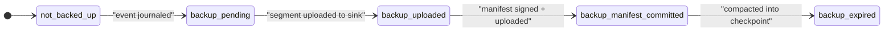

---

## 6. Search Engine Architecture

The search pipeline runs fully on-device. Cold buckets either
arrive as locally cached encrypted shards or are fetched on demand
by coarse bucket; the query string itself never crosses the FFI
boundary as a server request.

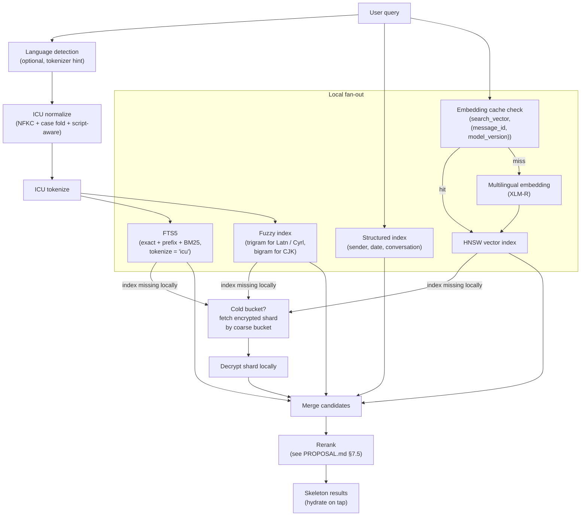

The embedding cache is populated by both the guardrail pipeline
(`kennguy3n/slm-guardrail`) and the search pipeline. A message's
`XLM-R` embedding is computed at most once: whichever pipeline
first observes the message writes the 384-dim vector into the
`search_vector` row keyed by `(message_id, model_version =
'xlmr@v1')`, and the other pipeline reads it back from that row
instead of running its own ONNX inference. See
[`docs/PROPOSAL.md` §7.6.1](./PROPOSAL.md) for the full contract
(version-mismatch handling, locality / non-replication rules) and
[`crate::models::embeddings::EmbeddingCache`] for the trait that
binds the seam.

---

## 7. Crypto Architecture

Every key derives from `K_user_master` via labelled HKDF-SHA256.
The crypto module knows nothing about messages, media, or search;
it serves AEAD-sealed bytes against typed key handles.

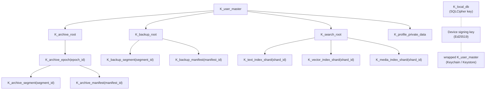

Per-media-object encryption is a separate path with its own
random key:

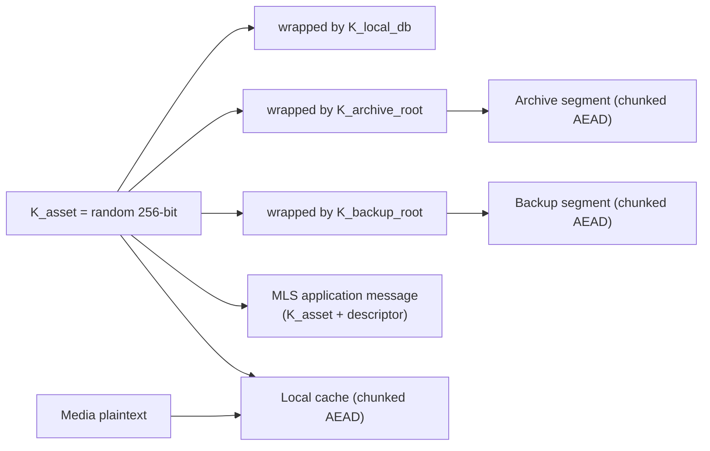

> Phase 3 inserts the `K_archive_epoch(epoch_id)` indirection
> between `K_archive_root` and the per-segment / per-manifest
> keys. `crypto::key_hierarchy` exposes
> `derive_archive_epoch_key`, `derive_archive_segment_key`,
> `derive_archive_manifest_key`, and the AES-256-KW pair
> `wrap_epoch_key` / `unwrap_epoch_key` so the orchestration
> layer can rotate epochs (default cadence: monthly, matching
> `time_bucket`) and still recover prior-epoch segment / manifest
> keys from the wrapped form persisted in the manifest chain.

ZK Object Fabric backups use Pattern C, derived deterministically
from the plaintext + tenant ID. The Rust path must produce
bit-identical output to the Go SDK at
`kennguy3n/zk-object-fabric/encryption/client_sdk/`:

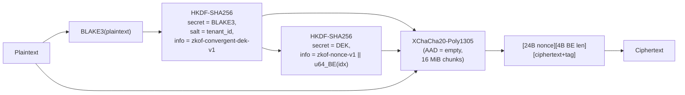

---

## 8. Archive and Offload Architecture

### 8.1 Archive segment build and upload

```mermaid
sequenceDiagram
    participant Core as "Rust core (archive engine)"
    participant Cr as "crypto"
    participant Tr as "transport"
    participant BE as "KChat backend"
    participant ZKOF as "ZK Object Fabric"

    Core->>Core: "read archive event journal since cursor"
    Core->>Core: "group by (conversation_id, time_bucket)"
    Core->>Core: "build CBOR payload, zstd compress"
    Core->>Cr: "AEAD seal with K_archive_segment<br/>(derived from K_archive_epoch)"
    Cr-->>Core: "ciphertext + Merkle root"
    alt "archive_backend = kchat"
        Core->>Tr: "blob init (chunked upload)"
        Tr->>BE: "POST /v1/blobs/init"
        BE-->>Tr: "blob_id"
        Core->>Tr: "upload chunks"
        Tr->>BE: "PUT /v1/blobs/{blob_id}/chunks/{idx}"
        Core->>Tr: "commit blob"
        Tr->>BE: "POST /v1/blobs/{blob_id}/commit"
        BE-->>Tr: "merkle_root"
    else "archive_backend = zkof"
        Core->>Tr: "S3 PutObject (multipart)"
        Tr->>ZKOF: "S3 PutObject (multipart)"
        ZKOF-->>Tr: "ETag + Merkle root"
    end
    Core->>Core: "verify backend Merkle root == local"
    Core->>Cr: "build & seal manifest gen N+1"
    Cr-->>Core: "manifest ciphertext"
    Core->>Tr: "upload manifest"
    Core->>Core: "mark archive_state = archive_verified;<br/>advance cursor"
```

### 8.2 Offload / eviction

```mermaid
sequenceDiagram
    participant Sys as "OS / scheduler"
    participant Off as "offload engine"
    participant DB as "local_store"

    Sys->>Off: "enforceStorageBudget(reason)"
    Off->>DB: "compute storage usage + headroom"
    Off->>DB: "build candidate set<br/>(verified archives, not pinned, not active)"
    Off->>DB: "score each candidate<br/>(see PROPOSAL.md §5.4)"
    loop "until headroom reclaimed"
        Off->>DB: "evict next candidate per priority order"
    end
    Off-->>Sys: "OffloadResult { freed_bytes, evicted_count }"
```

> Phase 3 implementation:
>
> * Storage usage probing and pressure-level computation live in
>   `offload::budget` (`StorageBudget`, `StorageUsage`,
>   `BudgetAssessment`, `PressureLevel::{None, Warning, Critical,
>   Extreme}`, `StorageBudgetEnforcer::assess`).
> * Per-candidate scoring lives in `offload::scoring`
>   (`ContentKind::weight`, 30-day half-life recency decay,
>   16 MiB-normalised size bonus, `compute_eviction_score`).
>   Pinned candidates short-circuit to `f64::NEG_INFINITY`.
> * Plan / execute live in `offload::eviction`. `plan_eviction`
>   filters pinned + not-archived candidates, sorts by score
>   descending, accumulates until `target_bytes`.
>   `plan_eviction_with_pressure` is the pressure-aware variant:
>   originals (video / documents / images / voice) are eligible at
>   `Warning+`, thumbnails at `Critical+`, cold text bodies at
>   `Extreme` only.
>   `execute_eviction` issues the state-machine demotion against
>   `media_asset`.
> * **Tiered eviction policy** (PROPOSAL §5.4 / §5.7): media
>   originals on a user-cloud sink (`storage_sink != "kchat_backend"`)
>   are evicted first because the original is still recoverable
>   from the configured `MediaBlobSink` (cheap rehydration), and
>   only if that pool underruns the byte target does the planner
>   fall through to a second pass over assets whose only remote
>   copy is in the KChat archive.
>   `EvictionTier::{CloudOffload, FullEviction}` classifies each
>   `EvictionCandidate` by its `storage_sink`;
>   `plan_tiered_eviction` partitions the candidate pool, runs
>   `plan_eviction_with_pressure` once per pool, and combines the
>   two `EvictionPlan`s into a `TieredEvictionPlan` with
>   `target_bytes` / `total_bytes` accounting.
> * `offload::hydration::HydrationQueue` drives the rehydration
>   side: a deduplicating priority queue ordered by
>   `HydrationReason` (P0..P5) with FIFO tiebreaker, plus
>   `enqueue_prefetch_window` for viewport adjacency.
> * `CoreImpl::enforce_storage_budget` wires the budget enforcer
>   in: it harvests rows via `collect_eviction_candidates`,
>   runs `plan_tiered_eviction`, and executes the cloud-offload
>   plan and the full-eviction plan in order. The combined
>   `freed_bytes` / `evicted_count` is reported to the caller via
>   `BudgetEnforcementReport`. The end-to-end pipeline is
>   exercised by
>   [`crates/core/tests/storage_budget_enforcement.rs`](../crates/core/tests/storage_budget_enforcement.rs)
>   across every `PressureLevel` and both `EvictionTier` branches.

### 8.3 Rehydration

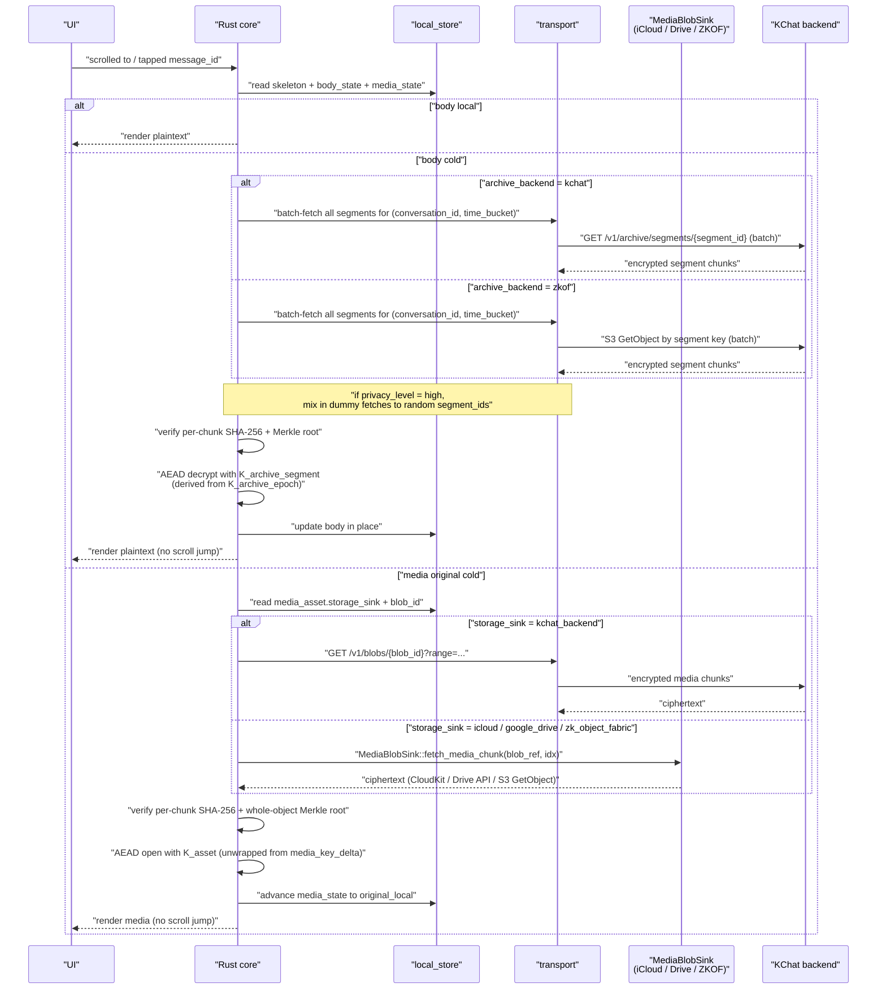

### 8.4 Prefetch window

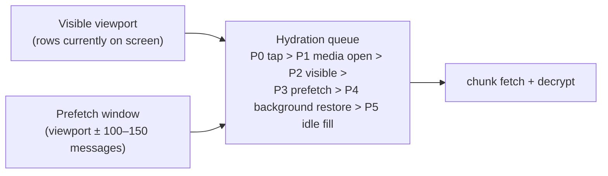

Prefetch granularity is **per time bucket**: when any segment in a
`(conversation_id, time_bucket)` is needed, all segments for that
pair are fetched. This aligns the prefetch unit with the archive
segment grouping and reduces per-segment access-pattern metadata
to per-bucket granularity (see PROPOSAL.md §5.6).

---

## 9. Backup and Restore Architecture

### 9.1 Incremental backup

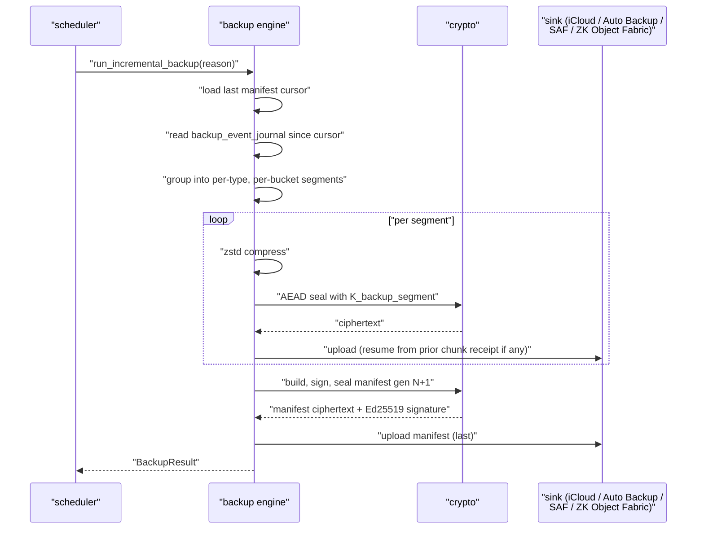

### 9.2 Skeleton-first restore

```mermaid
sequenceDiagram
    participant App as "KChat app"
    participant Core as "Rust core (restore engine)"
    participant Sink as "backup sink"
    participant BE as "KChat backend"
    participant UI as "UI"

    App->>Core: "restore_from_backup(source)"
    Core->>BE: "register device"
    Core->>Core: "recover K_user_master<br/>(D2D / recovery key / passphrase)"
    Core->>Sink: "fetch latest manifest"
    Core->>Core: "verify signature + previous_manifest_hash chain"
    Core->>Sink: "fetch conversation list segment"
    Core-->>UI: "skeleton_restored &mdash; render conversation list"
    Core->>Sink: "fetch timeline_skeleton segments"
    Core-->>UI: "skeletons render in each conversation"
    Core->>Sink: "fetch search_index_shard segments"
    Core-->>UI: "search_restored &mdash; search returns hits"
    Core->>Sink: "fetch recent message_body segments"
    Core-->>UI: "recent_messages_restored"
    Core->>Sink: "lazy media (on tap, on prefetch)"
```

### 9.3 Restore state machine

```mermaid
stateDiagram-v2
    direction LR
    [*] --> identity_restored
    identity_restored --> root_keys_unwrapped
    root_keys_unwrapped --> manifest_verified
    manifest_verified --> skeleton_restored
    skeleton_restored --> search_restored
    search_restored --> recent_messages_restored
    recent_messages_restored --> media_lazy_restore_enabled
    media_lazy_restore_enabled --> full_restore_complete
```

### 9.4 Manifest chain verification

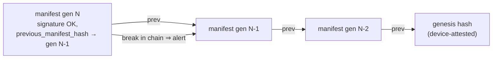

A break in the chain (a `previous_manifest_hash` mismatch or
signature failure) halts restore and surfaces a recoverable error
to the UI; restore never silently re-roots.

---

## 10. Transport Layer

The transport client is a thin async HTTP client that speaks the
KChat backend API. It does not hold any plaintext; every payload
it sends or receives is already AEAD-sealed by the crypto module.

### 10.1 Chunked encrypted blob upload

```mermaid
sequenceDiagram
    participant Core as "core"
    participant Tr as "transport"
    participant BE as "backend"

    Core->>Tr: "init blob (size, blob_class, expected_merkle_root)"
    Tr->>BE: "POST /v1/blobs/init"
    BE-->>Tr: "blob_id, upload_token"
    loop "per chunk"
        Core->>Tr: "upload chunk(idx, ciphertext, sha256)"
        Tr->>BE: "PUT /v1/blobs/{blob_id}/chunks/{idx}"
        BE-->>Tr: "chunk_receipt"
    end
    Core->>Tr: "commit"
    Tr->>BE: "POST /v1/blobs/{blob_id}/commit"
    BE-->>Tr: "computed merkle_root"
    Core->>Core: "verify merkle_root == local"
```

### 10.2 Range download

```mermaid
sequenceDiagram
    participant Core as "core"
    participant Tr as "transport"
    participant BE as "backend"

    Core->>Tr: "fetch blob {blob_id} range [from..to]"
    Tr->>BE: "GET /v1/blobs/{blob_id}?range=from-to"
    BE-->>Tr: "ciphertext bytes"
    Core->>Core: "verify per-chunk AEAD tag + SHA-256"
    Core->>Core: "decrypt with K_archive_segment / K_asset / etc."
```

### 10.3 Archive manifest fetch and segment download

```mermaid
sequenceDiagram
    participant Core as "core"
    participant Tr as "transport"
    participant BE as "backend"

    Core->>Tr: "list archive manifests after_generation = N"
    Tr->>BE: "GET /v1/archive/manifests?after_generation=N"
    BE-->>Tr: "manifest list (encrypted)"
    Core->>Core: "decrypt manifests, walk previous_manifest_hash"
    loop "per needed segment"
        Core->>Tr: "fetch segment {segment_id}"
        Tr->>BE: "GET /v1/archive/segments/{segment_id}"
        BE-->>Tr: "ciphertext"
        Core->>Core: "AEAD decrypt with K_archive_segment"
    end
```

### 10.4 Delivery message fetch (cursor-based)

```mermaid
sequenceDiagram
    participant Core as "core"
    participant Tr as "transport"
    participant BE as "backend"

    Core->>Tr: "ingest_remote_messages(conversation_id, after_cursor)"
    Tr->>BE: "GET /v1/mls/messages?conversation_id=&amp;after_cursor="
    BE-->>Tr: "MLS application messages + new cursor"
    Core->>Core: "MLS-decrypt (KChat MLS layer)"
    Core->>Core: "persist message_skeleton, message_body, media_asset"
    Core->>Core: "bump conversation.last_message_id / last_activity_ms"
    Core->>Core: "write backup + archive events"
    Core->>Core: "update FTS / fuzzy / vector / media indexes"
```

> **Phase 1 transport implementation note.** `transport` is now a
> Phase-1-implemented module (see §2): `core::transport::DeliveryClient`
> is the narrower trait the message-ingest path calls into,
> `RawDeliveryMessage` / `FetchResult` describe the wire shape, and
> `TransportError` flattens provider-specific failures into
> `Network` / `Auth` / `Server`. `CoreImpl::ingest_remote_messages`
> takes a `Box<dyn DeliveryClient>` (installed via
> `with_transport(config, key, client)` or
> `set_delivery_client(client)`), forwards `after_cursor` verbatim,
> converts each `RawDeliveryMessage` into the internal
> `IngestedMessage`, and runs the page through the existing
> `MessagePersister` pipeline so deduplication, FTS / fuzzy
> indexing, and journal writes happen exactly as in the local
> `send_text` path. When no client is configured the trait method
> returns `Err(Error::Transport("no delivery client configured"))`
> so callers fail fast instead of silently no-oping.
>
> The broader **`TransportClient`** trait (also in
> `core::transport`) carries the full §10 surface that Phases
> 2–4 will share: `fetch_messages` (cursor-paginated, returning
> `FetchMessagesResponse`), `init_blob_upload` /
> `upload_chunk` / `commit_blob` (chunked upload with
> whole-object Merkle verification through
> `BlobUploadHandle` / `ChunkReceipt` /
> `CommitBlobResponse`), `fetch_blob_range` (range
> download for resumable hydration), `fetch_archive_manifests`
> (returning `EncryptedManifest` so the manifest chain stays
> AEAD-sealed end-to-end), `fetch_archive_segment`, and
> `fetch_index_shards`. The `BlobClass` enum
> (`Media`, `ArchiveSegment`, `SearchIndexShard`,
> `BackupSegment`, `Manifest`) is shared between the
> per-chunk AAD constructed by `crypto::aead` and the
> `init_blob_upload` argument so the wire-level AAD and the
> upload-control message cannot disagree about what the blob
> is. `NoopTransportClient` returns
> `Error::NotImplemented("transport")` from every method —
> it is what `CoreImpl` builds against today, and the
> Phase-2+ HTTP / gRPC implementation drops in by replacing
> the noop without changing any of the calling code.

> **Conversation-metadata auto-update.** Both message-receive paths
> (`MessagePersister::persist_ingested_message` for transport-driven
> ingest and `MessagePersister::persist_outbox_entry` for the local
> `send_text` flow) call
> `LocalStoreDb::update_conversation_last_message(conversation_id,
> message_id, created_at_ms)` from inside the same `SAVEPOINT` that
> writes the skeleton + body + FTS row + journal entry. The
> conversation row's `last_message_id` and `last_activity_ms` columns
> therefore stay in lock-step with the message timeline atomically:
> `KChatCore::list_conversations` re-orders to reflect the latest
> activity without any additional call from the binding layer, and a
> mid-ingest crash cannot leave the conversation row pointing at a
> message that does not exist.

---

## 11. Platform Integration

### 11.1 iOS

| Concern                    | API / Mechanism                                                                                              |
| -------------------------- | ------------------------------------------------------------------------------------------------------------ |
| FFI binding                | UniFFI &rarr; generated Swift package consumed by KChat.app and any iOS extensions sharing the local store   |
| Keys                       | Keychain (`kSecAttrAccessibleAfterFirstUnlockThisDeviceOnly`); biometric-protected key for higher-tier ops   |
| Background work            | `BGTaskScheduler` (`BGProcessingTask` for backup / archive / index maintenance)                              |
| OCR                        | `VNRecognizeTextRequest` (multilingual; 18+ languages supported in current iOS)                              |
| ML inference               | Core ML (preferred) or ONNX Runtime CoreML EP                                                                |
| Audio transcription        | Apple MLX (`mlx-community/whisper-base-mlx`, preferred on Apple Silicon — routes to the Neural Engine) or ONNX Runtime fallback |
| Model warm-up              | XLM-R session created in `BGProcessingTask` during first idle after launch                                   |
| iCloud backup              | App's iCloud container file storage for encrypted backup files                                               |
| Audio session              | Foreground for live recording; background-friendly transcription via Whisper-tiny / Whisper-base             |

### 11.2 Android

| Concern                    | API / Mechanism                                                                                              |
| -------------------------- | ------------------------------------------------------------------------------------------------------------ |
| FFI binding                | JNI &rarr; idiomatic Kotlin façade in `crates/android-bridge`                                                |
| Keys                       | Android Keystore (StrongBox if available); biometric gate via `BiometricPrompt` when configured              |
| Background work            | `WorkManager` (constraints: charging, unmetered network, thermal-headroom)                                   |
| OCR                        | ML Kit Text Recognition v2 (multilingual; 50+ languages including CJK)                                       |
| ML inference               | ONNX Runtime NNAPI EP, fallback to CPU EP                                                                    |
| Model warm-up              | XLM-R session created in `WorkManager` job during first idle                                                 |
| Auto Backup                | `BackupAgent` storing recovery envelopes + manifest pointers under the 25 MB cap                             |
| Large Backup               | Large Backups API where available                                                                            |
| Storage Access Framework   | User-selected cloud / document provider for large encrypted backup files                                     |

### 11.3 macOS

| Concern                    | API / Mechanism                                                                                              |
| -------------------------- | ------------------------------------------------------------------------------------------------------------ |
| FFI binding                | Native Rust (no FFI bridge needed)                                                                           |
| Keys                       | Keychain                                                                                                     |
| Background work            | `NSBackgroundActivityScheduler` + cooperative scheduler                                                      |
| OCR                        | `VNRecognizeTextRequest` (Vision)                                                                            |
| ML inference               | Core ML or ONNX Runtime CoreML EP                                                                            |
| Audio transcription        | Apple MLX (`mlx-community/whisper-base-mlx`, preferred on Apple Silicon — routes to the Neural Engine); ONNX Runtime CPU EP fallback on Intel Macs |
| Model warm-up              | XLM-R session created eagerly at startup; kept resident                                                      |
| Search integration         | Optional Spotlight integration for app-internal search anchors                                               |

### 11.4 Windows

| Concern                    | API / Mechanism                                                                                              |
| -------------------------- | ------------------------------------------------------------------------------------------------------------ |
| FFI binding                | Native Rust                                                                                                  |
| Keys                       | DPAPI (`CryptProtectData`) bound to the user profile; TPM-backed via `NCryptCreatePersistedKey` if available |
| Background work            | Background Tasks / Task Scheduler integration                                                                |
| OCR                        | `Windows.Media.Ocr` (multilingual where the Language Pack is installed); Tesseract fallback                  |
| ML inference               | ONNX Runtime DirectML EP (preferred, when GPU available) or CPU EP (fallback); INT8/INT4 quantized models essential |
| Model warm-up              | XLM-R session created eagerly at startup; kept resident                                                      |
| Search integration         | Optional Windows Search integration for app-internal anchors                                                 |

> The DirectML EP is best-effort: session creation attempts
> DirectML first, and falls back to CPU EP if DirectML
> initialization fails (e.g., no compatible GPU, driver issues).
> This mirrors the cv-guard `OnnxInferenceBridge` pattern
> (`kennguy3n/cv-guard`,
> `desktop/native/windows/Sources/CVGuardAddon/OnnxInferenceBridge.cpp`).
> The Rust scaffold lives in
> `crates/core/src/models/embeddings_onnx.rs` (XLM-R) and
> `crates/core/src/models/clip.rs` (MobileCLIP-S2). The
> EP-selection state machine is factored as a pure function over
> a `DirectMlProbe` trait so it can be exhaustively unit-tested
> on non-Windows hosts.

---

## 12. Data Flow Diagrams

### 12.1 Message receive

```mermaid
flowchart LR
    MLS["MLS<br/>application message"]
    Decrypt["KChat MLS layer<br/>decrypt"]
    Persist["local_store:<br/>insert skeleton, body, media_asset"]
    Index["search:<br/>FTS / fuzzy / vector / media index"]
    ArchEvt["archive:<br/>write archive event"]
    BkEvt["backup:<br/>write backup event"]

    MLS --> Decrypt --> Persist
    Persist --> Index
    Persist --> ArchEvt
    Persist --> BkEvt
```

### 12.2 Message send

```mermaid
flowchart LR
    Compose["UI compose"]
    Outbox["message:<br/>persist to outbox<br/>(local_plain_available)"]
    Index["search:<br/>index outgoing message"]
    MLS["KChat MLS layer<br/>encrypt"]
    Send["transport:<br/>POST /v1/mls/messages"]
    Confirm["delivery confirm"]
    ArchEvt["archive event"]
    BkEvt["backup event"]

    Compose --> Outbox --> Index
    Outbox --> MLS --> Send --> Confirm
    Confirm --> ArchEvt
    Confirm --> BkEvt
```

### 12.3 Media receive

```mermaid
flowchart LR
    Msg["MLS message<br/>(K_asset + descriptor)"]
    Thumb["fetch thumbnail blob"]
    Decrypt["AEAD decrypt with K_asset"]
    Persist["local_store:<br/>media_asset (thumbnail_only),<br/>wrapped K_asset"]
    BG["background:<br/>OCR + image embedding +<br/>(if video) keyframe + Whisper transcript"]
    MIndex["media_search_index +<br/>search_vector"]

    Msg --> Thumb --> Decrypt --> Persist --> BG --> MIndex
```

### 12.4 Search

```mermaid
flowchart LR
    Q["query"]
    Local["local fan-out<br/>(FTS5 + fuzzy + HNSW + structured)"]
    Cold["cold buckets?<br/>fetch encrypted index shard"]
    Decrypt["decrypt shard locally"]
    Merge["merge + rerank"]
    Tap["user taps result"]
    Hyd["hydrate body / media if cold"]

    Q --> Local
    Local --> Cold --> Decrypt --> Merge
    Local --> Merge
    Merge --> Tap --> Hyd
```

### 12.5 Backup

```mermaid
flowchart LR
    Sched["scheduler trigger<br/>(BGTask / WorkManager / app launch)"]
    Journal["read backup_event_journal"]
    Build["build per-segment CBOR payload"]
    Compress["zstd compress"]
    Seal["AEAD seal with K_backup_segment"]
    Upload["upload to selected sink"]
    Manifest["build, sign, seal manifest gen N+1"]
    Commit["mark events included; advance cursor"]

    Sched --> Journal --> Build --> Compress --> Seal --> Upload --> Manifest --> Commit
```

### 12.6 Restore

```mermaid
flowchart LR
    Auth["authenticate account"]
    Reg["register new device"]
    Keys["recover K_user_master"]
    Man["fetch + verify manifest chain"]
    Conv["restore conversation list"]
    Skel["restore timeline skeletons"]
    Idx["restore search index shards"]
    Recent["restore recent bodies"]
    Lazy["lazy media on demand"]

    Auth --> Reg --> Keys --> Man --> Conv --> Skel --> Idx --> Recent --> Lazy
```
