# KChat Storage & Search — Architecture

**License**: Proprietary — All Rights Reserved. See [LICENSE](../LICENSE).

This document is the system-architecture companion to
[PROPOSAL.md](PROPOSAL.md). It contains the diagrams, schema, state
machines, and sequence flows that define how the Rust core and its
platform bridges fit together. Where the proposal is "what and why",
this document is "how the pieces connect".

All mermaid diagrams use double-quoted labels and no colors so they
render identically in every viewer.

---

## 1. System Overview

The library is a layered Rust core embedded in the KChat client
app. Platform bridges (UniFFI on iOS, JNI on Android, native crate
on desktop) project the core's public API into idiomatic Swift /
Kotlin / Rust call sites. The core itself is platform-agnostic.

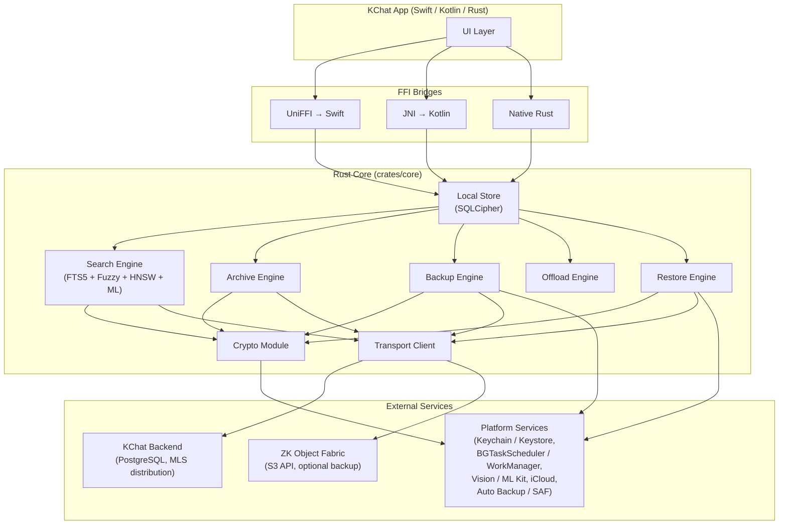

The core never talks to the UI directly. Every cross-boundary call
goes through the FFI bridge for the host platform.

---

## 2. Crate Structure

The workspace ships four crates: a core that knows nothing about
platforms, and three thin bridges.

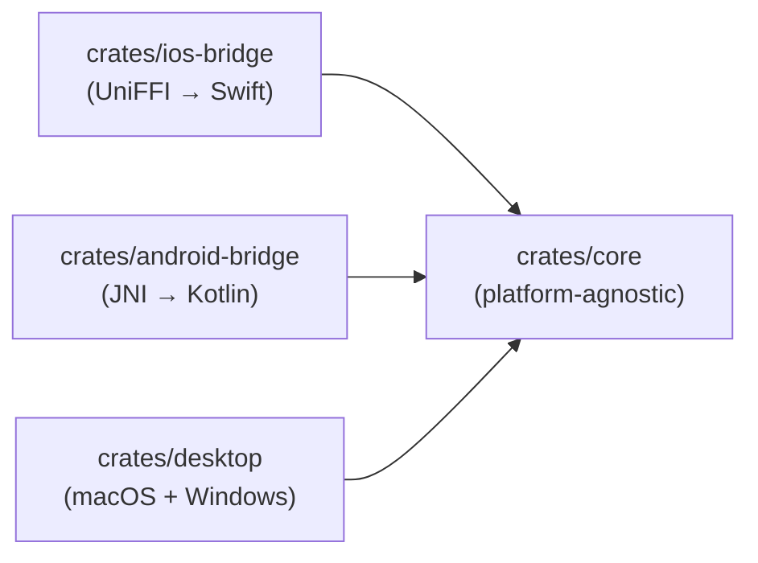

Inside `crates/core` the modules layer downward; higher-level
modules depend on lower-level ones, never vice versa.

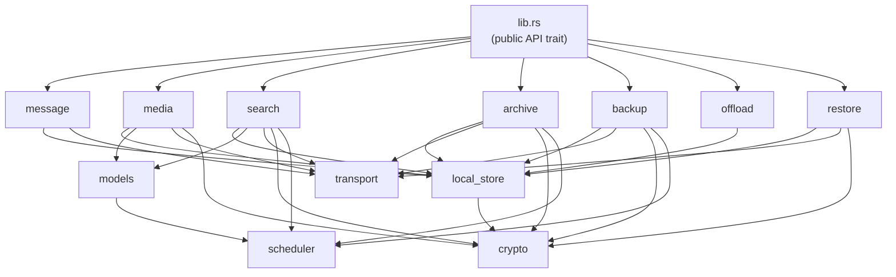

`crypto` is a leaf module: every other module that touches
ciphertext routes through it, and `crypto` itself depends only on
the standard library and chosen primitives.

---

## 3. Four-Store Data Flow

Four logically distinct stores; three interactive on the device,
one non-interactive for disaster recovery. Direction of arrows is
data flow, not request flow.

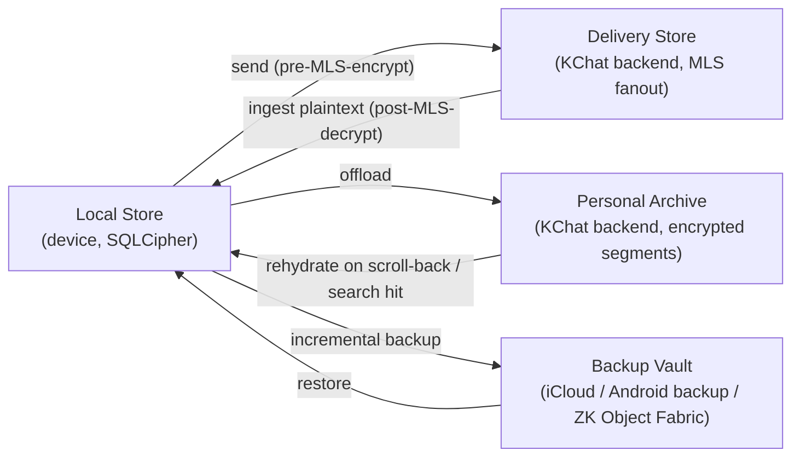

Backup never feeds the archive directly, and the archive never
feeds the backup directly. They are independent pipelines reading
from their own event journals on the local store.

---

## 4. Local Store Schema

The schema lives in `crates/core/src/local_store/schema.rs`. The
multilingual FTS5 configuration is the headline element:

```sql
-- Conversations
CREATE TABLE conversation (
    conversation_id   TEXT PRIMARY KEY,
    title_cipher      BLOB,                 -- encrypted with K_local_db
    pinned            INTEGER NOT NULL DEFAULT 0,
    muted             INTEGER NOT NULL DEFAULT 0,
    last_message_id   TEXT,
    last_activity_ms  INTEGER NOT NULL
);

-- Skeletons render the timeline before any body / media is loaded
CREATE TABLE message_skeleton (
    message_id        TEXT PRIMARY KEY,
    conversation_id   TEXT NOT NULL REFERENCES conversation(conversation_id),
    sender_id         TEXT NOT NULL,
    created_at_ms     INTEGER NOT NULL,
    received_at_ms    INTEGER NOT NULL,
    kind              TEXT NOT NULL,
    body_state        TEXT NOT NULL,
    media_state       TEXT,
    archive_state     TEXT NOT NULL DEFAULT 'not_archived',
    backup_state      TEXT NOT NULL DEFAULT 'not_backed_up',
    reply_to          TEXT,
    edited_at_ms      INTEGER,
    deleted_at_ms     INTEGER
);

CREATE TABLE message_body (
    message_id        TEXT PRIMARY KEY REFERENCES message_skeleton(message_id),
    text_content      TEXT,                 -- UTF-8, may mix scripts
    detected_language TEXT,                 -- BCP-47, optional
    rich_meta         BLOB                  -- mentions, link previews (CBOR)
);

CREATE TABLE media_asset (
    asset_id          TEXT PRIMARY KEY,
    message_id        TEXT NOT NULL REFERENCES message_skeleton(message_id),
    mime_type         TEXT NOT NULL,
    bytes_total       INTEGER NOT NULL,
    bytes_local       INTEGER NOT NULL,
    media_state       TEXT NOT NULL,
    wrapped_k_asset   BLOB NOT NULL,
    chunk_count       INTEGER NOT NULL,
    merkle_root       BLOB NOT NULL,
    blob_id           TEXT NOT NULL
);

-- Multilingual full-text search
CREATE VIRTUAL TABLE search_fts USING fts5(
    message_id        UNINDEXED,
    conversation_id   UNINDEXED,
    sender_id         UNINDEXED,
    created_at_ms     UNINDEXED,
    text_content,
    tokenize = 'icu'                       -- primary multilingual tokenizer
);

CREATE TABLE search_fuzzy (
    token       TEXT NOT NULL,
    script      TEXT NOT NULL,             -- ISO-15924
    message_id  TEXT NOT NULL,
    PRIMARY KEY (token, script, message_id)
);

CREATE TABLE search_vector (
    message_id    TEXT NOT NULL,
    embedding     BLOB NOT NULL,            -- INT8-quantized
    model_version TEXT NOT NULL,
    PRIMARY KEY (message_id, model_version)
);

CREATE TABLE media_search_index (
    asset_id      TEXT NOT NULL REFERENCES media_asset(asset_id),
    kind          TEXT NOT NULL,            -- 'ocr' | 'caption' | 'transcript' | 'tag'
    text          TEXT NOT NULL,
    language      TEXT,                     -- BCP-47 if detected
    confidence    REAL,
    PRIMARY KEY (asset_id, kind, text)
);

-- Backup pipeline
CREATE TABLE backup_event_journal (
    event_seq     INTEGER PRIMARY KEY AUTOINCREMENT,
    event_type    TEXT NOT NULL,
    payload       BLOB NOT NULL,            -- CBOR
    created_at_ms INTEGER NOT NULL
);

-- Archive pipeline
CREATE TABLE archive_segment_map (
    segment_id           TEXT PRIMARY KEY,
    conversation_id      TEXT NOT NULL,
    time_bucket          TEXT NOT NULL,     -- e.g. '2026-04'
    segment_type         TEXT NOT NULL,
    blob_id              TEXT NOT NULL,
    merkle_root          BLOB NOT NULL,
    state                TEXT NOT NULL      -- not_archived..archive_compacted
);

-- Restore state machine
CREATE TABLE restore_state (
    id     INTEGER PRIMARY KEY CHECK (id = 1),
    state  TEXT NOT NULL,                  -- identity_restored..full_restore_complete
    notes  TEXT
);
```

The whole database is a SQLCipher database keyed by `K_local_db`,
itself wrapped by the platform Keychain / Keystore.

---

## 5. Message State Machine

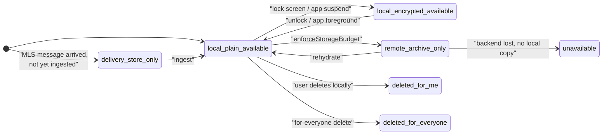

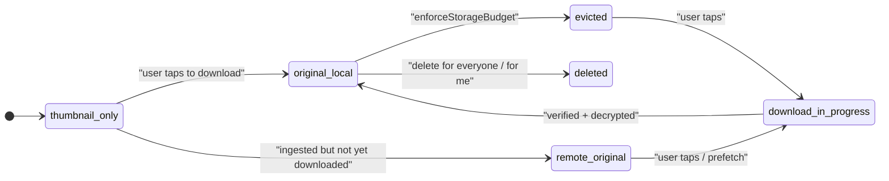

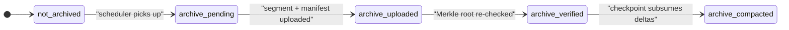

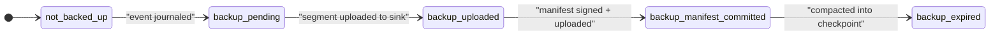

---

## 6. Search Engine Architecture

The search pipeline runs fully on-device. Cold buckets either
arrive as locally cached encrypted shards or are fetched on demand
by coarse bucket; the query string itself never crosses the FFI
boundary as a server request.

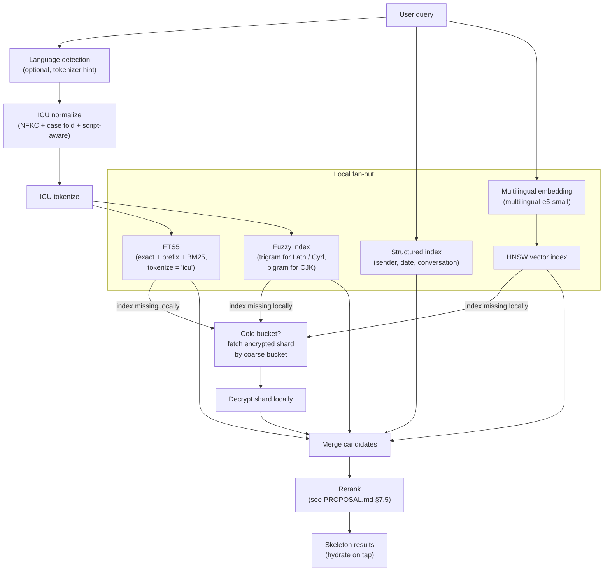

---

## 7. Crypto Architecture

Every key derives from `K_user_master` via labelled HKDF-SHA256.
The crypto module knows nothing about messages, media, or search;
it serves AEAD-sealed bytes against typed key handles.

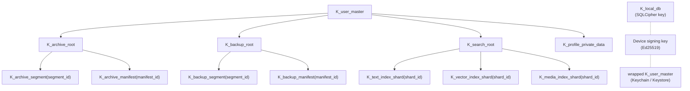

Per-media-object encryption is a separate path with its own
random key:

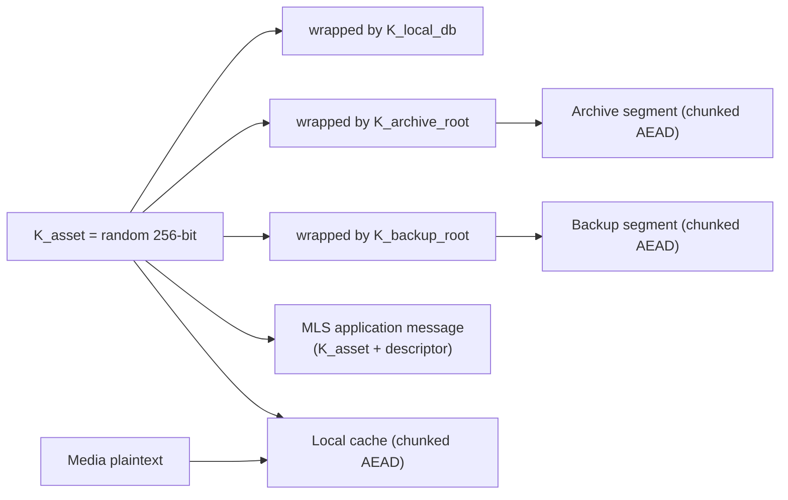

ZK Object Fabric backups use Pattern C, derived deterministically
from the plaintext + tenant ID. The Rust path must produce
bit-identical output to the Go SDK at
`kennguy3n/zk-object-fabric/encryption/client_sdk/`:

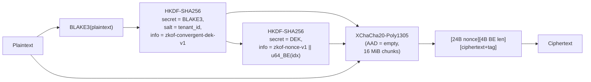

---

## 8. Archive and Offload Architecture

### 8.1 Archive segment build and upload

```mermaid
sequenceDiagram
    participant Core as "Rust core (archive engine)"
    participant Cr as "crypto"
    participant Tr as "transport"
    participant BE as "KChat backend"

    Core->>Core: "read archive event journal since cursor"
    Core->>Core: "group by (conversation_id, time_bucket)"
    Core->>Core: "build CBOR payload, zstd compress"
    Core->>Cr: "AEAD seal with K_archive_segment"
    Cr-->>Core: "ciphertext + Merkle root"
    Core->>Tr: "blob init (chunked upload)"
    Tr->>BE: "POST /v1/blobs/init"
    BE-->>Tr: "blob_id"
    Core->>Tr: "upload chunks"
    Tr->>BE: "PUT /v1/blobs/{blob_id}/chunks/{idx}"
    Core->>Tr: "commit blob"
    Tr->>BE: "POST /v1/blobs/{blob_id}/commit"
    BE-->>Tr: "merkle_root"
    Core->>Core: "verify backend Merkle root == local"
    Core->>Cr: "build & seal manifest gen N+1"
    Cr-->>Core: "manifest ciphertext"
    Core->>Tr: "upload manifest"
    Core->>Core: "mark archive_state = archive_verified;<br/>advance cursor"
```

### 8.2 Offload / eviction

```mermaid
sequenceDiagram
    participant Sys as "OS / scheduler"
    participant Off as "offload engine"
    participant DB as "local_store"

    Sys->>Off: "enforceStorageBudget(reason)"
    Off->>DB: "compute storage usage + headroom"
    Off->>DB: "build candidate set<br/>(verified archives, not pinned, not active)"
    Off->>DB: "score each candidate<br/>(see PROPOSAL.md §5.4)"
    loop "until headroom reclaimed"
        Off->>DB: "evict next candidate per priority order"
    end
    Off-->>Sys: "OffloadResult { freed_bytes, evicted_count }"
```

### 8.3 Rehydration

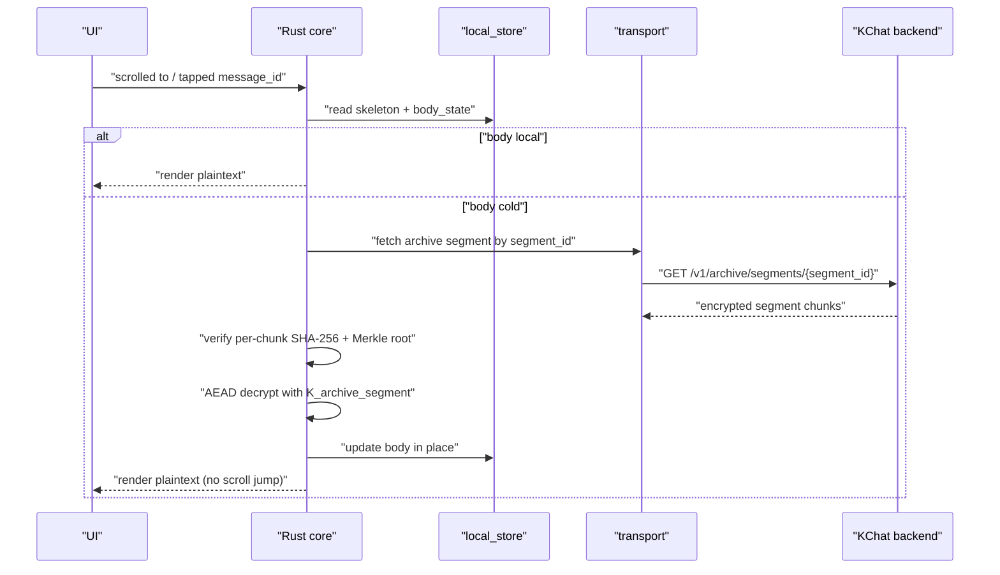

### 8.4 Prefetch window

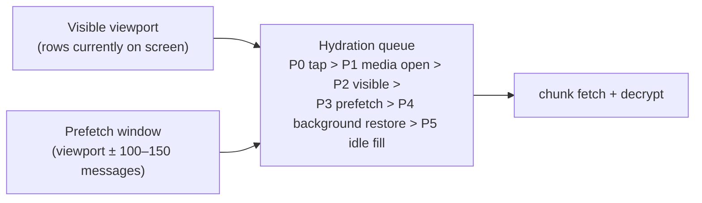

---

## 9. Backup and Restore Architecture

### 9.1 Incremental backup

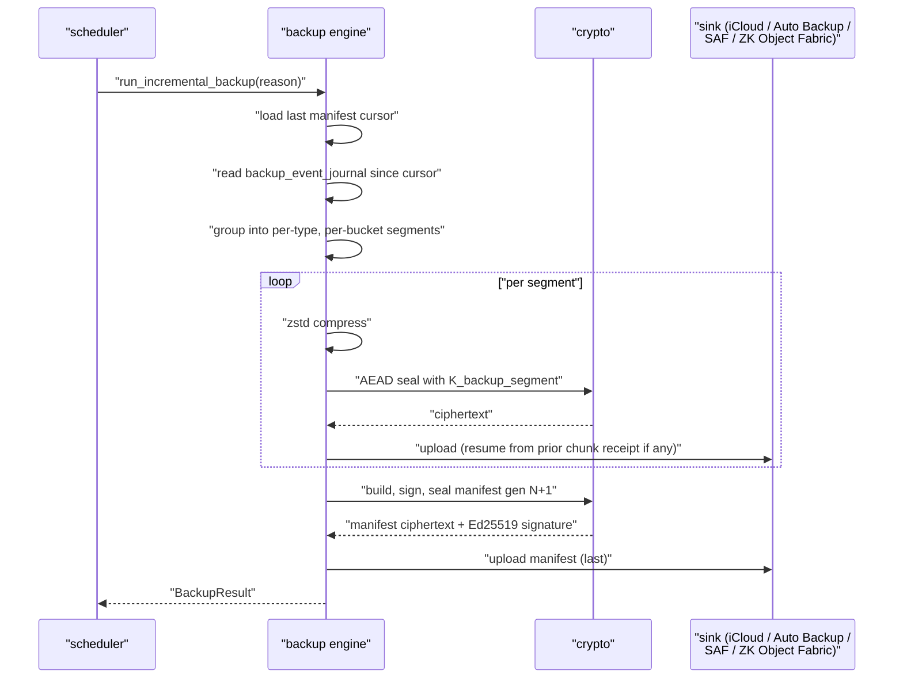

### 9.2 Skeleton-first restore

```mermaid
sequenceDiagram
    participant App as "KChat app"
    participant Core as "Rust core (restore engine)"
    participant Sink as "backup sink"
    participant BE as "KChat backend"
    participant UI as "UI"

    App->>Core: "restore_from_backup(source)"
    Core->>BE: "register device"
    Core->>Core: "recover K_user_master<br/>(D2D / recovery key / passphrase)"
    Core->>Sink: "fetch latest manifest"
    Core->>Core: "verify signature + previous_manifest_hash chain"
    Core->>Sink: "fetch conversation list segment"
    Core-->>UI: "skeleton_restored &mdash; render conversation list"
    Core->>Sink: "fetch timeline_skeleton segments"
    Core-->>UI: "skeletons render in each conversation"
    Core->>Sink: "fetch search_index_shard segments"
    Core-->>UI: "search_restored &mdash; search returns hits"
    Core->>Sink: "fetch recent message_body segments"
    Core-->>UI: "recent_messages_restored"
    Core->>Sink: "lazy media (on tap, on prefetch)"
```

### 9.3 Restore state machine

```mermaid
stateDiagram-v2
    direction LR
    [*] --> identity_restored
    identity_restored --> root_keys_unwrapped
    root_keys_unwrapped --> manifest_verified
    manifest_verified --> skeleton_restored
    skeleton_restored --> search_restored
    search_restored --> recent_messages_restored
    recent_messages_restored --> media_lazy_restore_enabled
    media_lazy_restore_enabled --> full_restore_complete
```

### 9.4 Manifest chain verification

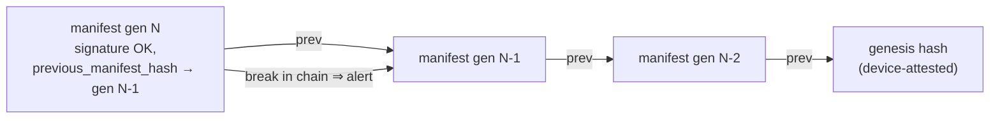

A break in the chain (a `previous_manifest_hash` mismatch or
signature failure) halts restore and surfaces a recoverable error
to the UI; restore never silently re-roots.

---

## 10. Transport Layer

The transport client is a thin async HTTP client that speaks the
KChat backend API. It does not hold any plaintext; every payload
it sends or receives is already AEAD-sealed by the crypto module.

### 10.1 Chunked encrypted blob upload

```mermaid
sequenceDiagram
    participant Core as "core"
    participant Tr as "transport"
    participant BE as "backend"

    Core->>Tr: "init blob (size, blob_class, expected_merkle_root)"
    Tr->>BE: "POST /v1/blobs/init"
    BE-->>Tr: "blob_id, upload_token"
    loop "per chunk"
        Core->>Tr: "upload chunk(idx, ciphertext, sha256)"
        Tr->>BE: "PUT /v1/blobs/{blob_id}/chunks/{idx}"
        BE-->>Tr: "chunk_receipt"
    end
    Core->>Tr: "commit"
    Tr->>BE: "POST /v1/blobs/{blob_id}/commit"
    BE-->>Tr: "computed merkle_root"
    Core->>Core: "verify merkle_root == local"
```

### 10.2 Range download

```mermaid
sequenceDiagram
    participant Core as "core"
    participant Tr as "transport"
    participant BE as "backend"

    Core->>Tr: "fetch blob {blob_id} range [from..to]"
    Tr->>BE: "GET /v1/blobs/{blob_id}?range=from-to"
    BE-->>Tr: "ciphertext bytes"
    Core->>Core: "verify per-chunk AEAD tag + SHA-256"
    Core->>Core: "decrypt with K_archive_segment / K_asset / etc."
```

### 10.3 Archive manifest fetch and segment download

```mermaid
sequenceDiagram
    participant Core as "core"
    participant Tr as "transport"
    participant BE as "backend"

    Core->>Tr: "list archive manifests after_generation = N"
    Tr->>BE: "GET /v1/archive/manifests?after_generation=N"
    BE-->>Tr: "manifest list (encrypted)"
    Core->>Core: "decrypt manifests, walk previous_manifest_hash"
    loop "per needed segment"
        Core->>Tr: "fetch segment {segment_id}"
        Tr->>BE: "GET /v1/archive/segments/{segment_id}"
        BE-->>Tr: "ciphertext"
        Core->>Core: "AEAD decrypt with K_archive_segment"
    end
```

### 10.4 Delivery message fetch (cursor-based)

```mermaid
sequenceDiagram
    participant Core as "core"
    participant Tr as "transport"
    participant BE as "backend"

    Core->>Tr: "ingest_remote_messages(conversation_id, after_cursor)"
    Tr->>BE: "GET /v1/mls/messages?conversation_id=&amp;after_cursor="
    BE-->>Tr: "MLS application messages + new cursor"
    Core->>Core: "MLS-decrypt (KChat MLS layer)"
    Core->>Core: "persist message_skeleton, message_body, media_asset"
    Core->>Core: "write backup + archive events"
    Core->>Core: "update FTS / fuzzy / vector / media indexes"
```

---

## 11. Platform Integration

### 11.1 iOS

| Concern                    | API / Mechanism                                                                                              |
| -------------------------- | ------------------------------------------------------------------------------------------------------------ |
| FFI binding                | UniFFI &rarr; generated Swift package consumed by KChat.app and any iOS extensions sharing the local store   |
| Keys                       | Keychain (`kSecAttrAccessibleAfterFirstUnlockThisDeviceOnly`); biometric-protected key for higher-tier ops   |
| Background work            | `BGTaskScheduler` (`BGProcessingTask` for backup / archive / index maintenance)                              |
| OCR                        | `VNRecognizeTextRequest` (multilingual; 18+ languages supported in current iOS)                              |
| ML inference               | Core ML (preferred) or ONNX Runtime CoreML EP                                                                |
| iCloud backup              | App's iCloud container file storage for encrypted backup files                                               |
| Audio session              | Foreground for live recording; background-friendly transcription via Whisper-tiny / Whisper-small            |

### 11.2 Android

| Concern                    | API / Mechanism                                                                                              |
| -------------------------- | ------------------------------------------------------------------------------------------------------------ |
| FFI binding                | JNI &rarr; idiomatic Kotlin façade in `crates/android-bridge`                                                |
| Keys                       | Android Keystore (StrongBox if available); biometric gate via `BiometricPrompt` when configured              |
| Background work            | `WorkManager` (constraints: charging, unmetered network, thermal-headroom)                                   |
| OCR                        | ML Kit Text Recognition v2 (multilingual; 50+ languages including CJK)                                       |
| ML inference               | ONNX Runtime NNAPI EP, fallback to CPU EP                                                                    |
| Auto Backup                | `BackupAgent` storing recovery envelopes + manifest pointers under the 25 MB cap                             |
| Large Backup               | Large Backups API where available                                                                            |
| Storage Access Framework   | User-selected cloud / document provider for large encrypted backup files                                     |

### 11.3 macOS

| Concern                    | API / Mechanism                                                                                              |
| -------------------------- | ------------------------------------------------------------------------------------------------------------ |
| FFI binding                | Native Rust (no FFI bridge needed)                                                                           |
| Keys                       | Keychain                                                                                                     |
| Background work            | `NSBackgroundActivityScheduler` + cooperative scheduler                                                      |
| OCR                        | `VNRecognizeTextRequest` (Vision)                                                                            |
| ML inference               | Core ML or ONNX Runtime CoreML EP                                                                            |
| Search integration         | Optional Spotlight integration for app-internal search anchors                                               |

### 11.4 Windows

| Concern                    | API / Mechanism                                                                                              |
| -------------------------- | ------------------------------------------------------------------------------------------------------------ |
| FFI binding                | Native Rust                                                                                                  |
| Keys                       | DPAPI (`CryptProtectData`) bound to the user profile; TPM-backed via `NCryptCreatePersistedKey` if available |
| Background work            | Background Tasks / Task Scheduler integration                                                                |
| OCR                        | `Windows.Media.Ocr` (multilingual where the Language Pack is installed); Tesseract fallback                  |
| ML inference               | ONNX Runtime CPU EP; **no GPU assumption**; INT8 quantized models essential                                  |
| Search integration         | Optional Windows Search integration for app-internal anchors                                                 |

---

## 12. Data Flow Diagrams

### 12.1 Message receive

```mermaid
flowchart LR
    MLS["MLS<br/>application message"]
    Decrypt["KChat MLS layer<br/>decrypt"]
    Persist["local_store:<br/>insert skeleton, body, media_asset"]
    Index["search:<br/>FTS / fuzzy / vector / media index"]
    ArchEvt["archive:<br/>write archive event"]
    BkEvt["backup:<br/>write backup event"]

    MLS --> Decrypt --> Persist
    Persist --> Index
    Persist --> ArchEvt
    Persist --> BkEvt
```

### 12.2 Message send

```mermaid
flowchart LR
    Compose["UI compose"]
    Outbox["message:<br/>persist to outbox<br/>(local_plain_available)"]
    Index["search:<br/>index outgoing message"]
    MLS["KChat MLS layer<br/>encrypt"]
    Send["transport:<br/>POST /v1/mls/messages"]
    Confirm["delivery confirm"]
    ArchEvt["archive event"]
    BkEvt["backup event"]

    Compose --> Outbox --> Index
    Outbox --> MLS --> Send --> Confirm
    Confirm --> ArchEvt
    Confirm --> BkEvt
```

### 12.3 Media receive

```mermaid
flowchart LR
    Msg["MLS message<br/>(K_asset + descriptor)"]
    Thumb["fetch thumbnail blob"]
    Decrypt["AEAD decrypt with K_asset"]
    Persist["local_store:<br/>media_asset (thumbnail_only),<br/>wrapped K_asset"]
    BG["background:<br/>OCR + image embedding +<br/>(if video) keyframe + Whisper transcript"]
    MIndex["media_search_index +<br/>search_vector"]

    Msg --> Thumb --> Decrypt --> Persist --> BG --> MIndex
```

### 12.4 Search

```mermaid
flowchart LR
    Q["query"]
    Local["local fan-out<br/>(FTS5 + fuzzy + HNSW + structured)"]
    Cold["cold buckets?<br/>fetch encrypted index shard"]
    Decrypt["decrypt shard locally"]
    Merge["merge + rerank"]
    Tap["user taps result"]
    Hyd["hydrate body / media if cold"]

    Q --> Local
    Local --> Cold --> Decrypt --> Merge
    Local --> Merge
    Merge --> Tap --> Hyd
```

### 12.5 Backup

```mermaid
flowchart LR
    Sched["scheduler trigger<br/>(BGTask / WorkManager / app launch)"]
    Journal["read backup_event_journal"]
    Build["build per-segment CBOR payload"]
    Compress["zstd compress"]
    Seal["AEAD seal with K_backup_segment"]
    Upload["upload to selected sink"]
    Manifest["build, sign, seal manifest gen N+1"]
    Commit["mark events included; advance cursor"]

    Sched --> Journal --> Build --> Compress --> Seal --> Upload --> Manifest --> Commit
```

### 12.6 Restore

```mermaid
flowchart LR
    Auth["authenticate account"]
    Reg["register new device"]
    Keys["recover K_user_master"]
    Man["fetch + verify manifest chain"]
    Conv["restore conversation list"]
    Skel["restore timeline skeletons"]
    Idx["restore search index shards"]
    Recent["restore recent bodies"]
    Lazy["lazy media on demand"]

    Auth --> Reg --> Keys --> Man --> Conv --> Skel --> Idx --> Recent --> Lazy
```
