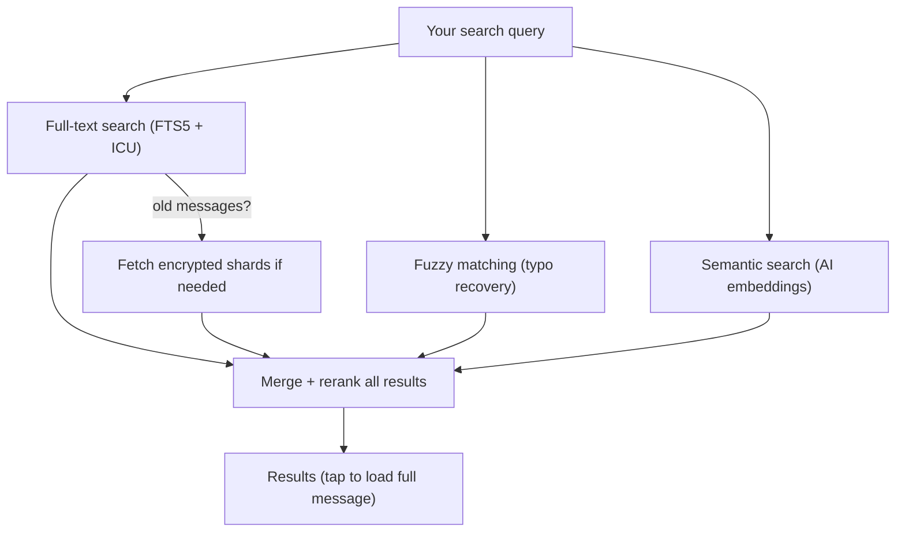
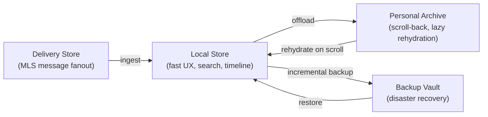
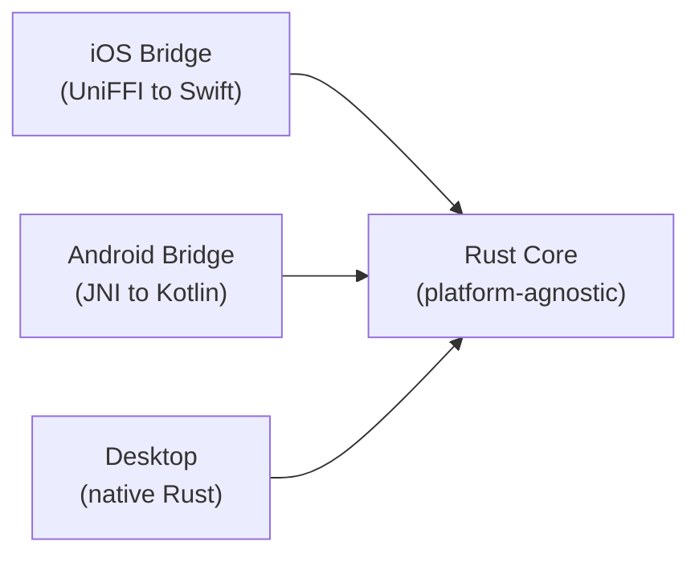

# How KChat Storage, Backup and Search Approach Keeps Your Messages Private: A Deep Dive into Privacy-First Chat Architecture

*A look inside the engineering of a messaging system where the server never sees your data — and what makes it different from the apps you use today.*

---

## The Problem With Most Chat Apps When It Comes to Search

When you search for a message in most chat apps, it is either all your text in local storage (which is a problem when device runs out of space) and files, media are unable to retrieve easily or your search query travels to a server, the server looks through your messages, and sends results back. That server — and anyone who compromises it — can see what you searched for, what you said, and to whom.

KChat takes a fundamentally different approach. Your data is yours forever and noone else can see it and for that we allow users to enable offloaded storage & backup (if user turns on) in a high privacy design and high usability manner. The server is treated as an **untrusted storage locker**. It holds encrypted blobs it cannot read. Every meaningful operation — searching, archiving, backing up, restoring — happens entirely on your device.

This blog walks through the most interesting design decisions that make this possible.

---

## 1. The Server Sees Nothing Useful

The privacy boundary is the project's hardest rule. Here's what the server is allowed to store versus what it must never touch:

| The server MAY store | The server MUST NOT store |
|---|---|
| MLS ciphertext | Plaintext messages |
| Encrypted media chunks | Search tokens, embeddings, OCR text |
| Encrypted archive segments | Media keys (`K_asset`) |
| Encrypted backup manifests | Backup keys |
| Coarse routing metadata (sizes, timestamps) | Filenames, captions, transcripts |

Every encryption, decryption, search query, and indexing operation runs **on your phone or laptop**. If a proposed feature would move any plaintext or derived plaintext (like search tokens or AI embeddings) to the server, it is rejected as a privacy regression — full stop.

---

## 2. Search Without a Server — The "No Server Search, Ever" Rule

This is perhaps the most novel aspect of the design. Most encrypted messengers either don't offer search, or quietly send your query to a server. KChat forbids this pattern entirely:

```
// FORBIDDEN — leaks user intent to the server
POST /v1/search { "query": "doctor appointment" }

// ALLOWED — leaks only coarse metadata (which month, which conversation hash)
GET /v1/archive/index-shards?conversation_hash=...&bucket=2026-04&type=text
```

Instead, KChat builds **encrypted search index shards** on your device, uploads them as opaque blobs, and when you need to search old messages, downloads those blobs and searches them locally. The server never learns what you searched for — it only sees that you accessed "April 2026 shards for conversation X."

The search engine itself is a multi-layered pipeline that runs entirely on-device:



This means you get Google-quality search — exact matches, typo correction, and even meaning-based ("semantic") search — without any server ever seeing your query.

---

## 3. Multilingual From Day One — Not an Afterthought

Most chat apps are built for English first, with other languages bolted on later. KChat rejects this. The design assumes **mixed-language content from the start**: a single message might contain `"Meeting at 3pm 会議室で"` (English and Japanese in one sentence).

The system handles this through:

- **ICU tokenization** for word segmentation — critical for Chinese, Japanese, Korean, and Thai, where there are no spaces between words.
- **Script-aware fuzzy matching** — trigrams for Latin/Cyrillic scripts (good for typo recovery like "meetng" → "meeting"), bigrams for CJK characters (where words are often just 1-3 characters).
- **XLM-R embeddings** — a multilingual AI model covering 100+ languages for semantic search. The English-only alternative (MiniLM-L6) was explicitly rejected despite being smaller.
- **Whisper transcription** — multilingual audio transcription covering 99 languages for voice message search.

---

## 4. Four Stores, Not One — And Why That Matters

Most apps dump everything into one database. KChat splits data across four logically distinct stores, each optimized for a different job:



| Store | Purpose | Interactive? |
|---|---|---|
| **Local Store** | Fast UX, search, timeline, thumbnails | Yes |
| **Delivery Store** | MLS message fanout (on the server) | Yes |
| **Personal Archive** | Scroll-back into old messages, storage offload | Yes |
| **Backup Vault** | Disaster recovery on a new device | No |

The critical insight: **backup and archive are deliberately separate**. An archive must support per-conversation, per-month scroll-back on a live device. A backup only needs to reproduce a working state on a fresh device. Conflating them — as many apps do — leads to either bad scroll-back UX or oversized backups.

---

## 5. The Key Hierarchy — One Master Key Rules Them All

Every piece of encrypted data traces back to a single root: `K_user_master`. From this one secret, the system derives separate keys for every purpose using HKDF-SHA256 with labeled info strings:

```
K_user_master (256-bit root)
  ├── K_archive_root
  │     └── K_archive_epoch(epoch_id)     ← rotated monthly
  │           ├── K_archive_segment(segment_id)
  │           └── K_archive_manifest(manifest_id)
  ├── K_backup_root
  │     ├── K_backup_segment(segment_id)
  │     └── K_backup_manifest(manifest_id)
  ├── K_search_root
  │     ├── K_text_index_shard(shard_id)
  │     ├── K_vector_index_shard(shard_id)
  │     └── K_media_index_shard(shard_id)
  └── K_profile_private_data
```

Each media file gets its own random `K_asset` key, which is then wrapped (encrypted) under three different parent keys — one for local storage, one for the archive, one for backup. This means compromising one subsystem doesn't compromise the others.

### Forward Secrecy Through Epoch Rotation

Archive keys rotate monthly. If an attacker compromises the current month's key, they can only read that month's archive segments — not your entire history. You can even delete old epoch keys to achieve true forward secrecy, at the cost of losing scroll-back into those months.

---

## 6. Post-Quantum Signatures — Preparing for Tomorrow's Threats

Backup manifests are signed with a **hybrid signature scheme**: classical Ed25519 *plus* ML-DSA-65 (a post-quantum algorithm from NIST FIPS 204). Both signatures must validate for a manifest to be accepted.

Why? Ed25519 is fast and well-understood today. But a future quantum computer running Shor's algorithm could break it. ML-DSA-65 is resistant to quantum attacks. By requiring both, the system is secure against today's classical attackers *and* tomorrow's quantum ones — following NIST SP 800-227 guidance.

---

## 7. Skeleton-First Restore — Usable Before It's Complete

When you set up a new phone and restore your messages, most apps make you wait until everything downloads. KChat takes a different approach: **skeleton-first restore**.

```
1. Recover your master key
2. Verify the manifest chain (cryptographic integrity check)
3. Restore conversation list          ← you can see your chats
4. Restore timeline skeletons         ← you can scroll through messages
5. Restore search indexes             ← you can search
6. Restore recent message bodies      ← recent messages have full text
7. Lazy-load older bodies and media   ← happens in the background
```

You're reading messages and searching after step 5. Full media downloads happen lazily in the background, prioritized by what you're actually looking at.

---

## 8. Access-Pattern Privacy — Hiding *What* You Read

Even with end-to-end encryption, a server can learn a lot from *when* you access *which* encrypted blobs. KChat uses two techniques to reduce this metadata leakage:

**Batch-by-bucket prefetch.** When you scroll back to an old message, the app doesn't fetch just that one message's archive segment. It fetches *all* segments for that entire month of that conversation. The server's view goes from "user accessed message #47291 at 14:03:22" to "user accessed April 2026 for conversation X."

**Dummy request padding.** When `privacy_level = "high"`, the app mixes real requests with fake ones to random segment IDs. The server returns ciphertext the app silently discards. A network observer sees a blurred access pattern instead of a sharp one.

---

## 9. Convergent Encryption — Dedup Without Seeing Plaintext

When backing up to ZK Object Fabric, KChat uses **Pattern C convergent encryption**: the encryption key is derived deterministically from the plaintext content and the tenant ID. Same content from the same tenant produces identical ciphertext, so the server can deduplicate on `BLAKE3(ciphertext)` without ever seeing plaintext.

```
Same plaintext + same tenant  →  same ciphertext  →  one stored copy
Different tenants             →  different keys    →  different ciphertext (no cross-tenant leakage)
```

The Rust implementation must produce **bit-identical** ciphertext to the Go reference SDK. Cross-language test vectors enforce this contract in CI.

---

## 10. Media Doesn't Duplicate — Smart Tiered Storage

Media (photos, videos, documents) dominates storage at 6-25 GB per user per year. The architecture avoids duplicating this across backup and archive through a three-tier model:

| Tier | What's stored | Where | Size |
|---|---|---|---|
| 0 | Text, skeletons, key wraps, thumbnails | KChat backend | 200-600 MB/yr |
| 1 | Older search index shards | KChat backend (movable) | 50-200 MB/yr |
| 2 | **Media originals** | **User's own cloud** (iCloud / Google Drive / ZKOF) | **6-25 GB/yr** |

Neither the archive nor the backup stores raw media bytes. Both store only *pointers* (`blob_id` + `wrapped_k_asset`) to the single copy in the user's configured cloud storage. This cuts KChat-side per-user storage by 95%+.

---

## 11. One Codebase, Four Platforms

The entire system is written in Rust — one codebase that compiles to iOS (via UniFFI/Swift), Android (via JNI/Kotlin), macOS, and Windows (native Rust). There is one source of truth for crypto, schema, search, and state machines.



This isn't just a convenience — it's a security property. Writing the same crypto and state machine logic four times in four languages is how bugs and inconsistencies creep in. One Rust implementation, exercised by cross-platform test vectors, eliminates that class of risk.

---

## 12. On-Device AI — Smart Search Without Cloud AI

KChat runs ML models directly on your device for features like:

- **Semantic search** (XLM-R, 100+ languages) — find messages by meaning, not just keywords
- **Image search** (MobileCLIP-S2) — search photos by visual content
- **Voice message search** (Whisper) — transcribe and search audio messages
- **Document search** — extract and search text from PDFs and Word documents
- **OCR** — search text in images

All of this runs on-device. The models are downloaded lazily on first use, and the system automatically selects INT4 quantization (half the model size) on storage-constrained devices, gracefully degrading to keyword-only search if models can't be loaded.

A clever optimization: the same XLM-R model is shared between the content safety guardrail system and the search pipeline. When the guardrail computes an embedding for a message, the search pipeline reuses it — eliminating redundant inference.

---

## 13. B2B Tenant Isolation — Cryptographic, Not Just Logical

For business (B2B) deployments, tenant isolation isn't just a database filter — it's cryptographic. Each tenant derives its own key subtree from `K_user_master`:

```
K_user_master
  ├── K_b2c_archive_root              (personal data)
  ├── K_b2b_tenant_root(tenant_id)    (per-tenant B2B data)
  │     └── K_b2b_archive_epoch(tenant_id, epoch_id)
  └── K_search_root
        ├── K_b2c_text_index_shard(shard_id)
        └── K_b2b_text_index_shard(tenant_id, shard_id)
```

A leaked B2C shard key cannot decrypt a B2B shard with the same `shard_id`, and vice versa. This is enforced by integration tests that verify cross-tenant decrypt rejection.

---

## 14. Bloom Filters — Search Smarter, Not Harder

When searching across all conversations (global search), the naive approach would download and decrypt every month's search index for every conversation. KChat uses **encrypted bloom filter shards** — tiny (~1-10 KB) probabilistic data structures that can quickly answer "does this month's data definitely NOT contain any of these search terms?"

The search pipeline fetches bloom shards first, eliminates 80%+ of buckets that can't possibly match, and only then downloads the full text/fuzzy shards for the remaining candidates. Missing bloom shards gracefully fall through to the full fetch — the system never silently drops results.

---

## Closing Thoughts

What makes this project interesting isn't any single technique — it's how they compose. Convergent encryption enables dedup without plaintext exposure. Epoch-rotated keys limit blast radius. Skeleton-first restore prioritizes usability. Batch-by-bucket prefetch hides access patterns. Bloom filters make global search practical. And all of it runs on-device, in one Rust codebase, across four platforms.

The result is a messaging system where the server is genuinely just a dumb pipe for encrypted bytes — and the user's device does all the thinking.
