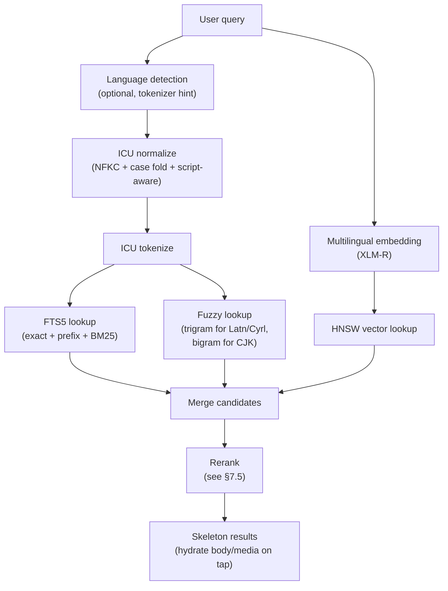

# KChat Storage & Search — Technical Proposal

**License**: Proprietary — All Rights Reserved. See [LICENSE](../LICENSE).

> Status: Phase 0 — Protocol and Test Vectors (`COMPLETE`). Phase 1 —
> Local Store + Text Search + MLS Integration (`In progress | ~96%`).
> Phase 2 — Media Encryption and Blob Service (`In progress | ~95%`).
> Phase 3 — Personal Archive and Offload (`In progress | ~97%`).
> Phase 4 — Backup and Restore (`In progress | ~90%`).
> Phase 5 — Search — Fuzzy + Encrypted Shards (`In progress | ~95%`).
> Phase 6 — Media and Semantic Search (`In progress | ~75%`).
> Phase 7 — Desktop + Optimization (`In progress | ~40%`).
> Phase 8 — Multi-Scope, Multi-Tenant Search (`In progress | ~90%`).
> This document defines the target architecture. See
> [PROGRESS.md](PROGRESS.md) for the live build tracker.

---

## 0. Scope

This module is a Rust core library with platform-specific bridges
that provides E2EE local storage, personal archive, encrypted
backup, storage offload, rehydration, and multilingual search to
KChat.

### 0.1 In scope

- **Rust core** crate: schema, crypto, indexing, search, archive,
  backup, offload, restore, transport, scheduler.
- **iOS bridge** via [UniFFI](https://mozilla.github.io/uniffi-rs/).
  Generated Swift package consumable from KChat's iOS app and any
  iOS extension targets that share state.
- **Android bridge** via JNI; idiomatic Kotlin façade over the
  generated bindings.
- **Desktop**: macOS and Windows native consumers of the same Rust
  crate. Windows must work CPU-only — no GPU assumption.
- **MLS-plaintext-in / persistence-out integration** with KChat's
  MLS layer: the library consumes already-decrypted MLS application
  messages and produces local rows, indexes, archive events, and
  backup events.
- **Local encrypted storage**: SQLCipher database, encrypted file
  cache for media originals and thumbnails.
- **Personal archive** stored as encrypted segments on KChat's
  PostgreSQL backend or, when configured, on ZK Object Fabric
  (S3 API). Both backends are untrusted; segments are AEAD-sealed
  on-device. The archive backend is selected per-deployment via
  `archive_backend` configuration.
- **Tiered media storage**: media originals route to user-configured
  cloud storage (iCloud, Google Drive, ZK Object Fabric) when
  available; thumbnails and archive segments stay on the KChat
  backend or ZKOF. The `MediaBlobSink` trait abstracts the storage
  backend for media blobs. See §5.7.
- **Incremental backup** to platform sinks: iCloud, Android Auto
  Backup, Android Large Backup, Storage Access Framework, and ZK
  Object Fabric (S3 API, Pattern C convergent encryption).
- **Storage offload and rehydration** with skeleton-first scroll-back.
- **Multilingual text, fuzzy, semantic, image, video, audio, and
  document search** — all local, no server search.
- **Backend transport client** for the encrypted blob, archive, and
  delivery services exposed by KChat's PostgreSQL backend.

### 0.2 Out of scope

- The KChat **UI** (Swift/Kotlin views, navigation, presentation).
- The **MLS protocol implementation** itself. KChat owns MLS; this
  library starts post-decrypt.
- **Push notification** vendor integrations (APNs, FCM, Huawei,
  Xiaomi, etc.).
- **Social / community discovery**, contact resolution, friend
  graph, presence.
- **Admin console**, payment / subscription flows, tenant signup
  for KChat itself.
- The **KChat backend service implementation** (PostgreSQL schema,
  MLS distribution server, blob storage server). This module is the
  **client** of those services; the backend is documented as an
  external API surface in §10.

---

## 1. Executive Summary

- **What**: a Rust core library (with iOS / Android / desktop
  bindings) that provides E2EE local storage, personal archive,
  backup, offload, rehydration, and multilingual search for KChat.
- **Why a single Rust core**: KChat must ship the same persistence
  and search semantics on iOS, Android, macOS, and Windows. Rust
  gives us memory safety without a garbage collector (critical on
  mobile), C/C++ performance, a single codebase, an excellent FFI
  story (UniFFI on iOS, JNI on Android, native on desktop), and
  bit-identical interoperability with `kennguy3n/zk-object-fabric`'s
  Go reference crypto. Writing the same logic four times in Swift /
  Kotlin / Swift / C# is the hazard this design is built to avoid.
- **Privacy boundary**: the KChat backend is untrusted encrypted
  storage. Plaintext messages, search tokens, embeddings, OCR text,
  media keys, and backup keys never leave the device.
- **Four-store architecture**: Local store (interactive, on-device),
  Delivery store (interactive, MLS fanout on the backend), Personal
  archive (interactive cold store on the KChat backend or ZK Object
  Fabric), Backup vault (non-interactive disaster recovery to iCloud /
  Android backup / ZK Object Fabric).
- **Multilingual from day one**: ICU-based tokenization, multilingual
  embedding models, script-aware fuzzy matching. The design rejects
  any choice that quietly assumes English-only input.
- **Backup interop**: when targeting ZK Object Fabric, the Rust
  crypto module produces bit-identical ciphertext to the Go SDK at
  `kennguy3n/zk-object-fabric/encryption/client_sdk/`. Pattern C
  (client-side convergent encryption) gives intra-tenant dedup
  without ever exposing plaintext.

### 1.1 Design principles

1. **Privacy boundary is non-negotiable.** The backend stores only
   ciphertext and server-safe metadata. The list of forbidden
   server-side data — plaintext, search tokens, embeddings, OCR
   text, media keys, backup keys, filenames, captions, transcripts —
   is closed; expanding it is a privacy regression.
2. **Backup and personal archive are separate stores.** Backup
   exists for disaster recovery on a fresh device and is
   non-interactive. Personal archive exists for scroll-back and
   storage offload on a live device and is interactive. Platform
   backup buckets are size-capped (Android Auto Backup is 25 MB) and
   not appropriate for scroll-back; conflating these stores is the
   default mistake the four-store model rules out.
3. **No server-side search, ever.** The server never receives
   plaintext search terms. The client either searches locally, or
   fetches **encrypted index shards by coarse bucket** (e.g. month +
   conversation hash + index type) and searches them on-device.
4. **Skeleton-first restore.** A restored device prioritizes
   *usability* over *completeness*: conversation list → timeline
   skeletons → search indexes → recent message bodies → lazy
   media. The user is reading messages and searching long before the
   last keyframe finishes downloading.
5. **Multilingual first.** All text-processing decisions assume
   mixed-language content. Tokenization, fuzzy matching, embeddings,
   OCR, and audio transcription all default to multilingual; English-
   only choices are rejected even when they are smaller or faster.

---

## 2. Key Architecture

### 2.1 Key hierarchy

```
Account recovery material
  └── K_user_master                   (256-bit; root of derivation)
        ├── K_archive_root
        │     └── K_archive_epoch(epoch_id)        ← NEW: epoch-rotated
        │           ├── K_archive_segment(segment_id)
        │           └── K_archive_manifest(manifest_id)
        ├── K_backup_root
        │     ├── K_backup_segment(segment_id)
        │     └── K_backup_manifest(manifest_id)
        ├── K_search_root
        │     ├── K_text_index_shard(shard_id)
        │     ├── K_vector_index_shard(shard_id)
        │     └── K_media_index_shard(shard_id)
        └── K_profile_private_data

Device-local
  ├── K_local_db                      (SQLCipher key, never leaves device)
  ├── device signing key              (Ed25519, identifies device on backend)
  ├── wrapped K_user_master           (sealed by Keychain / Keystore)
  └── recovery envelope metadata      (recovery key fingerprint, etc.)

Per media object
  K_asset = random 256-bit key
    ├── delivered inside the MLS-protected application message
    ├── stored locally wrapped by K_local_db
    ├── archived wrapped by K_archive_epoch (current epoch)
    └── backed up wrapped by K_backup_root
```

All sub-keys are derived with HKDF-SHA256 from the parent key using
labelled `info` strings (`"kchat-archive-root-v1"`,
`"kchat-archive-epoch-v1" || epoch_id`,
`"kchat-search-root-v1"`, `"kchat-backup-segment-v1" || segment_id`,
etc.). Versioned info strings let us rotate a derivation path
without colliding with deployed manifests.

> **Phase 8 extension.** The key hierarchy gains per-tenant B2B
> isolation:
>
> ```
> K_user_master
>   ├── K_b2c_archive_root              (personal B2C archive)
>   ├── K_b2b_tenant_root(tenant_id)    (per-tenant B2B archive)
>   │     └── K_b2b_archive_epoch(tenant_id, epoch_id)
>   └── K_search_root
>         ├── K_b2c_text_index_shard(shard_id)
>         ├── K_b2b_text_index_shard(tenant_id, shard_id)
>         └── K_bloom_index_shard(shard_id)   ← NEW
> ```
>
> Per-tenant keys allow cryptographic separation of B2B
> organizational data from personal B2C data. See PHASES.md Phase 8.

Archive epoch rotation: `K_archive_epoch(epoch_id)` is derived from
`K_archive_root` with `info = "kchat-archive-epoch-v1" || epoch_id`.
The default epoch cadence is monthly, matching the archive
`time_bucket` granularity. The current epoch key is held in memory;
prior epoch keys are wrapped under `K_archive_root` and recorded in
the archive manifest chain so that restore can unwrap any historical
epoch. An operator or user may optionally delete old epoch keys from
the device to achieve forward secrecy at the cost of losing
scroll-back into those epochs.

### 2.2 Platform key storage

| Platform | Wrap K_local_db                  | Wrap wrapped K_user_master                | Notes                                                                               |
| -------- | -------------------------------- | ----------------------------------------- | ----------------------------------------------------------------------------------- |
| iOS      | Keychain (Secure Enclave-bound)  | Keychain (`kSecAttrAccessibleAfterFirstUnlockThisDeviceOnly`) | Biometric gate optional for higher-tier ops.        |
| macOS    | Keychain                         | Keychain                                  | Same as iOS where APIs differ only in availability.                                 |
| Android  | Android Keystore (StrongBox if available) | Android Keystore (`UserAuthenticationRequired` optional) | Biometric gate via `BiometricPrompt` when configured.                |
| Windows  | DPAPI (`CryptProtectData`) bound to user profile | DPAPI                            | TPM-backed where available via `NCryptCreatePersistedKey`.                          |

### 2.3 Recovery modes

| Mode                       | UX                                                                  | Strength                                                  | Default? |
| -------------------------- | ------------------------------------------------------------------- | --------------------------------------------------------- | -------- |
| Device-to-device transfer  | Old device shows QR; new device scans; MLS-style ephemeral handshake exports `K_user_master` | Strong (wraps over Diffie-Hellman + short auth string) | Yes (preferred when both devices are present) |
| Recovery key (32-char)     | One-time printable / written-down code generated on first device    | Strong (key is full entropy)                              | Offered at onboarding |
| Recovery passphrase        | User-chosen passphrase + Argon2id stretch                           | Variable (depends on user choice)                         | Offered when user opts out of recovery key |
| Platform backup            | Backup blob restored by iCloud / Android backup; key is wrapped under platform-specific account | Inherits platform recovery posture | Available |
| **Server escrow**          | Backend holds a wrapped `K_user_master`                             | Weakens privacy boundary                                  | **Off by default; never enabled silently** |

The default posture supports the first three; server escrow is
disabled by default and only available when the deployment
explicitly opts in (e.g. an enterprise tenant that requires
operator recovery).

---

## 3. Local Device Storage

### 3.1 Storage layers

```
Local encrypted DB (SQLCipher; key = K_local_db)
  ├── conversation
  ├── message_skeleton
  ├── message_body
  ├── media_asset
  ├── search_fts                  (FTS5 with tokenize = 'icu')
  ├── search_fuzzy                (trigram / bigram tokens, script-tagged)
  ├── search_vector               (quantized embedding rows, HNSW backing)
  ├── media_search_index          (OCR text, image tags, transcripts)
  ├── backup_event_journal
  ├── archive_segment_map
  └── restore_state

Local encrypted file cache (per-file AEAD seals)
  ├── media originals
  ├── thumbnails
  ├── video keyframes
  ├── temporary decrypted previews
  └── chunk download staging
```

### 3.2 Schema sketches

The following are illustrative — the authoritative schema lives in
`crates/core/src/local_store/schema.rs`. Multilingual considerations
are noted inline.

```sql
CREATE TABLE message_skeleton (
    message_id          TEXT PRIMARY KEY,
    conversation_id     TEXT NOT NULL,
    sender_id           TEXT NOT NULL,
    created_at_ms       INTEGER NOT NULL,
    received_at_ms      INTEGER NOT NULL,
    kind                TEXT NOT NULL,                 -- 'text' | 'media' | 'system'
    body_state          TEXT NOT NULL,                 -- see §4
    media_state         TEXT,
    archive_state       TEXT NOT NULL DEFAULT 'not_archived',
    backup_state        TEXT NOT NULL DEFAULT 'not_backed_up',
    reply_to            TEXT,
    edited_at_ms        INTEGER,
    deleted_at_ms       INTEGER
);

CREATE TABLE message_body (
    message_id          TEXT PRIMARY KEY REFERENCES message_skeleton(message_id),
    text_content        TEXT,                           -- plaintext UTF-8, may mix scripts
    detected_language   TEXT,                           -- BCP-47, optional, best-effort
    rich_meta           BLOB                            -- mentions, link previews (CBOR)
);

CREATE TABLE media_asset (
    asset_id            TEXT PRIMARY KEY,
    message_id          TEXT NOT NULL REFERENCES message_skeleton(message_id),
    mime_type           TEXT NOT NULL,
    bytes_total         INTEGER NOT NULL,
    bytes_local         INTEGER NOT NULL,
    media_state         TEXT NOT NULL,
    wrapped_k_asset     BLOB NOT NULL,                  -- wrapped by K_local_db
    chunk_count         INTEGER NOT NULL,
    merkle_root         BLOB NOT NULL,
    blob_id             TEXT NOT NULL                   -- backend blob ID
);

CREATE VIRTUAL TABLE search_fts USING fts5(
    message_id        UNINDEXED,
    conversation_id   UNINDEXED,
    sender_id         UNINDEXED,
    created_at_ms     UNINDEXED,
    text_content,
    tokenize = 'icu'                                   -- ICU is the primary tokenizer
);

CREATE TABLE search_fuzzy (
    token       TEXT NOT NULL,                          -- trigram OR bigram
    script      TEXT NOT NULL,                          -- 'Latn' | 'Cyrl' | 'Hani' | ...
    message_id  TEXT NOT NULL,
    PRIMARY KEY (token, script, message_id)
);

CREATE TABLE search_vector (
    message_id    TEXT NOT NULL,
    embedding     BLOB NOT NULL,                        -- INT8-quantized vector
    model_version TEXT NOT NULL,                        -- 'xlmr@v1'
    PRIMARY KEY (message_id, model_version)
);

CREATE TABLE media_search_index (
    asset_id      TEXT NOT NULL REFERENCES media_asset(asset_id),
    kind          TEXT NOT NULL,                        -- 'ocr' | 'caption' | 'transcript' | 'tag'
    text          TEXT NOT NULL,
    language      TEXT,                                 -- BCP-47 if known
    confidence    REAL,
    PRIMARY KEY (asset_id, kind, text)
);
```

> **Phase 8 extension (§3.2.1).** The `conversation` table gains
> `conversation_type`, `scope`, `tenant_id`, `community_id`, and
> `domain_id` columns to support the multi-scope, multi-tenant
> search architecture. The `archive_segment_map` table likewise
> gains a `tenant_id` column so cold-bucket fan-out can prune by
> tenant. See PHASES.md Phase 8 and PROPOSAL.md §7.10.

### 3.3 FTS5 tokenizer choice

Primary: `tokenize = 'icu'`. ICU performs:

- Word segmentation for CJK (Chinese, Japanese, Korean), Thai,
  Khmer, Lao, and Myanmar — scripts where there is no whitespace
  word boundary.
- NFKC normalization, case folding, and accent folding.
- Script-aware word-break rules for Latin, Cyrillic, Greek, Arabic
  (with morphology-aware light stemming via ICU's locale rules),
  Hebrew, Devanagari, Tamil, Bengali, Hangul, etc.
- Native handling of mixed-script messages (each run tokenized
  under the rules of its detected script).

Fallback: `tokenize = 'unicode61 remove_diacritics 2'`. ICU is
required for usable CJK / Thai / Khmer / Lao / Myanmar search; the
fallback is only acceptable on platforms where ICU cannot be
linked. The design accepts the binary-size cost of ICU as the
price of multilingual support and links it statically.

### 3.4 Fuzzy index

The fuzzy index lives outside FTS5 because FTS5 does not natively
support edit-distance lookup. Two complementary structures:

- **Trigram index** for scripts where words are typically ≥ 3
  characters: Latin, Cyrillic, Greek, most of Arabic and Hebrew,
  Devanagari, Tamil, Bengali, Hangul (when treated graphemically).
- **Bigram index** for logographic CJK runs, where words are
  commonly 1–3 characters and trigrams are too coarse.

Each fuzzy row is tagged with the ISO-15924 script of its source
run (`Latn`, `Cyrl`, `Hani`, `Hira`, `Kana`, `Hang`, `Arab`,
`Hebr`, `Deva`, `Beng`, …). Query-side fuzzy lookup uses
script-aware Levenshtein for alphabetic scripts and
character-Levenshtein for logographic ones; unknown scripts fall
back to graphemic-Levenshtein. Mixed-script queries fan out per
script run and merge candidates downstream.

---

## 4. Message State Machines

```
body_state:
  local_plain_available
  local_encrypted_available     (sealed in cache, in-memory key required)
  remote_archive_only           (offloaded; rehydratable from archive)
  delivery_store_only           (not yet downloaded from MLS delivery)
  deleted_for_me
  deleted_for_everyone
  unavailable                   (terminal: backend lost it and we have no local copy)

media_state:
  thumbnail_only
  original_local
  remote_original
  download_in_progress
  evicted
  deleted

archive_state:
  not_archived → archive_pending → archive_uploaded → archive_verified → archive_compacted

backup_state:
  not_backed_up → backup_pending → backup_uploaded → backup_manifest_committed → backup_expired
```

State transitions are persisted on `message_skeleton`. Every
transition is also written as a row in the corresponding event
journal so backup deltas reproduce the state machine deterministically
on restore.

---

## 5. Personal Archive and Offload

### 5.1 Archive segment types

| Segment type           | Purpose                                                                  |
| ---------------------- | ------------------------------------------------------------------------ |
| `message_delta`        | New / edited / deleted message bodies for a conversation + time bucket   |
| `timeline_skeleton`    | Compact `message_skeleton` rows for scroll-back rendering                |
| `media_key_delta`      | New `K_asset` wraps under `K_archive_epoch` (current epoch) for offloaded media |
| `search_text_index`    | Encrypted FTS / fuzzy index shards keyed by conversation + bucket        |
| `search_vector_index`  | Encrypted HNSW shard fragments keyed by conversation + bucket            |
| `media_index`          | OCR / transcript / caption rows for media in this bucket                 |
| `checkpoint`           | Periodic compaction over the prior deltas for a conversation + bucket    |

### 5.2 Archive build algorithm

1. Read events from the archive event journal since last cursor.
2. Group by `(conversation_id, time_bucket)` (default: month).
3. Build a per-segment CBOR payload per segment type.
4. zstd-compress.
5. AEAD-seal with `K_archive_segment(segment_id)` derived from
   `K_archive_epoch(epoch_id)` for the current epoch.
6. Upload the ciphertext as a chunked encrypted blob via the
   transport client (§10).
7. Verify the returned Merkle root matches the one we computed
   locally before commit.
8. Build manifest generation `N+1` (chained to `N` via
   `previous_manifest_hash`), AEAD-seal with `K_archive_manifest`,
   upload.
9. Mark contributing rows `archive_state = archive_verified` and
   advance the cursor.

A failure at any stage leaves the cursor un-advanced; the next
attempt is idempotent because `segment_id`s are derived from
`(conversation_id, bucket, sequence)`, not allocated.

### 5.3 Offload algorithm — `enforceStorageBudget`

```
1. Read system free space, configured cap, and per-user cap.
2. Compute headroom = min(system_free - reserve, user_cap - used_by_app).
3. Build eviction candidate set:
     all media_asset and message_body rows where
       archive_state = archive_verified
       AND not pinned_chat
       AND not pinned_message
       AND not active_download
       AND not failed_recent_hydration
       AND age >= min_offload_age
4. Score each candidate (see §5.4).
5. Walk candidates highest-score-first until headroom reclaimed:
     priority order:
       (1) old video originals
       (2) old document originals
       (3) old image originals
       (4) voice notes
       (5) [under severe pressure] old thumbnails
       (6) [under extreme pressure] cold text bodies
6. Always preserve:
     timeline_skeleton rows
     search indexes (FTS / fuzzy / vector / media)
     pinned chats and messages
     offline-saved messages
```

Cold text bodies are evicted only as a last resort because text is
small and rehydration latency directly affects scroll-back UX.

### 5.4 Eviction score formula

```
eviction_score =
    media_size_weight
  + age_weight
  + low_access_weight
  + conversation_inactivity_weight
  + duplicate_cache_weight
  - pinned_chat_weight
  - pinned_message_weight
  - recently_viewed_weight
  - offline_saved_weight
  - failed_recent_hydration_penalty
```

Higher score ⇒ evicted earlier. `failed_recent_hydration_penalty`
keeps recently-failed items resident so we don't churn-evict them
on every pressure cycle.

### 5.5 Rehydration

Rehydration is driven by the UI scroll position and search-result
taps. The contract is that **skeleton rows render immediately**
even when the body / media is cold. The user never sees a
"loading…" state above the fold for a row whose skeleton is local.

1. Skeleton rows render immediately from local DB.
2. If the row has a local body / thumbnail, show it.
3. If body is `remote_archive_only` or media is `evicted`, queue a
   hydration job in the appropriate priority class.
4. Download encrypted chunks; verify per-chunk SHA-256, AEAD tag,
   and whole-object Merkle root.
5. Decrypt locally; update the row in place without changing scroll
   position.
6. Update local cache; the row's body / media state advances.

Prefetch window: visible viewport ± 100–150 messages. Thumbnails
prefetch eagerly; originals only on tap.

Hydration priority queue:

| Priority | Trigger                                                    |
| -------- | ---------------------------------------------------------- |
| P0       | User tapped a search result                                |
| P1       | User opened media full-screen                              |
| P2       | Visible in current viewport                                |
| P3       | Adjacent prefetch (within ± 100–150 messages)              |
| P4       | Background restore (after fresh restore, behind P0–P3)     |
| P5       | Opportunistic cache fill (idle + charging + Wi-Fi)         |

### 5.6 Access-pattern privacy

Two mechanisms reduce the metadata the archive backend learns from
rehydration traffic:

**Batch-by-bucket prefetch.** When any segment in a
`(conversation_id, time_bucket)` pair is needed, the client fetches
*all* segments for that pair in a single batch. This coarsens the
metadata signal from "user accessed message #47291 at 14:03:22" to
"user accessed April 2026 for conversation X". The batch aligns
with the existing per-conversation, per-time-bucket segment
grouping (§5.2) so no additional server-side indexing is required.
Batch prefetch also improves UX by reducing round-trips on
continued scroll.

**Dummy request padding (optional).** When `privacy_level = "high"`,
the client mixes real rehydration fetches with dummy fetches to
random segment IDs. The backend returns ciphertext the client
discards. This raises the cost of timing correlation for a
sophisticated adversary. Dummy padding is off by default
(`privacy_level = "standard"`) because it increases bandwidth
consumption.

### 5.7 Tiered media storage

Media originals dominate per-user archive storage at scale. A
realistic active user generates 1–3 GB of photos, 5–20 GB of
videos, and < 100 MB of text per year. Routing those originals
through the same KChat backend that holds text deltas pushes
backend storage 1–2 orders of magnitude higher than the data the
backend actually needs to fan out (text, skeletons, indexes, key
wraps, thumbnails). The fix is a three-tier storage model that
keeps the user-paid cloud (iCloud, Google Drive, ZKOF) on the
critical path for media originals.

**Tier 0 — KChat backend (always)**: text deltas, message
skeletons, manifests, media `K_asset` wraps, thumbnails, search
index shards (recent). Small, latency-sensitive, ciphertext-only.

**Tier 1 — KChat backend, movable**: older search index shards.
Stored on the KChat backend by default, can age to user cloud
under storage pressure (Phase 7). Shards remain encrypted; the
shard fetch path on a search hit is the only consumer.

**Tier 2 — User cloud (media originals)**: photos, videos,
documents, voice messages, large attachments. Routed to iCloud,
Google Drive, or ZK Object Fabric via the configured
`media_blob_sink`. Tap-to-download latency is acceptable for this
class. Ciphertext-only — the user-cloud provider sees opaque
encrypted blobs.

| Tier | Contents                                       | Backend            | Latency budget     |
| ---- | ---------------------------------------------- | ------------------ | ------------------ |
| 0    | text, skeletons, manifests, key wraps, thumbnails, recent search shards | KChat backend / ZKOF | Interactive (< 100 ms p95) |
| 1    | older search index shards                      | KChat backend / ZKOF (movable) | Interactive (< 250 ms p95) |
| 2    | media originals                                | iCloud / Google Drive / ZKOF | Tap-to-download (< 2 s p95) |

**Routing surface.** [`MediaDescriptor::storage_sink`] (CBOR
field, `#[serde(default)]` for backward compat) and
`media_asset.storage_sink` (SQL column, default
`'kchat_backend'`) record where each blob actually lives. The
[`MediaBlobSink`] trait at `crates/core/src/media/sinks/mod.rs`
is the routing seam — analogous to `backup/sinks/` for the backup
vault — that the media engine calls into when uploading or
fetching an original. Thumbnails always go through the KChat
[`TransportClient`] (Tier 0); only originals are routed.

**Default policy.** `media_blob_sink = None` means originals flow
through the default `TransportClient` to the KChat backend (the
Phase 1 / Phase 2 default). Setting `media_blob_sink` to one of
the user-cloud variants in `KChatCoreConfig` redirects originals
to that sink without touching the thumbnail or archive path.

**Rehydration path.** On a tap or scroll-back hit, the media
engine reads `media_asset.storage_sink` for the asset and
dispatches to the matching `MediaBlobSink` implementation:
`"kchat_backend"` → `TransportClient`, `"icloud"` → iCloud sink,
`"google_drive"` → Drive sink, `"zk_object_fabric"` → ZKOF sink.
The chunk verification (per-chunk SHA-256 + whole-object Merkle
root) and AEAD open with `K_asset` are unchanged — only the
*source of bytes* differs.

**Cross-platform migration.** Switching from iOS to Android
requires migrating iCloud-resident originals to Google Drive (or
ZKOF as a platform-neutral fallback). Phase 7 carries a
background migration job that re-uploads originals from the old
sink to the new one and rewrites `media_asset.storage_sink` and
the related `MediaDescriptor` field. ZKOF is the recommended
neutral target for households that span platforms because it
removes the per-vendor dependency entirely.

**Storage projection (per active user, per year).**

| Component                          | Approx. size | Tier   |
| ---------------------------------- | ------------ | ------ |
| Text deltas + skeletons + manifests | 50–100 MB   | 0      |
| Search index shards (recent + old)  | 50–200 MB   | 0 / 1  |
| Media `K_asset` wraps + thumbnails  | 100–300 MB  | 0      |
| **Media originals**                 | **6–25 GB** | **2**  |
| Total                               | ≈ 6–25 GB    |        |

Routing originals to Tier 2 cuts KChat-side per-user storage from
≈ 6–25 GB to ≈ 200–600 MB — a 95%+ reduction at scale. The
remaining KChat-resident bytes are the parts that *only* the
KChat backend can serve: MLS fanout, search shards, manifests.
The user-paid cloud absorbs the rest.

---

## 6. Backup Specification

### 6.1 Backup event journal

Every durable client-side mutation writes a backup event:

| Event                       | Trigger                                            |
| --------------------------- | -------------------------------------------------- |
| `message_received`          | MLS plaintext arrives and is persisted             |
| `message_sent`              | Outbox confirms delivery                           |
| `message_edited`            | User edits a message                               |
| `message_deleted`           | Local or for-everyone deletion                     |
| `reaction_added` / `removed`| Reaction state change                              |
| `media_asset_created`       | Media asset persisted locally                      |
| `media_thumbnail_created`   | Thumbnail generated                                |
| `search_index_updated`      | FTS / fuzzy / vector / media index row written     |
| `archive_pointer_updated`   | Archive segment uploaded and verified              |
| `tombstone_created`         | Hard delete recorded                               |
| `conversation_state_updated`| Mute, pin, archive flag changes                    |

### 6.2 Backup segment frame

CBOR-encoded, zstd-compressed inside the AEAD ciphertext:

```
| magic "KCHAT_BAK_V1"     (12 bytes)
| version                  (u16, big-endian)
| segment_id               (16-byte UUID v7)
| segment_type             (varint)
| event_seq_from           (u64 BE)
| event_seq_to             (u64 BE)
| nonce                    (24 bytes for XChaCha20-Poly1305)
| aad_hash                 (32-byte BLAKE3 of canonical AAD)
| ciphertext               (zstd(cbor(events)) sealed with K_backup_segment)
| ciphertext_sha256        (32 bytes; covers the ciphertext above)
```

Per-chunk AAD for the underlying blob chunks is the KChat-internal
scheme `"KCHAT_BLOB_CHUNK_V1" || blob_id || blob_class || chunk_no
|| chunk_count || ciphertext_merkle_root` (see §8). Pattern C
backup-to-ZK-Object-Fabric paths use empty AAD to remain
bit-identical with the Go SDK; see §8.4.

### 6.3 Backup manifest frame

```
{
  "magic": "KCHAT_BAK_MANIFEST_V1",
  "version": 1,
  "manifest_id": "<uuid v7>",
  "generation": 42,
  "previous_manifest_hash": "<32-byte BLAKE3>",
  "segments": [ { "segment_id": "...", "segment_type": "...", "ciphertext_sha256": "...", "size": 12345 } ],
  "search_index_shards": [ ... ],
  "media_references": [ { "asset_id": "...", "blob_id": "...", "merkle_root": "...", "wrapped_k_asset": "..." } ],
  "tombstones": [ { "kind": "...", "id": "...", "deleted_at_ms": ... } ],
  "merkle_root": "<32-byte BLAKE3 over segments + shards + media_references>",
  "manifest_signature": "<Ed25519 over the above, signed with the device's manifest signing key>"
}
```

The manifest is then itself sealed with `K_backup_manifest` and
uploaded last so a half-failed backup never leaves a manifest
referring to segments that did not commit.

### 6.4 Backup algorithm

1. Load last manifest cursor.
2. Read backup events since cursor.
3. Group into per-type, per-bucket segments.
4. Compress each segment with zstd.
5. AEAD-seal each segment with `K_backup_segment`.
6. Upload to the selected sink (§6.5). Resume any prior partial
   uploads using returned chunk receipts.
7. Compute `merkle_root` over the committed segment set.
8. Build manifest generation `N+1`, sign with the device key,
   AEAD-seal with `K_backup_manifest`, upload.
9. Mark events included; advance cursor.

### 6.5 Backup sinks

| Sink                  | Platform     | Mechanism                                          | Notes                                                                                                                               |
| --------------------- | ------------ | -------------------------------------------------- | ----------------------------------------------------------------------------------------------------------------------------------- |
| iCloud                | iOS / macOS  | iCloud container file storage                      | Encrypted backup files in the app's iCloud container; user-controllable per device.                                                 |
| Android Auto Backup   | Android      | `BackupAgent` + Auto Backup API                    | **25 MB per app cap.** Used only for recovery envelopes, manifest pointers, and key metadata — not full data.                       |
| Android Large Backup  | Android      | Large Backups API (where available)                | Larger encrypted datasets. Availability is OEM-dependent, so this is a sink, not a guaranteed default.                              |
| Android SAF           | Android      | Storage Access Framework                           | User-selected cloud / document provider; user grants persistent URI permissions.                                                    |
| ZK Object Fabric      | All          | S3-compatible API with Pattern C convergent enc.   | Cross-platform; intra-tenant dedup; unlimited; optional. See §8.4 and `kennguy3n/zk-object-fabric/docs/INTEGRATION.md` §5.          |

### 6.6 Compaction

- **Daily**: small incremental delta segments per conversation +
  bucket.
- **Weekly**: compact the prior week's deltas into a `checkpoint`
  segment per conversation + bucket; the checkpoint subsumes those
  deltas.
- **Monthly**: prune superseded deltas only after the most recent
  checkpoint has been verified (Merkle root re-checked after
  download).

Compaction never drops data; it only moves it from a chain of
deltas to a single equivalent checkpoint and removes the deltas.

---

## 7. Search Architecture

This section is load-bearing for the multilingual requirement.

### 7.1 No-server-search rule

KChat MUST NOT implement:

```
POST /v1/search { "query": "<plaintext>" }
```

KChat MAY implement:

```
GET /v1/archive/index-shards?conversation_hash=...&bucket=2026-04&type=text
```

The first leaks user intent (the literal search term) to the
backend. The second leaks only coarse shard-access metadata —
which conversation hash and which time bucket the user is browsing
— and is unavoidable in a system where indexes can be offloaded.

When fetching encrypted index shards, the client SHOULD fetch all
shard types for the target `(conversation_hash, bucket)` in a single
batch rather than issuing per-type requests. This coarsens the
metadata signal from "user searched text in April 2026 for
conversation X" to "user accessed April 2026 shards for
conversation X".

KChat MAY additionally implement:

```
GET /v1/archive/index-shards?conversation_hash=...&bucket=2026-04&type=bloom
```

Bloom filter shards are a Phase 8 addition. They are tiny (~1-10 KB)
encrypted bloom filters over the lowercased words in a bucket. The
client fetches bloom shards first to determine which buckets could
possibly match the query, then fetches full text + fuzzy shards only
for bloom-positive buckets. This reduces the number of full shard
downloads by 80%+ for global search without leaking any additional
metadata beyond the existing `(conversation_hash, bucket)` signal.

### 7.2 Search content types

| Content              | Indexed locally                                 | Multilingual considerations                                                                                                              |
| -------------------- | ----------------------------------------------- | ---------------------------------------------------------------------------------------------------------------------------------------- |
| Text messages        | Tokens, prefixes, fuzzy n-grams, embeddings     | ICU tokenizer; per-message language detection used as a tokenizer hint, not a filter.                                                    |
| Images               | OCR text, image labels, image embeddings        | iOS Vision: 18+ languages; Android ML Kit Text Recognition v2: 50+ languages including CJK; desktop: multilingual fallback.              |
| Videos               | Keyframe OCR, keyframe embeddings, audio transcript | Multilingual keyframe OCR; multilingual Whisper for audio.                                                                            |
| Voice notes          | Whisper transcript, duration, sender / time     | Whisper multilingual covers 99 languages; tiny variant for low-end Android.                                                              |
| PDFs / Documents     | Extracted text, OCR for scanned pages, page-level embeddings | Multilingual extraction (no English-only PDF parser); page-level OCR.                                                       |

### 7.3 Text search flow (multilingual)



Every stage runs on-device. The query never crosses the FFI
boundary as a server request.

### 7.4 Multilingual tokenization strategy

- **Primary**: SQLite FTS5 with `tokenize = 'icu'`. ICU handles
  word segmentation for CJK, Thai, Khmer, Lao, Myanmar; word-break
  rules for Latin, Cyrillic, Greek, Arabic, Hebrew, Devanagari,
  and others; and mixed-script messages by applying
  script-specific rules per run.
- **Fallback**: `unicode61 remove_diacritics 2` if ICU is
  unavailable on a platform. Acceptable for Latin / Cyrillic;
  degraded for CJK / Thai (effectively per-character indexing,
  which is correct but verbose).
- **Fuzzy matching**: trigram index for Latin / Cyrillic / Greek /
  Devanagari etc.; bigram index for logographic CJK runs;
  per-token script tag drives lookup.
- **Mixed-language messages** (e.g. `"Meeting at 3pm 会議室で"`): a
  single message contributes tokens to both indexes, each tagged
  with its source script. Both sides of the query fan out to the
  appropriate index.

### 7.5 Ranking formula

```
rank = (BM25_WEIGHT × bm25_score + FUZZY_WEIGHT × fuzzy_score + SEMANTIC_WEIGHT × semantic_similarity)
     × recency_factor(age_days)
     × content_kind_weight(kind)

where:
  BM25_WEIGHT           = 2.0
  FUZZY_WEIGHT          = 1.0
  SEMANTIC_WEIGHT       = 1.5
  RECENCY_WEIGHT        = 0.5
  RECENCY_HALF_LIFE     = 30 days
  TEXT_KIND_WEIGHT       = 1.0
  MEDIA_KIND_WEIGHT      = 0.8

  recency_factor = (1 - RECENCY_WEIGHT) + RECENCY_WEIGHT × exp(-ln(2) × age_days / 30)
```

The constants live in `crates/core/src/search/query_engine.rs`
(`BM25_WEIGHT`, `FUZZY_WEIGHT`, `SEMANTIC_WEIGHT`, `RECENCY_WEIGHT`,
`RECENCY_HALF_LIFE_DAYS`, `TEXT_KIND_WEIGHT`, `MEDIA_KIND_WEIGHT`)
and are applied by `apply_recency_and_kind_weight` /
`execute_search_with_semantic`. ARCHITECTURE.md §6.3 contains the
matching tabular reference and worked-example numbers.

Sender, conversation, and date filters are SQL `WHERE`-clause
filters against `message_skeleton` — they reduce the candidate set
but are not score boosts. Likewise there is no `exact_match_score *
4.0` term: exact matches naturally dominate the merged score
because BM25 ranks them above prefix / fuzzy hits at the lexer
level. The previous `cold_content_penalty * 0.1` term was removed
when cold buckets started running through the same
`recency_factor × content_kind_weight` post-multiplier as local
results (`apply_cold_recency_weight` in `query_engine.rs`); cold
hits and local hits now share one symmetric ranker, so an old cold
hit and an old local hit are penalized identically and a recent
cold hit can still beat an old local hit on its underlying BM25 /
fuzzy / semantic contributions.

### 7.6 On-device ML models (multilingual)

| Model                          | Purpose                     | Size (INT8 ONNX) | Size (INT4 ONNX) | Apple MLX                        | Languages            | Platform                                                          |
| ------------------------------ | --------------------------- | ---------------- | ---------------- | -------------------------------- | -------------------- | ----------------------------------------------------------------- |
| `XLM-R`                        | Text embeddings             | ~80–100 MB       | ~40–50 MB        | (ONNX only)                      | 100+                 | All (CPU)                                                         |
| `MobileCLIP-S2`                | Image / video embeddings    | ~80 MB           | ~40 MB           | (ONNX only)                      | language-agnostic    | All (CPU)                                                         |
| `Whisper-base` (multilingual)  | Audio transcription         | ~140 MB          | n/a              | `mlx-community/whisper-base-mlx` | 99                   | iOS / macOS (Apple Silicon): MLX (preferred); All others: ONNX (fallback) |
| `Whisper-tiny` (multilingual)  | Low-end audio transcription | ~75 MB           | n/a              | (ONNX only)                      | 99                   | All (CPU); low-end Android default                                |

`XLM-R` is the same encoder used by the guardrail system
(`kennguy3n/slm-guardrail`). Standardizing on it here unifies the
text encoder across the platform — the guardrail and the search
pipeline share one ONNX artifact instead of bundling two
semantically-similar multilingual encoders side by side, which
eliminates a redundant ~120 MB model from the on-device footprint
and keeps cross-repo embedding semantics aligned. English-only
MiniLM-L6 (~30 MB) remains **rejected** because it does not
support the 100+ languages KChat targets. The remaining ~50–70 MB
delta between MiniLM-L6 and `XLM-R` is the price of multilingual
coverage and is paid by:

- Lazy download on first semantic-search use, not at install time.
- INT8 quantization on disk and at inference time.
- Per-device opt-out for users on extremely tight storage budgets
  (search degrades gracefully to FTS + fuzzy without semantic).

INT4 quantization via ONNX Runtime
[`MatMulNBits`](https://onnxruntime.ai/docs/performance/model-optimizations/quantization.html)
is supported for the embedding models (`XLM-R` and `MobileCLIP-S2`).
INT4 halves the on-disk size with minimal accuracy loss for
embedding tasks (cosine-similarity correlation against the INT8
baseline is verified by the multilingual relevance regression
suite — see PHASES Phase 6). INT4 is the default on devices with
tight storage budgets (low-end Android, Windows tablets); INT8
remains the default on desktop and recent flagship mobile hardware
where the slightly higher accuracy is preferred and the storage
delta is not material. Whisper is **not** quantized to INT4 — the
audio transcription quality regression at INT4 is too large; INT8
remains the floor for `Whisper-base` and `Whisper-tiny`.

#### 7.6.1 Cross-pipeline embedding cache

When the guardrail pipeline (`kennguy3n/slm-guardrail`) computes an
`XLM-R` embedding for a message, the raw 384-dim vector is
returned alongside the classification result. The chat-storage-search
`MessagePersister` checks the `search_vector` table for a cached
embedding before invoking the ONNX session. This eliminates one
full `XLM-R` inference per message on the hot path — every
ingested message would otherwise pay an embedding cost twice
(guardrail then search) for the same `(message_id, model_version)`
pair.

The cache key is `(message_id, model_version)` where `model_version`
is `xlmr@v1`. If the guardrail and search pipelines use different
`XLM-R` checkpoints the cache is invalidated by version mismatch:
the search pipeline will not consume a guardrail-written entry
tagged with a stale `model_version`, and instead recomputes and
overwrites the row with its own version tag. The reverse is also
true — the guardrail will not consume a search-written entry under
a different version. This makes the cache a forward-compatible
seam across rolling encoder upgrades on either side.

The cache is local-only: it lives in the same SQLCipher database
as the rest of the local store and is sealed by `K_local_db`. It
is **not** uploaded to the search-shard archive (vector index
shards are computed from the same embeddings but encrypted under
`K_vector_index_shard` with their own segmentation). The cache is
treated as a hot-path optimization, not as durable state — losing
it only causes a recomputation on the next message ingestion or
semantic search, not data loss.

The trait that defines this seam is
[`crate::models::embeddings::EmbeddingCache`]:

```rust
pub trait EmbeddingCache {
    fn get(
        &self,
        message_id: &str,
        model_version: &str,
    ) -> crate::Result<Option<Vec<f32>>>;
    fn put(
        &self,
        message_id: &str,
        model_version: &str,
        embedding: &[f32],
    ) -> crate::Result<()>;
}
```

The default implementation reads / writes the `search_vector`
table; a `Noop` placeholder is provided for callers that do not
have a local store handy (e.g. very early bring-up before the
database is open).

### 7.7 Platform ML execution

| Platform | Inference                                      | OCR                                | Notes                                                          |
| -------- | ---------------------------------------------- | ---------------------------------- | -------------------------------------------------------------- |
| iOS      | MLX (preferred for Whisper) or Core ML or ONNX Runtime CoreML EP | `VNRecognizeTextRequest` (Vision)  | Background inference under BGTaskScheduler. INT4 supported via ONNX Runtime CoreML EP for embedding models on devices with tight storage. |
| Android  | ONNX Runtime NNAPI EP, fallback to CPU EP      | ML Kit Text Recognition v2         | WorkManager job constrained on battery + thermal + network. INT4 default for embeddings on low-end Android (tight storage budget); INT8 on flagship. |
| macOS    | MLX (preferred for Whisper) or Core ML or ONNX Runtime CoreML EP | `VNRecognizeTextRequest` (Vision)  | Desktop-class resources; can keep models resident. INT8 default; INT4 available as a per-device opt-in for shared-disk laptops. |
| Windows  | ONNX Runtime DirectML EP (preferred) or CPU EP (fallback) | Multilingual OCR via Tesseract / Windows.Media.Ocr | DirectML EP for GPU-equipped machines; CPU EP fallback for CPU-only laptops; INT8/INT4 (`MatMulNBits`) quantized models essential. INT4 is the default on Windows tablets / low-storage SKUs. |

> On Apple Silicon, `Whisper-base` runs via Apple MLX
> ([`mlx-community/whisper-base-mlx`](https://huggingface.co/mlx-community/whisper-base-mlx)),
> which routes to the Neural Engine for significantly lower
> latency and battery cost than ONNX Runtime CPU EP. ONNX Runtime
> CPU EP remains the fallback on non-Apple-Silicon Macs (Intel
> hardware) and on all other platforms (Android, Windows, Linux).
> The runtime selection is implemented in
> `crates/core/src/models/whisper.rs` as a pure
> [`select_whisper_backend`] state machine (mirrors the
> DirectML → CPU pattern from
> [`crate::models::embeddings_onnx`]) so the routing logic is
> exhaustively unit-tested on any host.

#### 7.7.1 Model warm-up strategy

XLM-R is pre-loaded during app startup on all platforms because it
serves both the guardrail pipeline and semantic search. The ONNX
session is created eagerly and kept resident on desktop; on mobile
it is loaded during the first idle period after launch (via
`BGTaskScheduler` on iOS, `WorkManager` on Android).

MobileCLIP-S2 and Whisper remain lazy-loaded on first use, since
they are only needed for image search and audio transcription
respectively.

### 7.8 Search index shard format

Index shards are encrypted on the backend and decrypted on-device
when needed:

```json
{
  "magic": "KCHAT_INDEX_SHARD_V1",
  "version": 1,
  "shard_id": "<uuid v7>",
  "index_type": "text | fuzzy | vector | media | bloom",
  "conversation_id_hash": "<base64 BLAKE3-keyed-hash>",
  "time_bucket": "2026-04",
  "doc_count": 12000,
  "compression": "zstd",
  "encryption": "xchacha20-poly1305",
  "nonce": "<base64>",
  "aad_hash": "<base64 BLAKE3 of canonical AAD>",
  "ciphertext": "<base64>",
  "ciphertext_sha256": "<base64>"
}
```

Conversation IDs are keyed-hashed (BLAKE3 with a per-account key)
before they appear in the shard URL so two conversations cannot be
correlated by the shard listing endpoint.

### 7.9 Search × offload — four cases

1. **Body local + index local** — instant result; no network.
2. **Body offloaded + index local** — result appears instantly;
   tap rehydrates the archive segment, decrypts, shows.
3. **Body offloaded + index shard offloaded** — fetch encrypted
   text / fuzzy / vector / media index shard by coarse bucket;
   decrypt locally; search locally; tap rehydrates body / media.
4. **Media original offloaded** — thumbnail + OCR / index local;
   result appears instantly; tap downloads encrypted chunks,
   verifies, decrypts, streams.

### 7.10 Multi-scope search architecture (Phase 8)

KChat's organizational model introduces three search scope levels
beyond the single-conversation filter:

- **B2C**: 1:1 DMs, group chats, communities (collections of group
  chats / channels).
- **B2B**: 1:1 DMs, group chats, domains (collections of group
  chats / channels) — each B2B chat boundary is a tenant.
- **Global**: search across all conversations on the device.

`SearchQuery.conversation_filter: Option<Uuid>` is replaced by
`SearchQuery.target: SearchTarget`, where `SearchTarget` is one of:
`Conversation(Uuid)`, `Community(Uuid)`, `Domain(Uuid)`,
`Tenant(String)`, `B2cAll`, `Global` (default).

The scope resolver maps each `SearchTarget` to a
`HashSet<conversation_id>` via SQL lookups on the conversation
table's `community_id`, `domain_id`, `tenant_id`, and `scope`
columns. The resolved set replaces the single-ID filter in the
cold bucket fan-out loop.

Performance optimizations for multi-scope search:
1. **Bucket-level date pruning** — skip entire month buckets
   outside `[date_from, date_to]`.
2. **Encrypted bloom filter per bucket** — pre-check query terms
   against a tiny bloom shard before downloading full shards.
3. **On-device shard cache (LRU)** — cache decrypted shards to
   eliminate re-fetches.
4. **Parallel bucket fetch** — bounded-concurrency fetch instead
   of sequential loop.
5. **Progressive results** — stream cold results as each bucket
   completes.
6. **Background shard warming** — pre-fetch shards during idle.

B2B tenant isolation is cryptographic: each tenant derives its own
`K_b2b_tenant_root(tenant_id)` from `K_user_master`, with
per-tenant archive and search shard keys. A `TenantSearchPolicy`
controls whether a tenant's data participates in global search.

> **Phase 8 batch 6 — landed.** All ten of the items 1–6 plus
> background shard warming, bridge surface, latency benchmarks,
> and integration tests are implemented under their respective
> source files
> (`crates/core/src/search/{query_engine,shard_cache,shard_prefetch}.rs`,
> `crates/core/src/crypto/key_hierarchy.rs`,
> `crates/core/src/config.rs`,
> `crates/core/src/models/resource_gate.rs`,
> `crates/core/src/scheduler/mod.rs`,
> `crates/{android-bridge,ios-bridge}/src/lib.rs`,
> `crates/ios-bridge/src/kchat.udl`,
> `crates/core/benches/phase8_benchmarks.rs`,
> `crates/core/tests/phase8_multi_scope_search.rs`). Items 4
> (parallel bucket fetch) and 5 (progressive / streaming
> results) remain deferred. See PHASES.md Phase 8 and
> PROGRESS.md Phase 8 for the per-task checklist + test names.

See PHASES.md Phase 8 for the full checklist and priority order.

---

## 8. Chunking and Encryption Specs

### 8.1 Chunk sizes

| Object class                   | Recommended chunk size          |
| ------------------------------ | ------------------------------- |
| Text / archive segment         | 512 KB – 2 MB                   |
| Search index shard             | 512 KB – 4 MB                   |
| Image original                 | 1 MB                            |
| Video original                 | 4 MB – 16 MB                    |
| Document                       | 1 MB – 4 MB                     |
| Thumbnail                      | single small blob               |
| Manifest                       | single small blob               |
| Pattern C upload to ZK Fabric  | **16 MiB exactly** (matches `client_sdk.DefaultChunkSize`) |

### 8.2 Size classes

To reduce exact-size leakage, chunk + manifest objects are padded
up to one of: 4 KB, 16 KB, 64 KB, 256 KB, 1 MB, 4 MB, 16 MB,
64 MB, 256 MB. Padding is included under the AEAD tag and removed
on decrypt.

### 8.3 KChat's per-chunk AAD (own backend, archive, search shards)

```
AAD = "KCHAT_BLOB_CHUNK_V1"
   || blob_id              (16 bytes)
   || blob_class           (varint:  1=media, 2=archive_segment,
                                       3=search_index_shard,
                                       4=backup_segment, 5=manifest)
   || chunk_no              (u32 BE)
   || chunk_count           (u32 BE)
   || ciphertext_merkle_root (32 bytes BLAKE3)
```

Integrity layers:

- Per-chunk SHA-256.
- Whole-object BLAKE3 Merkle root.
- AEAD authentication tag per chunk.
- Manifest reference back to the Merkle root.
- Optional Ed25519 device signature over the manifest.

### 8.4 Interoperability with `kennguy3n/zk-object-fabric`

When backing up to ZK Object Fabric using **Pattern C**, the Rust
crypto module must produce **bit-identical** ciphertext to the Go
reference at `kennguy3n/zk-object-fabric/encryption/client_sdk/`.
That means:

| Construct                | Specification                                                                                                                                                   | Reference (Go)                                          |
| ------------------------ | --------------------------------------------------------------------------------------------------------------------------------------------------------------- | ------------------------------------------------------- |
| `BLAKE3(plaintext)`      | 32 bytes, applied to the full plaintext object (not per chunk)                                                                                                  | computed by the caller                                  |
| `DeriveConvergentDEK`    | `HKDF-SHA256(secret = BLAKE3(plaintext), salt = tenant_id_bytes, info = "zkof-convergent-dek-v1")`; output 32 bytes                                             | `client_sdk.DeriveConvergentDEK` in `keygen.go`         |
| Convergent nonce         | `HKDF-SHA256(secret = DEK, salt = nil, info = "zkof-nonce-v1" \|\| u64_BE(chunk_index))`; output first 24 bytes                                                 | `client_sdk.deriveConvergentNonce` in `sdk.go`          |
| Chunk size               | 16 MiB (`16 * 1024 * 1024` bytes); last chunk may be shorter                                                                                                    | `client_sdk.DefaultChunkSize` in `sdk.go`               |
| Cipher                   | XChaCha20-Poly1305 (24-byte nonce, 16-byte Poly1305 tag); AAD = empty                                                                                           | `chacha20poly1305.NewX` in `sdk.go`                     |
| Frame layout             | `[24-byte nonce][4-byte BE ciphertext length][ciphertext+tag]` per chunk                                                                                        | `chunkHeaderSize` + `nextFrame` in `sdk.go`             |

Cross-language test vectors fix this contract — see Phase 0 in
[PHASES.md](PHASES.md). Pattern C also drops KChat's per-chunk AAD
for ZK Fabric uploads because the Go SDK uses empty AAD; the
KChat-internal AAD scheme in §8.3 is for KChat's own backend
blob, archive, and search shard paths, not for Pattern C. The
distinction is intentional and tested.

---

## 9. Restore Architecture

### 9.1 Restore order (skeleton-first)

1. Authenticate the account.
2. Register the new device with KChat's backend.
3. Recover `K_user_master` (device-to-device transfer, recovery
   key, or passphrase — see §2.3).
4. Fetch the latest backup / archive manifest.
5. Verify the manifest signature and the chain
   (`previous_manifest_hash` walk back to the device-attested
   genesis hash).
6. Restore the conversation list.
7. Restore timeline skeletons.
8. Restore search index shards (text, fuzzy, vector, media).
9. Restore recent message bodies (most recent N per conversation,
   default N = 200).
10. Restore thumbnails for recent media.
11. Lazily restore older bodies / media on demand.

The user is reading messages and searching after step 8; full
hydration completes in the background.

### 9.2 Restore state machine

```
identity_restored
   ↓
root_keys_unwrapped
   ↓
manifest_verified
   ↓
skeleton_restored                  ← UI shows conversation list + timeline skeletons
   ↓
search_restored                    ← search returns hits across the restored corpus
   ↓
recent_messages_restored           ← top of each conversation has plaintext bodies
   ↓
media_lazy_restore_enabled         ← media originals fetched on tap; thumbnails on prefetch
   ↓
full_restore_complete              ← optional terminal state, only reached if user opts in to a full pull
```

---

## 10. Backend Transport

This module is a **client** of KChat's PostgreSQL-backed backend
services. It does **not** implement those services. This section
documents the API surface the Rust transport client must speak. It
is reference material for the bridging team between KChat's backend
and this library.

| Endpoint                                                                  | Direction | Purpose                                                       |
| ------------------------------------------------------------------------- | --------- | ------------------------------------------------------------- |
| `POST   /v1/devices/register`                                             | Client → BE | Register a new device, attach signing key                  |
| `POST   /v1/mls/key-packages` / `GET /v1/mls/key-packages/claim`          | Client ↔ BE | Upload / claim MLS key packages                            |
| `POST   /v1/mls/messages`                                                 | Client → BE | Send an MLS application message                            |
| `GET    /v1/mls/messages?conversation_id=...&after_cursor=...`            | Client ← BE | Cursor-paginated fetch of MLS messages                     |
| `POST   /v1/blobs/init`                                                   | Client → BE | Initiate a chunked encrypted blob upload                   |
| `PUT    /v1/blobs/{blob_id}/chunks/{idx}`                                 | Client → BE | Upload one chunk                                           |
| `POST   /v1/blobs/{blob_id}/commit`                                       | Client → BE | Commit a blob; backend returns Merkle root for verification|
| `GET    /v1/blobs/{blob_id}?range=...`                                    | Client ← BE | Range download                                             |
| `GET    /v1/archive/manifests?after_generation=...`                       | Client ← BE | Fetch archive manifests                                    |
| `GET    /v1/archive/segments/{segment_id}`                                | Client ← BE | Fetch an archive segment (encrypted)                       |
| `GET    /v1/archive/index-shards?conversation_hash=...&bucket=...&type=...` | Client ← BE | Fetch encrypted search index shards                  |
| `POST   /v1/backup/manifests`                                             | Client → BE | Upload a backup manifest (when KChat-hosted backup is used)|
| `GET    /v1/backup/manifests?after_generation=...`                        | Client ← BE | Fetch backup manifests                                     |

The transport client is responsible for:

- Authenticating via the device signing key.
- Resuming partial uploads using returned chunk receipts.
- Verifying the backend-returned Merkle root against the locally
  computed one before commit.
- Backoff and retry with jitter for 5xx and network-class failures.
- Proxying through the user's chosen backup sink (iCloud, Android
  Auto / Large Backup, SAF, ZK Object Fabric) when configured —
  only `POST /v1/backup/manifests` and the corresponding fetch are
  KChat-hosted; alternative sinks bypass these endpoints.

### 10.1 Archive backend routing

When `archive_backend` is set to `"zkof"`, archive segment upload,
download, and manifest storage route to the ZK Object Fabric S3 API
instead of the KChat backend's `/v1/blobs/*` and `/v1/archive/*`
endpoints. The mapping is:

| KChat backend endpoint                          | ZKOF equivalent                                      |
| ----------------------------------------------- | ---------------------------------------------------- |
| `POST /v1/blobs/init` + chunk upload + commit   | S3 `PutObject` (multipart upload for large segments)  |
| `GET /v1/archive/segments/{segment_id}`         | S3 `GetObject` by segment key                         |
| `GET /v1/archive/manifests?after_generation=...` | S3 `GetObject` on a well-known manifest-index key    |
| `GET /v1/archive/index-shards?...`              | S3 `GetObject` by shard key                           |

The transport client selects the backend at initialization based on
configuration. Both backends receive identical ciphertext; the
crypto layer is unaware of the routing decision.

Media blob routing is **independent** of archive backend routing.
A deployment can run with `archive_backend = "kchat"` for archive
segments while routing media originals to user cloud via
`media_blob_sink` (§5.7). The two configurations live on
[`crate::config::KChatCoreConfig`] as separate fields and the
transport / sink dispatch paths do not share state. ZKOF can play
either role (or both) without coupling them.

### 10.2 Media blob sink routing

When `media_blob_sink` is set on `KChatCoreConfig`, media-original
upload, download, and delete route to the configured sink instead
of the KChat backend's `/v1/blobs/*` endpoints. Each
`MediaBlobSink` variant maps to a concrete transport mechanism:

| `StorageSink` variant   | Upload                                          | Download                                    | Delete                                    |
| ----------------------- | ----------------------------------------------- | ------------------------------------------- | ----------------------------------------- |
| `KChatBackend` (default)| `TransportClient` `POST /v1/blobs/init` + chunks + commit | `TransportClient` `GET /v1/blobs/{id}?range=` | `TransportClient` blob delete             |
| `ICloud { … }`          | CloudKit file storage in the configured container | CloudKit fetch by record name               | CloudKit record delete                    |
| `GoogleDrive { … }`     | Drive API `files.create` (resumable upload) in the configured folder | Drive API `files.get?alt=media` (range)     | Drive API `files.delete`                  |
| `ZkObjectFabric { … }`  | S3 `PutObject` (multipart for large originals) in the configured bucket | S3 `GetObject` (range)                      | S3 `DeleteObject`                         |

All variants receive identical AEAD-sealed ciphertext (per
`docs/PROPOSAL.md §8`). The sink is a byte mover — it never
inspects, compresses, or re-keys the chunks. Thumbnails and
archive segments do not flow through `MediaBlobSink`; they keep
the existing routing (Tier 0).

The `MediaBlobReference` returned from `upload_media_chunks`
carries the sink-specific identifier (`blob_id`) plus an opaque
metadata blob for things like CloudKit zone names, Drive
revisions, and S3 version-ids. The local store persists the
identifier to `media_asset.blob_id` and the variant tag to
`media_asset.storage_sink`; rehydration reverses the flow.

---

## 11. Background Processing

| Job                              | iOS                                                        | Android                                                       |
| -------------------------------- | ---------------------------------------------------------- | ------------------------------------------------------------- |
| Incremental backup               | `BGProcessingTask` (charging + Wi-Fi class)                | `WorkManager` periodic work (charging + unmetered network)    |
| Archive compaction               | `BGProcessingTask` (charging)                              | `WorkManager` constrained work                                |
| Media upload continuation        | Background URL session                                     | `WorkManager` + foreground service for >> 10 MB transfers     |
| Search index maintenance         | Foreground + opportunistic background                      | `WorkManager` (battery / thermal gated)                       |
| Storage pressure cleanup         | App launch + `BGProcessingTask` + system storage warning   | `WorkManager` + app startup + `ACTION_DEVICE_STORAGE_LOW`     |
| ML model inference (embeddings)  | Foreground + opportunistic background                      | `WorkManager` (battery / thermal gated)                       |
| OCR / Whisper transcription      | Foreground + opportunistic background                      | `WorkManager` (charging + thermal-headroom gated)             |

Desktop schedules the same jobs against an internal cooperative
scheduler; macOS additionally registers `NSBackgroundActivityScheduler`
where appropriate and Windows uses Background Tasks /
`Task Scheduler` integration.

---

## 12. Core Public API Surface

The API is defined as Rust traits in `crates/core` and projected
across the FFI boundary by UniFFI (iOS / Swift) and JNI (Android /
Kotlin). Desktop consumers call the trait directly.

The signatures below are illustrative; the authoritative API lives
in `crates/core/src/lib.rs`.

```rust
pub trait KChatCore {
    async fn initialize(config: KChatCoreConfig) -> Result<()>;
    async fn register_device(account_token: &str) -> Result<DeviceRegistrationResult>;

    async fn send_text(
        conversation_id: Uuid,
        text: &str,
        reply_to: Option<Uuid>,
    ) -> Result<ClientMessageId>;

    async fn send_media(
        conversation_id: Uuid,
        local_file: &Path,
        caption: Option<&str>,
    ) -> Result<ClientMessageId>;

    async fn ingest_remote_messages(
        conversation_id: Uuid,
        after_cursor: Option<DeliveryCursor>,
    ) -> Result<IngestResult>;

    async fn search(
        query: SearchQuery,
        scope: SearchScope,
    ) -> Result<Vec<SearchResult>>;

    async fn hydrate_message(
        message_id: Uuid,
        reason: HydrationReason,
    ) -> Result<HydratedMessage>;

    async fn run_incremental_backup(
        reason: BackupReason,
    ) -> Result<BackupResult>;

    async fn enforce_storage_budget(
        reason: StoragePressureReason,
    ) -> Result<OffloadResult>;

    async fn restore_from_backup(
        source: BackupSource,
    ) -> Result<RestoreResult>;
}
```

`SearchQuery` carries the raw query string plus optional filters
(sender, conversation, date range, content kind). `SearchScope`
controls whether to include cold (offloaded) buckets — the default
is *include cold*, with a small ranking penalty per §7.5.

---

## 13. Performance Targets

| Operation                                               | Target                                                             |
| ------------------------------------------------------- | ------------------------------------------------------------------ |
| Insert decrypted text message locally                   | < 20 ms                                                            |
| Search recent local text                                | < 150 ms                                                           |
| Search large local index (100K+ messages)               | < 500 ms                                                           |
| Render timeline skeleton                                | < 100 ms                                                           |
| Open local thumbnail                                    | < 100 ms                                                           |
| Start media hydration (UI state change + first byte)    | < 300 ms before network                                            |
| Backup delta build                                      | Incremental, bounded by changed data, never full re-scan           |
| Restore conversation list                               | Available before full media restore completes                      |
| Upload resume                                           | No duplicate completed chunks                                      |
| FTS5 query latency on a 1M-row CJK corpus               | < 250 ms p95                                                       |
| Multilingual semantic query (HNSW, 100K embeddings, INT8)| < 200 ms p95 on a mid-tier 2024 phone                             |

---

## 14. Technical Risks & Mitigations

| Risk                                                              | Mitigation                                                                                                                                                                              |
| ----------------------------------------------------------------- | --------------------------------------------------------------------------------------------------------------------------------------------------------------------------------------- |
| ICU tokenizer unavailable on some platforms                       | Static-link ICU; ship `unicode61` as a documented fallback; cross-platform tokenizer test vectors so any deviation is caught in CI.                                                     |
| Multilingual embedding model size (~120 MB)                       | Lazy download on first semantic-search use; INT8 quantization on disk and at inference; per-device opt-out with graceful degradation to FTS + fuzzy.                                    |
| Whisper multilingual too slow on low-end Android                  | Default to `whisper-tiny` on devices below a perf threshold (`whisper-base` elsewhere); queue transcription for charging cycles; allow user to opt out per conversation.                  |
| SQLCipher + FTS5 + ICU combined binary size                       | Static linking with LTO; strip unused features; target ~15–20 MB added per platform; budget tracked in CI.                                                                              |
| UniFFI / JNI bridge overhead for search results                   | Batch results across the boundary; return cursor handles for pagination; use shared memory / FlatBuffers for large payloads.                                                            |
| Windows CPU-only search latency                                   | INT8 quantized models; pre-computed embeddings; cap concurrent inference; document a "no semantic on Windows < this CPU class" envelope.                                                |
| Mixed-script fuzzy matching accuracy                              | Per-token script tag; script-appropriate algorithm (trigram vs bigram); combine candidates downstream rather than picking one strategy.                                                 |
| CJK word segmentation accuracy                                    | ICU's dictionary-based segmentation is good but imperfect; semantic search compensates for terms ICU mis-segments; per-language hints when language detection is confident.             |
| Backup manifest chain corruption                                  | Verify `previous_manifest_hash` chain on every restore; alert on chain break; never silently re-rooted.                                                                                 |
| Archive segment loss on backend                                   | Whole-object Merkle root verification; re-archive from local if the segment is still on-device; surface the loss to the user when neither side has it.                                  |
| Platform backup size limits (Android Auto Backup 25 MB)           | Auto Backup carries only recovery envelopes + manifest pointers; full data goes to Large Backup, SAF, or ZK Object Fabric.                                                              |
| ZK Object Fabric Pattern C interop drift                          | Cross-language test vectors locked in Phase 0; Rust implementation diff-tested against the Go SDK on every release.                                                                     |
| Access-pattern metadata leakage on rehydration                    | Batch-by-bucket prefetch coarsens the signal to per-bucket granularity; optional dummy request padding (`privacy_level = "high"`) further obscures access patterns. See §5.6.          |
| Archive key compromise exposes full history                       | Epoch-rotated archive keys (`K_archive_epoch`) limit the blast radius to the current epoch + any prior epochs whose wrapped keys the attacker can unwrap. Optional epoch-key deletion provides forward secrecy at the cost of scroll-back depth. See §2.1. |
| Backend storage cost at scale (media originals)                   | Tiered media storage routes originals to user-paid cloud (iCloud / Google Drive / ZK Object Fabric); KChat backend holds only text, indexes, thumbnails, and manifests. See §5.7.       |
| User cloud storage quota exhaustion                               | Graceful fallback: if user cloud is full, queue uploads and notify; fall back to KChat backend or ZKOF. Settings surface "KChat is using X GB of your iCloud / Google storage". See §5.7. |
| FFI panic propagation                                             | Rust core never `panic!`s across the boundary; all errors surface as typed `Result` variants; UniFFI / JNI wrappers translate to platform exceptions / `Error` enums.                   |
